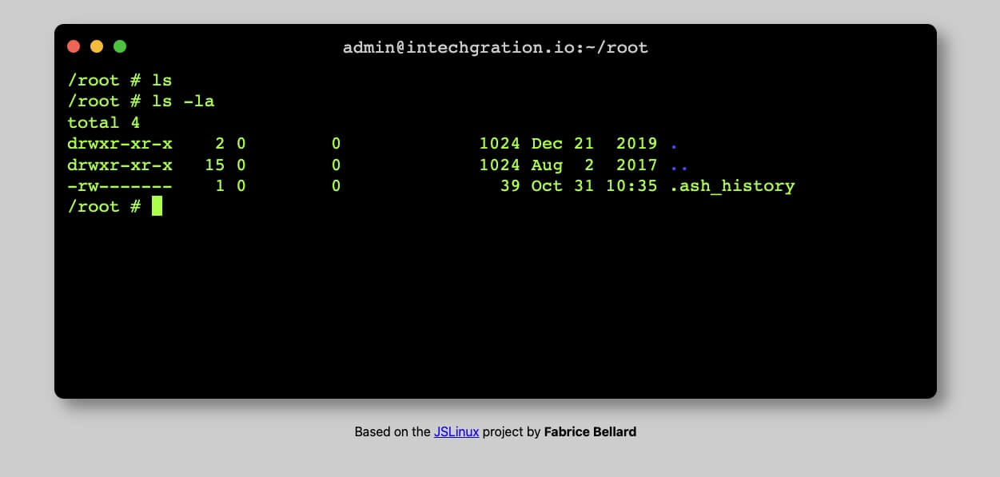
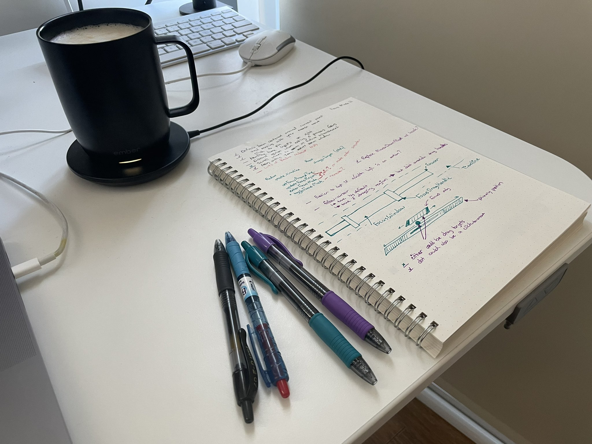

# WDX 180°

## Web Development X - 180°

<!-- ABOUT -->

  
<h3>About</h3>

  This is Web Development X 180°. An introductory course to the web and related technologies such as HTML, CSS and JavaScript, split into 180 days.

  > If you are just starting and want to know more about what Web Development is and how it fits within the Internet start by [**watching this introductory video**](https://www.youtube.com/watch?v=JtNmSHnirfY){:target="_blank"}. After watching the video, you'll be able to understand what this course is all about.
  > 
  > You can also follow up, by watching this [Q&A session](https://www.youtube.com/watch?v=Y_wKi7-RBOg){:target="_blank"} accompanying the video above.

  The WDX 180° curriculum, along with all related material (exercises, code, etc.), **is and will always be free and open-source** under the GPLv3 license.

  You can find the [Syllabus here](curriculum/index.md).

  This project is created by [intechgration.io](https://intechgration.io/){:target="_blank"}. Here's a [**short video**](https://youtu.be/VQUxkCUGW7w){:target="_blank"} about our story.

<!-- WHERE DO I START? -->

  
<h3>Where do I start?</h3>

  You definitely need to **start by watching [this welcoming video](https://youtu.be/PxBdVw9tTa0){:target="_blank"}** about WDX180. Learn about what this we will cover, how to study, how to reach for help and some general tips and advice for the course.

  
  
  What we are going to cover, how to study and some general tips

  If you are ready and feel committed enough to start the course, you must start by carefully going through the following sections and completing all the necessary tasks:

  - **Accounts**  
  - **Setup**  
  - **Communication**  
  - **Hardware Requirements**  
  - **Software**  
  - **Getting familiar with data formats**
  - **How to Study / Productivity Tips**  

  Don't forget to open the [FAQ page](./curriculum/FAQ/index.md){:target="_blank"} that accompanies the setup process in a new Tab and check for relevant questions and their respective responses as you go through the next steps.

<!-- ACCOUNTS -->

  
<h3>Accounts</h3>

  In order to attend the course (and become a professional web developer) you will need to open an account in the following services:

  - [Google Gmail](https://www.google.com/gmail/about/){:target="_blank"}
    - A Google Gmail account gives you free web-based email but also access to all the services provided by Google, e.g. YouTube, Google Docs, Google Drive and more.
  - [GitHub](https://github.com/){:target="_blank"}
    - `GitHub` is a web-based platform for `version control` & collaboration on code projects.
  - [StackOverflow](https://stackoverflow.com/){:target="_blank"}
    - `StackOverflow` is a Q&A site for programmers.
  - [Netlify](https://www.netlify.com/){:target="_blank"}
    - `Netlify` lets you host your websites and applications for free.
  - [Codesandbox](https://codesandbox.io/){:target="_blank"}
    - An online code editor that gives you the ability to share your code with a single web address.

  **Want more?**
  
  - [Codepen](https://codepen.io){:target="_blank"}
    - Another popular code editor that gives you the ability to share your code with a single web address.

<!-- SETUP -->

  
<h3>Setup</h3>

  The first thing you want to do, is to [fork](https://docs.github.com/en/get-started/quickstart/fork-a-repo){:target="_blank"}  this repository under your GitHub account.

  **IMPORTANT:** In the video we mention that you should enable the `GitHub Pages` feature on your copy (forked) of the WDX-180 repository. We no longer recommend that you do that, so you can ignore the part of the video that goes through that process and **stop watching at 02:25**.

  > Here is a [YouTube video walkthrough](https://www.youtube.com/watch?v=xqGlWAHjtcM){:target="_blank"} to help you with this step. 

<!-- COMMUNICATIONS -->

  
<h3>Communication</h3>

  Our main channel of communication is [Slack](https://intechgration.slack.com){:target="_blank"}. If you haven't received an invitation to the Intechgration Slack team, please inform us via email. 

  We encourage you to use the [Web version](https://slack.com/signin#/signin){:target="_blank"} of Slack on your PC/laptop and also have it installed on your smartphone. It's available for both [Android](https://play.google.com/store/apps/details?id=com.Slack){:target="_blank"} and [iOS](https://apps.apple.com/app/slack-app/id618783545?ls=1){:target="_blank"} devices.

  You can start familiarizing yourself with Slack by [watching these short videos](https://www.youtube.com/playlist?list=PLWlXaxtQ7fUb1WqLJDqJFGQsAXU7CjoGz){:target="_blank"} on YouTube, created by the Slack team.

  In order to learn more about Slack and the various versions (mobile, desktop, web), scroll down to the [Software](#software) section.

  **Enrolled students** also have the opportunity to schedule one 30~45min call each week with an instructor.

<!-- HARDWARE -->

  
<h3>Hardware Requirements</h3>

  In order to attend the course you will need the following:

  - Attending **in-person**:
    - Notebook for note taking

  - Attending **remotely**:
    - A computer with camera, microphone and speakers or headphones.
    - Notebook for note taking

<!-- SOFTWARE -->

  
<h3 id="software">Software</h3>

  This is a list of Software you must have installed on your system in order to get started with the course:

  - **Communication:** [Slack](https://slack.com){:target="_blank"} is our main communication tool.
    - [Web version (**recommended**)](https://slack.com/signin#/signin){:target="_blank"}
    - Mobile version (**recommended**): [Android](https://play.google.com/store/apps/details?id=com.Slack){:target="_blank"} / [iOS](https://apps.apple.com/app/slack-app/id618783545?ls=1){:target="_blank"}
    - Desktop version: 
      - [Windows](https://slack.com/downloads/windows){:target="_blank"} (109MB)
      - [Mac](https://slack.com/downloads/mac){:target="_blank"} (160MB)
      - [Linux (*_beta_)](https://slack.com/downloads/linux){:target="_blank"} (81MB)
    - You should check out the dedicated page we have created for Slack over [here](./curriculum/modules/curriculum/communication/slack/){:target="_blank"}.

  - **Communication:** [Zoom client](https://zoom.us/support/download){:target="_blank"} and [Google Meet](https://meet.google.com/) are used to attend the live lectures and student sessions.
    - You can do a quick video/audio check for Google Meet, following the directions [found here](https://support.google.com/meet/answer/10409699?hl=en){:target="_blank"}. Video is optional, but **audio (good quality microphone) is mandatory**. 

  - **Browser(s)**:
    - [Chrome](https://www.google.com/chrome/){:target="_blank"}
      - Windows: _
      - Mac: 212MB
      - Linux: 90MB
    - [Firefox](https://www.mozilla.org/en-US/firefox/){:target="_blank"}
      - Windows: 55MB
      - Mac: 115MB
      - Linux: 76MB

    > **Note:** During the course, we recommend using `Chrome` for developing and debugging Frontend web applications. For daily, normal usage we recommend using browsers that respect the privacy of their users, such as `Firefox` and [Brave](https://brave.com/download/){:target="_blank"}. Likewise, we tend to `Google` a lot for technical issues and searching for resources, but we recommend using an alternative search engine, such as [DuckDuckGo](https://duckduckgo.com/){:target="_blank"} for personal use.  

  - **Code Editor:** Download and install [Visual Studio Code](https://code.visualstudio.com/){:target="_blank"}
    - Windows: 88MB
    - Mac: 203MB
    - Linux: 82MB
    - **Extensions for VSCode:** Throughout the course we will be recommending  a variety of VSCode extensions that can be installed and extend the functionality of the code editor and boost our productivity. 
      - One of the first extensions that **must be installed** is the [Live Server](https://marketplace.visualstudio.com/items?itemName=ritwickdey.LiveServer){:target="_blank"}. 
      - Another one is the [Live Share](https://marketplace.visualstudio.com/items?itemName=MS-vsliveshare.vsliveshare){:target="_blank"} which allows for real-time collaboration. More to follow. 🙂
      - Last, but not least, you want to install our very own [WDX Extension Pack](https://marketplace.visualstudio.com/items?itemName=kostasx.vscode-wdx-extension-pack){:target="_blank"} which comes packed with recommended extensions and snippets that will you study and code better.

  - **Git:** Mandatory [Version Control](https://www.atlassian.com/git/tutorials/what-is-version-control){:target="_blank"} software for the professional developer. [**Download here**](https://git-scm.com/downloads){:target="_blank"}
    - **Windows** users will also need to run the following command after installing git: `git config --global core.autocrlf true` as mentioned [here](https://docs.github.com/en/get-started/getting-started-with-git/configuring-git-to-handle-line-endings?platform=windows#global-settings-for-line-endings){:target="_blank"}
    - In order to check that `git` has been installed on your system, you will need to run one of the following commands in the terminal: 
    - `git --version`
    - `git -v` (for short)

  - **Command Line Tools (Terminal):**
    - **Windows:** you will use [GitBash](https://www.atlassian.com/git/tutorials/git-bash){:target="_blank"} _(which is bundled along with `git` so you don't need to install anything if you already have `git`` installed)_ as your UNIX-style command line environment.
    - **Linux:** _(Already includes built-in Unix command line terminals. No need to install.)_
    - **MacOS:** _(Already includes built-in Unix command line terminals. No need to install.)_
      - You will need to install [Homebrew](https://brew.sh/){:target="_blank"}

  > So, you've downloaded Visual Studio Code (aka VSCode) along with Git and GitBash if you are running Windows. Even though Windows comes packed with quite a few types of terminals through which you can type and execute commands, we highly recommend that you stick with Git Bash on Windows.
  >
  > VSCode has this neat feature called **Integrated Terminal** which basically means that you can access any terminal without leaving the VSCode interface. Pretty cool!

  - Spend a few minutes to watch the following video and learn some of the most basic terminal commands. You will need to **carefully practice** _(especially with the `rm` command)_ and repeat these commands on your own terminal in order to become comfortable with it. 
  
  - [Watch: **Terminal Commands for Web Developers**](https://www.youtube.com/watch?v=YSj30jnvxKo)
    - **Duration:** 12min
    - **Level:** Beginner 
    - List of commands that you will learn: `pwd`, `cd`, `mkdir`, `ls`, `touch`, `rm`, `rmdir`, `mv`, `cp`.

  **❌ Caution:** be extremely careful with the `rm -rf` command. You can probably try to avoid running this command on your system until you get quite comfortable with the terminal, as this command can literally wipe out your entire disk drive if ran improperly.  

  You can also use our [**online virtual terminal**](https://in-tech-gration.github.io/WDX-180/resources/vm/jslinux/){:target="_blank"} to safely practice these commands. Remember that the file structure on your system and our virtual terminal environment is quite different from the file structure depicted in the video above. And, yes, you can safely run `rm -rf` in this virtual environment!

  {:target="_blank"}

  It's extremely helpful and will greatly improve your chances of retaining any new concept, to keep notes of everything that you learn (e.g. terminal commands in this case) and organize them in a manner that will help you quickly go back and find what you need. 

  > At this point, it's also probably a good idea to spend a few minutes watching this [YouTube video walkthrough](https://youtu.be/S9Qg3Ltf__c){:target="_blank"} and follow along in order to create your SSH keys and connect them with GitHub, then follow the rest of the instructions to `clone` (download) the repository to your computer and install all the necessary dependencies.  

  - **Node.js:** Download the `LTS` version of the powerful and popular JavaScript running environment [here](https://nodejs.org/en){:target="_blank"}. You are going to be using `Node.js` **a lot** during this course 🙂. In order to check that `Node.js` has been installed on your system, you will need to run one of the following commands in the terminal: 
    - `node --version`
    - `node -v` (for short)

  - **Productivity:**
    - [**Photopea**](https://www.photopea.com/){:target="_blank"}: a free, online image editing software that's pretty similar to `Adobe Photoshop`. You can use this tool to resize, crop or compress images among other things. 

<!-- DATA FORMATS -->

  
<h3>Getting familiar with data formats</h3>

  In this course we will be working a lot with `Markdown` files and `CSV` files.

  If you are unfamiliar with either the `markdown` or `CSV` file formats, we highly recommend that you watch the following 2 YouTube videos to get a better understanding:

  **Markdown** is a lightweight markup language used for formatting plain text documents, allowing users to easily add structure and style using simple, human-readable syntax.

  - [What is markdown?](https://www.youtube.com/watch?v=f49LJV1i-_w){:target="_blank"}
    - Duration: 8 min
    - Level: Beginner

  **CSV (Comma-Separated Values)** is a simple file format used for storing and exchanging structured data, where each line represents a record or entry, and fields or columns within each record are separated by commas.

  - [Understanding CSV Files](https://www.youtube.com/watch?v=UofTplCVkYI){:target="_blank"}
    - Duration: 6 min
    - Level: Beginner
    - You can find the `sample.csv` file mentioned in the video in the following filepath: [curriculum/modules/computer_science/misc/data_formats/assets/sample.csv](./curriculum/modules/computer_science/misc/data_formats/assets/sample.csv)

  In short, CSV is a lightweight data format, where:
  
  - Each line of text is a single row
  - Fields (columns) are separated by comma `,` delimiter character  
  - The file contains just the data itself (along with the delimiter)
  - Does not need any special software (it's just a plain text file)
  - All spreadsheet apps (MS Excel, Google Sheets, Numbers, etc.) can read and write CSV

<!-- Syllabus -->

  
<h3>Syllabus</h3>

  You can find the [Syllabus here](curriculum/index.md#syllabus).

<!-- HOW TO STUDY -->

  
<h3>How to Study / Productivity tips</h3>

  

  - **AVOID DISTRACTIONS at all costs!** This means, closing all tabs, browser windows and applications that are not related to your daily study plan and practice. Be very vigilant against applications that include notifications (WhatsApp, Messenger, etc.). From time to time, you might even consider **pausing notifications from Slack** itself. Check the [**instructions found here**](https://slack.com/help/articles/214908388-Pause-notifications-with-Do-Not-Disturb){:target="_blank"} on how to do this. 

  - **Go the extra mile** and go through the `Extra Resources` section that accompanies most of the chapters in this curriculum.

  - **I'm stuck!** Don't worry. Here are some tips to help you overcome what's blocking you:
    - ___I don't really understand this concept. What should I do?___
      - Search for extra information and resources online. (Found something useful that helped you? Make sure to share it!). We **highly recommend** that you always include [MDN](https://developer.mozilla.org/en-US/){:target="_blank"} in your searches for concepts related to Web technologies. You can google by including the `+MDN` keyword in your searches to find relevant pages in the MDN documentation, e.g. `css position sticky +MDN` or you can narrow and limit your searches only within the MDN documentation pages by googling using the `site:` operator, e.g. `css position sticky site:developer.mozilla.org`. Other channels for searching extra information include [YouTube](https://www.youtube.com/){:target="_blank"}, [StackOverflow](https://stackoverflow.com/){:target="_blank"} and [**other**](resources/PRODUCTIVITY.md#where-to-look-for-information){:target="_blank"}. 
      - Give yourself a break and try it again in a few minutes, hours, days.
      - Reach out to other students on [Slack](https://intechgration.slack.com){:target="_blank"}
      - Keep notes in order to discuss this during an upcoming support/Q&A session
    - My code is not working (as expected). What should I do?
      - Use the [rubber duck technique](https://en.wikipedia.org/wiki/Rubber_duck_debugging){:target="_blank"}
    
    Hungry for more tips? We have a whole section full of productivity and learning tips [right here](resources/productivity.md){:target="_blank"}.

<!-- HOW TO RUN WDX LOCALLY -->

  
<h3>How to run WDX locally</h3>

  ---

  - Clone the GitHub repository locally:
    - Via SSH (recommended): `git clone git@github.com:in-tech-gration/WDX-180.git` 
    - Via HTTPS: `git clone https://github.com/in-tech-gration/WDX-180.git`
  - Change into the WDX directory: `cd WDX-180`
  - Run: `npm install`

  Once you have followed the steps above (which was a one-time thing)
  you can launch the app using the following command:

  - `npm run serve:jekyll`

### Finished setting everything up? 

[**➡️ LET'S GET STARTED**](/curriculum/index.md)

---

## Who's Involved

- [**Sohail Haqyar** / Co-founder](https://www.linkedin.com/in/sohail-haqyar/)
- [**Abed Hamami** / Co-founder, Course Instructor](https://www.linkedin.com/in/abedhamami/) 
- [**Kostas Minaidis** / Technical Curriculum Developer](https://www.linkedin.com/in/kostas-minaidis/)
- [**Asteris Giannoudis** / Software Development, Content Curator & Accessibility Consultant](https://www.linkedin.com/in/asteris-giannoudis/)
- [**Gogi A. Hatzichristos** / Content Curator & Passionate Contributor](https://www.linkedin.com/in/gogi-hatzichristos/)
- [**Leon Kountouras** / Content Curator & Passionate Contributor](https://github.com/leonalkalai/)
- [**Maria Barkouzou** / Content Curator & Passionate Contributor](https://www.linkedin.com/in/mariabarkouzou/)
- [**Shariar Shakhawat** / Content Curator & Passionate Contributor](https://www.linkedin.com/in/shariar-shakhawat/)
- [**Vangelis Chirmpilidis** / Content Curator & Passionate Contributor](https://github.com/vagelisx)
- [**Mary Richelle** / Content Curator & Passionate Contributor](https://github.com/MaryRichelle)
- [**Evan Cole** / Educational Advisor](https://www.linkedin.com/in/evan-cole/)
- [**Yoshi Malaise** / Educational Advisor](https://www.linkedin.com/in/yoshi-malaise/)
- [**How about you?**](#contribute) 😉

The curriculum draws heavily on the following amazing resources:

- [**Mozilla Developer Network**](https://developer.mozilla.org/en-US/)
- [**CodeYourFuture**](https://codeyourfuture.io/about/)
- [**Codecademy**](https://www.codecademy.com/)
- [**DeNepo: Open Ed**](https://github.com/denepo/)
- [**javascript.info** by Ilya Kantor](https://www.linkedin.com/in/iliakan/)
- [**Kyle Simpson** aka getify, author of ___You Don't know JS___](https://www.linkedin.com/in/getify/)
- [**LaunchCode Education**](https://github.com/LaunchCodeEducation)
- [**Dave Gray**](https://www.linkedin.com/in/davidagray/)
- [**Ruby Monstas**](https://rubymonstas.org/)

## Side Projects

- [**VSCode WDX Extension Pack**](https://marketplace.visualstudio.com/items?itemName=kostasx.vscode-wdx-extension-pack): A VSCode extension that comes packed with recommended extensions and snippets that will help students study and code better.

## Contribute

- Spotted a broken link?
- Found a typo?
- Have an idea on how to improve the course? 
- How about mentoring?

[**Reach out to us!**](https://github.com/in-tech-gration/WDX-Intro/discussions)

Our lovely contributors _(feel free to give them a follow/subscribe/like as a gesture of appreciation)_:

- **Nicolas Wickens**: [GitHub](https://github.com/NicolasWickens)
- **Walaa Medhat**: [GitHub](https://github.com/walaamedhat)
- **Maria Karavazaki**: [GitHub](https://github.com/MariaKar1991)
- **Mubashra Irshad**: [GitHub](https://github.com/mubashra21c)
- [**PlethoraThemes**](https://plethorathemes.com/)
- **Shariar Shakhawat**: [GitHub](https://github.com/Sha-Shak) / [Twitter](https://twitter.com/shahriartweets)
- **Dimitris**: [GitHub](https://github.com/dimitriost1)

---

<!-- COMMENTS: -->

