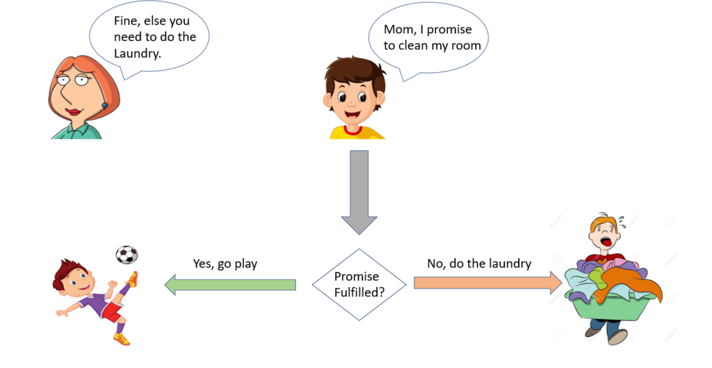
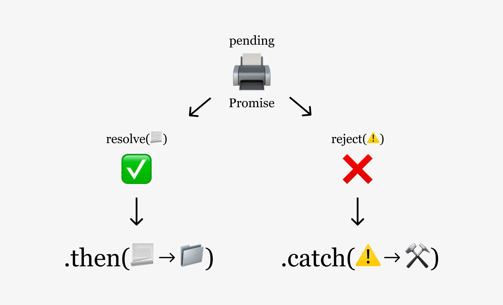
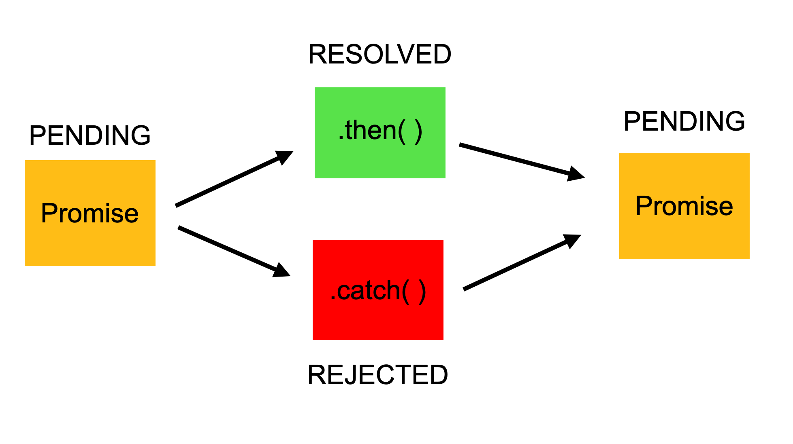
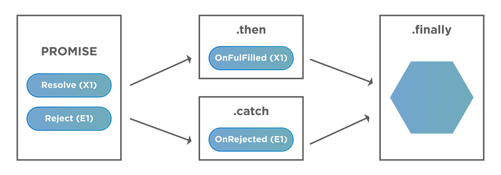
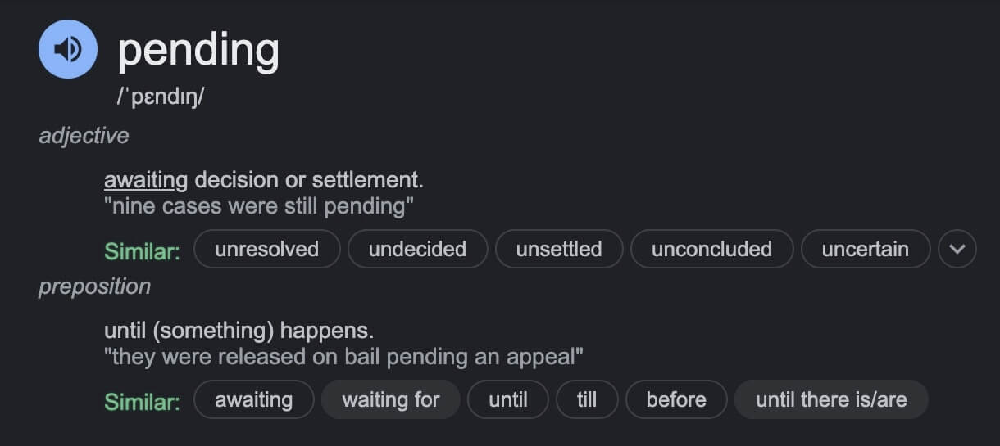
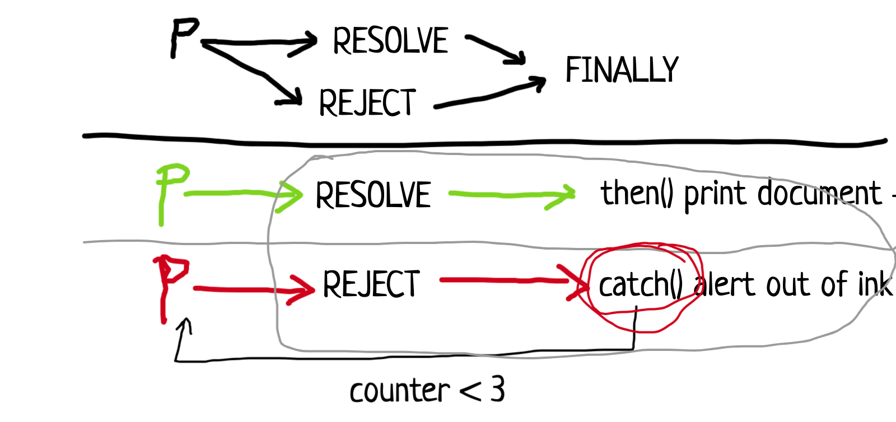
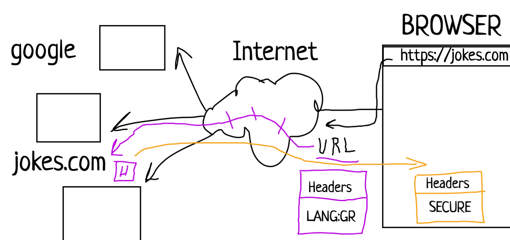

# Slack Messages: Week 13 (08/01/2024 - 12/01/2024)

## 08/01/2024

OK, everyone! Let's start practicing what we've learned.

- [Promise codepen](https://codepen.io/kostasx/pen/RwdadmX)
- [The Chicken=>Egg Function pen](https://codepen.io/kostasx/pen/eYXZwpd)
- Promise Diagrams:
  - 
  - 
  - 
  - 
  - 
  - 
- Servers that return JSON data:
  - [Chuck Norris Jokes](https://api.chucknorris.io/jokes/random)
  - [Cat Facts](https://catfact.ninja/fact)
  - 

## 09/01/2024

Here's the suggested schedule for today:

- Start with some theory and learn about the **CSS Object Model** on the [WDX180 platform](https://in-tech-gration.github.io/WDX-180/curriculum/week13/){:target="_blank"} (Day 2)
- Practice what you learn in a real coding environment (create an `index.html` file and use Live Server in VSCode to serve the content)
- Schedule a call with your team and go over the following topics together:
  - CSSOM
  - Bookaholics tasks
  - Try out some things that you've learned yesterday about Promises and the egg-laying chickens (aka Functions) in your project code.
- Share any questions, issues, bugs, insights on Slack. Make sure to document your bugs in your Bug Journal.
- Don't worry too much about Promises at this point, as we've scheduled a week dedicated to async, so we'll cover more soon.
- Enjoy and have fun! :star:

### Replies:

- What does paint mean? Is that a feature of the browser? Does browser use Canvas to paint the DOM? How does it "paint" the pixels?

- Yes, "paint" refers to an internal Browser feature. The way browsers "paint" everything on the main browser window is something that is hidden away from us. It is not to be confused with the Canvas API which is an HTML element with drawing/painting capabilities.

- Typo? Should be CSSStyleDeclaration and not CSSSyleDeclaration?

- is CSSStyleDeclaration a special type of object? or have another prototype, not object? I feel like I don't fully understand the object model JS :worried: all clear - CSSStyleDeclaration has prototype object :ok_hand:

- When we use javascript are the css styles applied inline? Because it seems so. If we have a rule in our project for not to use inline styling, how are we going to handle this so we change css of DOM without applying inline styling or even the styling not to be visible inside the DOM HTML but only hidden in a file? Should we use css classes instead? That will also change the styles inline though if the property we change is not a part of css properties.

- https://codepen.io/leonalkalai/pen/VwRjzrZ

- When you are using JS to alter the style of your document, the changes are applied as inline. This happens because you alter the DOM directly. The general rule we want you to follow is not to use inline styling, because it is difficult to keep up, reuse and scale a project that uses CSS inline styling.

- CSSStyleDeclaration is an Interface: https://developer.mozilla.org/en-US/docs/Web/API/CSSStyleDeclaration
...based on which a special type of Object is created

- So the best thing is to create a class that contain all this css properties and values and just add this class to the element so it gets the values without set them inline.

- Yep, that's a good way of thinking about this. There are plenty of ways to deal with dynamic CSS in JS, so there will be times where other methods might be more appropriate or needed. Here's another way of injecting CSS stylinng:
```js
const style = document.createElement("style");
style.textContent = `
  body { 
    background: black;
    color: white;
  }
`
document.head.appendChild(style);
```
Here, we are dynamically creating a `<style>` element, adding some text content (plain CSS rules) and then appending that element to the document's `<head>` element.

- Yes indeed :+1: but this applies a style tag and the css inside something that is not recommended.

## 10/01/2024
## 11/01/2024

Here's the suggested plan for today.

- Go through the content of Day 3 which contains a small debugging exercise and some advanced CSS. (Hey, JS is cool, but let's not forget that CSS and HTML can do quite a lot of things for us too).

- Practice some of the things that we've learned yesterday

- Dedicate some time to complete tasks for the group project and start preparing with your team for the final presentation (we suggest that it should be sometime next week)

## 12/01/2024

I suggest that in order to strengthen the knowledge that we've gained
and also practice some HTML and CSS skills (we don't need them to get
rusty just because of JS), recreate the table below in plain HTML and CSS.
[Image source](https://cdn.hashnode.com/res/hashnode/image/upload/v1658225167119/MxOGBQkWE.jpg?auto=compress,format&format=webp){:target="_blank"}

You can use some emojis for the :x: :white_check_mark: or you can recreate them using plain CSS!
[Check Mark](https://emojipedia.org/check-mark-button){:target="_blank"}
[Corss Mark](https://emojipedia.org/cross-mark){:target="_blank"}

If you go with the CSS route for the symbols, you can use the following HTML entities
and find some CSS rules to apply colors, background, borders, circles, etc. to these characters
- `<span>&check;</span>`
- `<span>&CircleTimes;</span>`
 Refs:
[Unicode Character “⊗” (U+2297)](https://www.compart.com/en/unicode/U+2297){:target="_blank"}
[Unicode Character “✓” (U+2713)](https://www.compart.com/en/unicode/U+2713){:target="_blank"}

You can of course, build the structure in many ways, but the `<table>` element is the most appropriate here.
In case you've started building using another element, feel free to do so, and we'll check how different layouts
and structure look later on.