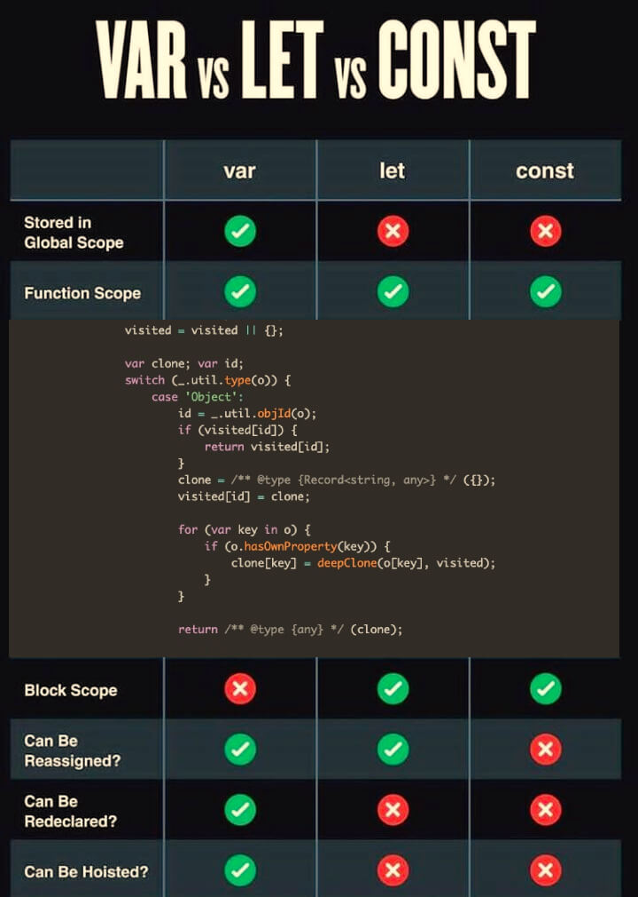

# Slack Messages: Week 15 (22/01/2024 - 26/01/2024)

## 22/01/2023

## 23/01/2023

Let's see what we've planned for you for today and the upcoming weeks.
First of all some theory. Start by reading about `iframe` and `eval` (or as some people call it, `evil()`):
- [eval @ W3Schools (gear 1 :car:)](https://www.w3schools.com/jsref/jsref_eval.asp){:target="_blank"}
- [eval @ MDN (gear 5 :racing_car:)](https://developer.mozilla.org/en-US/docs/Web/JavaScript/Reference/Global_Objects/eval){:target="_blank"}
- [iframe @ W3Schools (gear 1 :car:)](https://www.w3schools.com/tags/tag_iframe.ASP){:target="_blank"}
- [iframe @ MDN (gear 5 :racing_car:)](https://developer.mozilla.org/en-US/docs/Web/HTML/Element/iframe){:target="_blank"}

Next, we're going to start our new group project, so make sure to schedule a call with your team today and talk about how to best organize your calls and tasks.

For this project, we want you to build a real app that will be integrated into the WDX180 curriculum and will help other students learn about the differences between `var`, `let` and `const`.

You will build an exact replica of this [reference table](https://cdn.hashnode.com/res/hashnode/image/upload/v1658225167119/MxOGBQkWE.jpg){:target="_blank"} using HTML and CSS.

For each row of the table, the user must be able to click on it and some sample code must be displayed that shows the difference between the 3 ways of declaring a variable and the particular feature (e.g. function scope, hoisting, etc.). See the screenshot for an idea on how to display the code. It's up to you to find the most appropriate solution. Feel free to experiment and also come up with various ways to do this.

The code must be syntax highlighted. You *must* use the [prism.js library](https://prismjs.com/#examples){:target="_blank"} for that and pick the `tomorrow night` theme.

You can optionally go one step further and make the code runnable. You can experiment with things like `eval`, `iframe` or anything you can think of or find on StackOverflow. You might also want to experiment with ready-made libraries like [Flems](https://flems.io/){:target="_blank"}.

For this project, you must create a new repository under the Cohort organization on GitHub and you must also coordinate with your team about the next steps. *Don't work without consulting from the team* on what to do, try or experiment next. This is a group project and you must coordinate with your colleagues about any feature that you might want to try.

## 24/01/2023

## 25/01/2023

## 26/01/2023