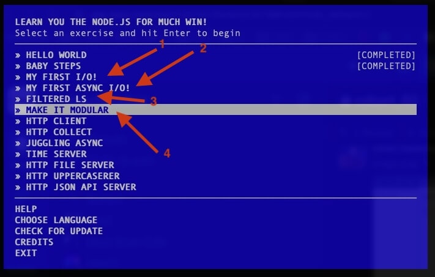

# Slack Messages: Week 19 (19/02/202 - 23/02/2024)

## 19/02/2024

## 20/02/2024

- Here's the plan for today:
  - Open [yesterday's notes](https://docs.google.com/document/d/1d13RdV80EyhpfAAs_cy6mhpJXeIVdFNw4r-9Sl498W4/edit#heading=h.233c4hc85pa6){:target="_blank"} and work on the Study and Practice section. There's plenty of things to study and practice on. Don't forget to add the code in the corresponding user/ subfolder and push.
  - Schedule a call with your classmates and spend a few minutes on the following:
    - Share what you've built and explain any code that is unfamiliar to them
    - Share the challenges that you faced and discussed it with them
    - Code something together, debug some buggy code together and discuss about the topics of yesterday's lectures.
    - Share your tips, insights, tools or other cools things that you've learned in the past few days
    - Create a list of questions or things that we can solve together during the upcoming sessions
    - Post things on Slack (code, questions, snippets, helpful articles and so on)
Please do not ignore these calls with your team.
It will only take about 1 hour of your time and are really important.
They show how committed you are and demonstrate your ability to work collaboratively in a professional manner.
Above all, have fun! :rocket:

- FYI: Here's today's real task at my job: build a Hedonic Scale component, where a user can select a value from each column. Pretty challenging (as all attributes and values should be customizable) but also quite fun! Just a hint of what tasks you might get asked to develop. :bulb:


- And, here's the initial mockup I received:


- `class HedonicScale extends HTMLElement { ...the journey begins! :laughing: }`
- `<HedonicScale parameters="Fish flavor, Fish odor, ..." />`
- :wink:

## 21/02/2024

## 22/02/2024

- Today, it's best to focus on the fs module and practice what you've learned yesterday. Practice by writing many small node scripts and finish up any code from the previous days. You should also complete the following 4 steps in learnyounode: My first I/O, My first async I/O, Filtered LS, Make it Modula

- we need to install npm ?
- nodejs come packed with npm so, there's no need to install npm
- I meant we need to install it with npm from the repository or does it have a running website?
- https://www.npmjs.com/package/learnyounode
- I guess no couch coding :rolling_on_the_floor_laughing:
- i think i can take it from [here](https://github.com/workshopper/learnyounode/blob/master/exercises/my_first_io/problem.md){:target="_blank"}
- Anybody knows where is the test file for the first exercise?
- I believe you run learnyounode verify file.js, to verify the result of your solution
- i just took the exercises from the repo, read them and code , after execute in the cmd.
- And how do you verify them?
- by looking at the result
- Why not running the `learnyounode verify`?
- i didn't have the time to install the repo and work with it using npm install and vscode so in order to gain time i figured out this way.
- Hmmmm... not sure whether you are really saving time this way, but I guess that can work also. Also, why do you say npm install takes time?
- Me and npm will meet some day soon. It doesn't take so much time but it takes more than just opening a notepad and cmd.

- Good morning, i have a good exercise and question all together. The os.cpus() module in nodejs returns this array of objects. How can we loop over this structure and display each index and property seperated by HTML elements like div,p, span and display them? The problem is that this object has nested objects, so what is the best, clearest, shortest, functional way to do it?
```js
[ { model: 'Intel(R) Core(TM) i5-7200U CPU @ 2.50GHz',
    speed: 2712,
    times:
     { user: 900000, nice: 0, sys: 940265, idle: 11928546, irq: 147046 } },
  { model: 'Intel(R) Core(TM) i5-7200U CPU @ 2.50GHz',
    speed: 2712,
    times:
     { user: 860875, nice: 0, sys: 507093, idle: 12400500, irq: 27062 } },
  { model: 'Intel(R) Core(TM) i5-7200U CPU @ 2.50GHz',
    speed: 2712,
    times:
     { user: 1273421, nice: 0, sys: 618765, idle: 11876281, irq: 13125 } },
  { model: 'Intel(R) Core(TM) i5-7200U CPU @ 2.50GHz',
    speed: 2712,
    times:
     { user: 943921, nice: 0, sys: 460109, idle: 12364453, irq: 12437 } } ]
```
- Good morning! That's a very good question! You seem to be eager to find a clean, efficient and optimal way to tackle your problems.Do you see any pattern in the data that os.cpus() provides? What was your first take on this ?
- Main object contain returned objects wich contain the following attributes:
```json
{
  model: string,
  speed:  number, 
  times: { 
   user: number, 
   nice: number,
   sys: number,
   idle: number,
   irq:  number
  }
},
{
  model: string,
  speed:  number, 
  times: { 
   user: number, 
   nice: number,
   sys: number,
   idle: number,
   irq:  number
  }
}
```
- Ok so that's a pattern here I suppose. You can iterate through each object in the list and for each on dig deeper and access the nested objects. Is that something that you have tried already ?
- Yes but it gets too complicated from a point. Need a better solution.
- You have a list of 4 objects (one per CPU core), where each object has some attributes (string, number, etc.) another object (with its own attributes). If you had a CPU with 2,6,8 or even more cores you would have the same type of objects, but a bigger list in total. So you would need a function/method to loop over each entry on the list efficiently. What do you think a better solution should be ?
- recursive for each nesting
- Just because recursion is a more advanced and difficult to use concept, it does not mean it's always a better practice. Sometimes the simpler approach is the best solution.
- So what you are proposing is a loop over the objects and if the property of the object is an object then loop over that also
- There is no need to loop over the second object. You have a list of objects, we loop/iterate/parse each element of the list. Each object is of the "same type". Think of it a class, maybe named CpuCore. Each CpuCore object consists of the attributes listed below: model -> string, speed -> number, times -> object. The 'times' object consists of 5 number attributes. I don't see why would you need to loop over this object. It's neither a list nor an array.
- times is an object: if you print it it returns [object object], if you stringify it it returns the object as a string but not the properties of it separately
- ok so you have two options here: you could loop over the keys of the object and print each attribute value (a more dynamic approach), you could define a type/class as I mentioned above and print each attribute. something like print(times["user"]) (a more data dependent approach). I hope I didn't confuse you more with this.
- you mean use destructuring to the times?

- :point_up: As a side note, at first forget about "what is the best, clearest, shortest, functional way to do it?" and remember the motto: "First make it work, then make it better" So, my take on this is, just use your intuition and make it work, without worrying about the best or shortest or functional way. That will be the next step (only if the code is slow or unclear).

- Your tools here are simple: how do I iterate over an Array? How do I iterate over an object's properties?


## 23/02/2024
