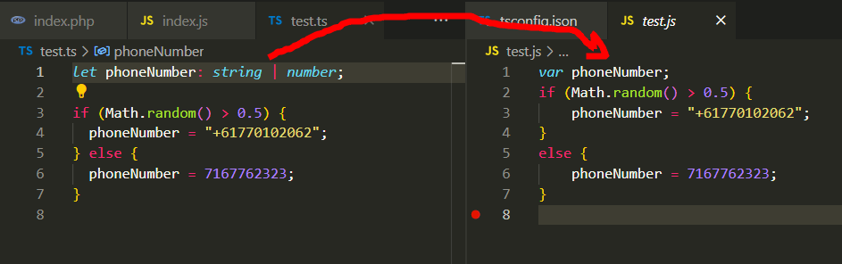
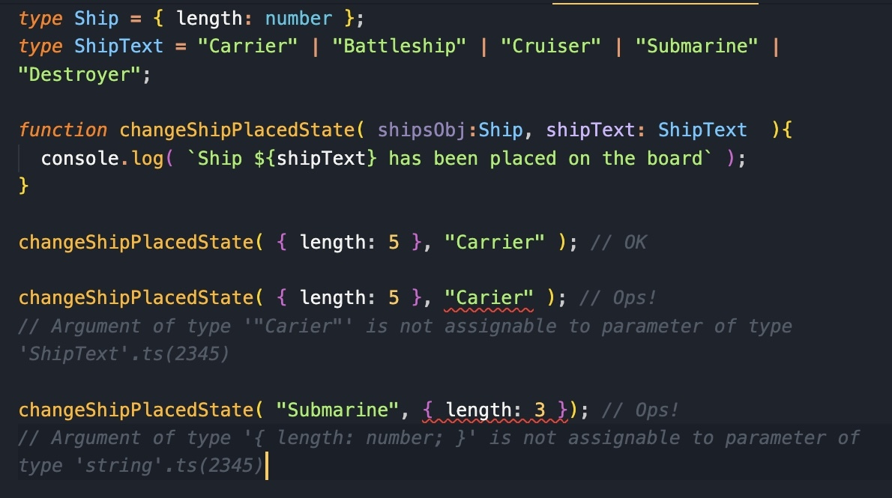

# Slack Messages: Week 30 (13/05/2024 - 17/05/2024)

## 13/05/2024

## 14/05/2024

- Good morning everyone! [Here's some code](https://intechgration.slack.com/files/U02RU6B1TGW/F073B1PUWMA/visibility.badger.html.zip){:target="_blank"} to study and practice today.
  - Tasks:
    - Read and understand what the code does
    - Test the code (press the play button and switch to another Tab to see how the app behaves differently)
    - Does this remind you of chat applications (like Slack) that provide some notification when the chat Tab is out of focus?
    - Learn more about the Visibility Web API
    - Enforce ts-check and apply as many JSDoc types as you can
    - Improve the code and add comments
    - Share your version and questions!
    - **Have fun and enjoy!** :smiley:
- Some [amazing tips](https://twitter.com/wesbos/status/1790072655913050579){:target="_blank"} from Wes Bos for textareas. Completely mind-blowing CSS I had no idea about: ex unit, lh unit and more!

## 15/05/2024

## 16/05/2024

- Hi, I can't understand why `const` and `let` transpile to `var`. I test it with TS and SWC but the same. It's strange, only the command `npx tsc` without filename transpiled normally. It's strange :face_with_diagonal_mouth:

  - It's for backwards compatibility with older versions of JS running on legacy systems.
  - I set `"target": "es2022" /* Set the JavaScript language version for emitted JavaScript and include compatible library declarations. */,`  in `tsconfig.json`
  - Oh! :open_mouth: That's strange.Make sure that it reads the tsconfig.json. Perhaps, break something on the tsconfig.json and see if the compiler complains.
  - Command `npx tsc test.ts` not read tsconfig, but `npx tsc` have error when I changed target in config to `es3033`  In SWC and TS playgrounds everything converts well. I need more dive in configs
  - You're right - from help:   `tsc app.ts util.ts Ignoring tsconfig.json, compiles the specified files with default compiler options.`
- Just for safety. The idea is: keep everything safe in TS land, then safely compile to JS (with var) Catch bugs and fix code early one (in VSCode with TS) then don't worry about transpiled JS. I believe there is a config for Babel or tsc to compile to ES6 and get rid of var. For full support, I believe the default settings would be OK in most cases. Basically, TS does extra protection during coding, so const and let will keep you safe while developing.
- Embrace TypeScript! :safety_vest: No more couch-coding errors. :ring_buoy:

## 17/05/2024