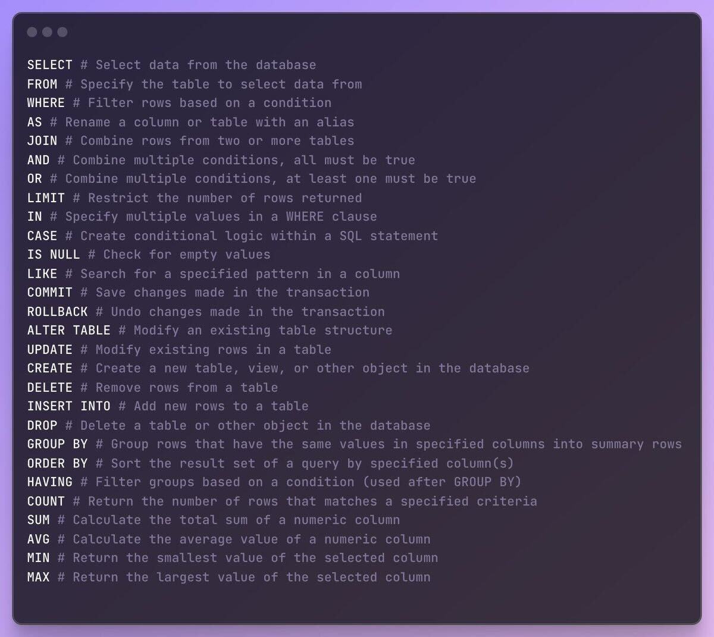

# Slack Messages: Week 33 (03/06/2024 - 07/06/2024)

## 03/06/2024

## 04/06/2024

- `SELECT mood FROM students WHERE currently_studying = "SQL";`
- An [amazing introduction to SQL](https://www.youtube.com/watch?v=KLwnfxhobIQ){:target="_blank"} by the incredible Eddie Woo

## 05/06/2024

## 06/06/2024

- SQL Commands

- A nice resource for [SQL](https://www.atlassian.com/data/sql){:target="_blank"} and [SQL joins](https://www.atlassian.com/data/sql/sql-join-types-explained-visually){:target="_blank"} also check [inner join](https://dataschool.com/how-to-teach-people-sql/inner-join-animated/){:target="_blank"}
 
## 07/06/2024
