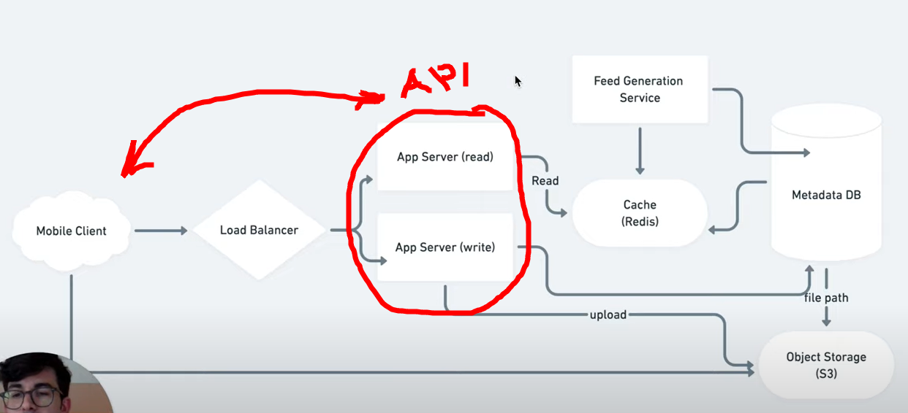

# Slack Messages: Week 34 (10/06/2024 - 14/06/2024)

## 10/06/2024

## 11/06/2024

- Good morning everyone! Since we are going to be designing our Database soon, here are two really interesting videos that walk you through designing a system (an Instagram-like app in one case, a calendar app in the other). You can lear a lot from this process, such as thinking about the system from a high level and breaking it up in different modules and deciding on the Database entities (tables) and Schema (columns and types). Enjoy and gain some insights for tomorrow's discussion!
  - [Design Instagram: 30'](https://www.youtube.com/watch?v=VJpfO6KdyWE){:target="_blank"}
  - [Design Calendar Application: 25'](https://www.youtube.com/watch?v=39eAITqeu7g){:target="_blank"}
- In the video about Instagram, if I understood correctly, he talks about API, but most likely API is on a different logical level of the diagram, for example, in which data flows are considered, or is API in this case just part of the technical implementation?

- Yes, you are right. The API is thought to be part of the section you highlighted, but not explicitly named or shown in the diagram. My guess, is also that the highlighted part is the part responsible for acting as an API gateway.
- It seems to me that knowledge of system design greatly increases the chances of getting any job, when a developer understands not only HOW to write code, but also WHAT for. Where would you recommend starting?
- These 2 books by this guy are a great intro ([1](https://www.linkedin.com/in/alexxubyte/){:target="_blank"}, [2](https://blog.bytebytego.com/){:target="_blank"})

## 12/06/2024

## 13/06/2024

## 14/06/2024

- Good morning everyone! Unfortunately, we will have to postpone today's lecture due to an illness that will keep me in bed -hopefully not for long. Take this opportunity and try to work on the CMS project (you can fork the repo and work on a branch) to accomplish the following tasks:
  - Create a new `src/db/basic.ts` file and paste the official sqlite3 example [found here](https://github.com/TryGhost/node-sqlite3?tab=readme-ov-file#usage){:target="_blank"}. We'll just keep the other database-related files aside for now.
  - Instead of creating a sample `lorem` table, like the example, update the code and create 2 tables that will hold our CMS `Users` and their Blog `Posts`. Make sure that these two tables have a one-to-many relation, where one `User` can create many `Posts`. Make use of the `Primary/Foreign Keys` to connect the two tables and populate then with a few sample users and posts. ChatGPT can help you come up with some sample user names, blog post titles and sample content.
  - Think carefully about the Schema of these two tables (column names and value types).
  - Rename `src/index.ts` to `src/web.ts` and create a new file named `src/index.ts`. Find a way to import both the `src/db/basic.ts` and `src/web.ts` into `src/index.ts` and "wire" them up correctly so that the web server starts listening when the database has been initialized and the table creation (CREATE TABLE) and population (INSERT INTO) have completed. You will have to create some functions and of course make use of some callbacks in order to achieve that.
  - Create another route named `/blog` that will read the contents of the `Posts` table and send the contents back to the user in the form of an HTML page.
- Here is some code to get you started:
  ```javascript
  // index.mjs
  import webInit from "./web.mjs";
  import dbInit from "./db.mjs";
  
  dbInit( webInit );
  ```

  ```javascript
  // web.mjs
  export default function webInit(db){
    console.log("Web server initialized!");
    function listen(){
      console.log("Table:", db);
    }
    listen();
  }
  ```

  ```javascript
  // db.mjs
  export default function dbInit(cb){
    console.log("Database server initialized!");
    setTimeout(()=>{
      console.log("Table ready!");
      cb({ table: "Users" });
    },500);
  }
  ```
- Run: `node index.mjs`
- Output:
  ```
  Database server initialized!
  Table ready!
  Web server initialized!
  Table: { table: 'Users' }
  ```
- That's it! Share your progress and questions on Slack and we'll (hopefully be able to) take a look at your approaches on Monday. Good luck and have a nice weekend!
