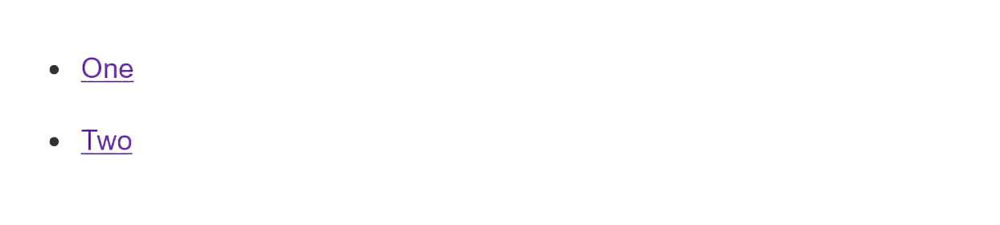

# Test your skills: The Cascade

_(Updated: 10/10/2023)_

The aim of this skill test is to assess whether you understand universal property values for [controlling inheritance in CSS](../../resources/css_building_blocks/cascade_and_inheritance/index.md).

> **Note:** If you get stuck, then ask us for help!

## Task 1

In this task, we want you to use one of the special values we looked at in the [controlling inheritance](../../resources/css_building_blocks/cascade_and_inheritance/index.md#controlling-inheritance) section. To write a declaration in a new rule that will reset the background color back to white, without using an actual color value.

Copy and paste the code below in a file named `cascade.html`.

```html
<!DOCTYPE html>
<html lang="en">
  <head>
    <meta charset="utf-8" />
    <title>The Cascade Task</title>

    <style>
      body {
        background-color: #fff;
        color: #333;
        font: 1.2em / 1.5 "Helvetica Neue", Helvetica, Arial, sans-serif;
        padding: 1em;
        margin: 0;
      }
      #outer div ul .nav a {
        background-color: yellow;
        padding: 5px;
        display: inline-block;
        margin-bottom: 10px;
      }

      div div li a {
        color: rebeccapurple;
      }
    </style>
  </head>

  <body>
    <div id="outer" class="container">
      <div id="inner" class="container">
        <ul>
          <li class="nav">
            <a href="#">One</a>
          </li>
          <li class="nav">
            <a href="#">Two</a>
          </li>
        </ul>
      </div>
    </div>
  </body>
</html>
```

Your final result should look like the image below:



When you're ready, move the files in the following path `user/week03/exercises/day04/cascade_tasks/task01/` and run the git commands below to submit your exercise:

- `git add user/week03/exercises/day04/cascade_tasks/task01/`
- `git commit -m "cascade_tasks_task01"`
- `git push`

## Task 2

In this task, we want you to make your changes by leveraging the [order of cascade layers](../../resources/css_building_blocks/cascade_and_inheritance/index.md#order-of-cascade-layers) section. Edit an existing declaration, without touching the lightgreen declaration, using the cascade layer order to make the links rebeccapurple.

Copy and pase the code below in a file named `cascadelayer.html`.

```html
<!DOCTYPE html>
<html lang="en">
  <head>
    <meta charset="utf-8" />
    <title>The Cascade Layer Task</title>

    <style>
      @layer yellow, purple, green;

      @layer yellow {
        #outer div ul .nav a {
          padding: 5px;
          display: inline-block;
          margin-bottom: 10px;
        }
      }
      @layer purple {
        div div li a {
          color: rebeccapurple;
        }
      }
      @layer green {
        a {
          color: lightgreen;
        }
      }
    </style>
  </head>

  <body>
    <div id="outer" class="container">
      <div id="inner" class="container">
        <ul>
          <li class="nav">
            <a href="#">One</a>
          </li>
          <li class="nav">
            <a href="#">Two</a>
          </li>
        </ul>
      </div>
    </div>
  </body>
</html>
```

Your final result should look like the image below:


When you're ready, move the files in the following path `user/week03/exercises/day04/cascade_tasks/task02/` and run the git commands below to submit your exercise:

- `git add user/week03/exercises/day04/cascade_tasks/task02/`
- `git commit -m "cascade_tasks_task02"`
- `git push`

### Sources and Attributions

**Content is based on the following sources:**

- **MDN**
  - [Test your skills: The Cascade](https://developer.mozilla.org/en-US/docs/Learn/CSS/Building_blocks/Cascade_tasks){:target="_blank"} [(Permalink)](https://github.com/mdn/content/blob/529a4466f00f0f29e11716313a3ceb1f9ce5ce76/files/en-us/learn/css/building_blocks/cascade_tasks/index.md){:target="_blank"}