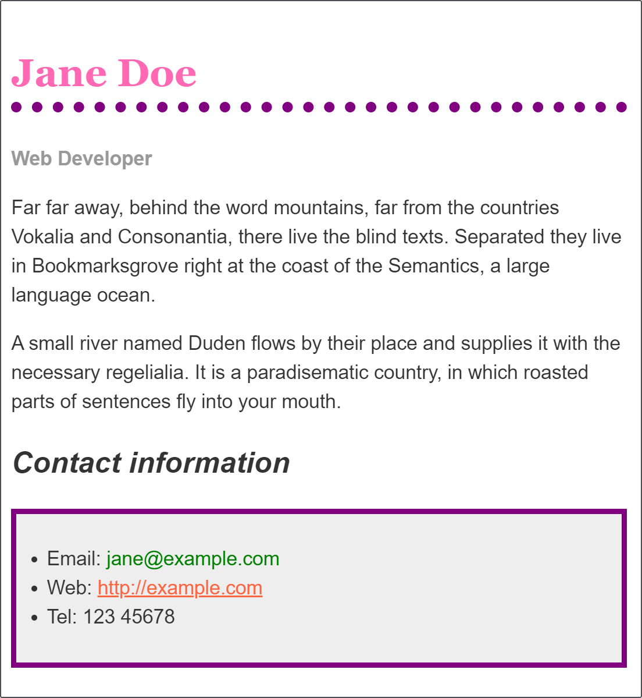

# Styling a biography page

_(Updated: 10/10/2023)_

With the things you have learned in the last few lessons you should find that you can format simple text documents using CSS to add your own style to them. This assessment gives you a chance to do that.

**Prerequisites:**
  - Before attempting this assessment you should have already completed Week 03 Day 2 Study Plan, and also have an understanding of HTML basics

**Objective:**
  - To have a play with some CSS and test your new-found knowledge.

## Starting point

Copy and paste the code below in a file named `blog.html`.

```html
<!DOCTYPE html>
<html lang="en">

  <head>
    <meta charset="utf-8" />
    <meta name="viewport" content="width=device-width" />
    <title>Formatting a biography</title>
    <style>
      body {
        background-color: #fff;
        color: #333;
        font-family: Arial, Helvetica, sans-serif;
        padding: 1em;
        margin: 0;
      }

      h1 {
        color: #375e97;
        font-size: 2em;
        font-family: Georgia, 'Times New Roman', Times, serif;
        border-bottom: 1px solid #375e97;
      }

      h2 {
        font-size: 1.5em;
      }

      .job-title {
        color: #999999;
        font-weight: bold;
      }

      a:link,
      a:visited {
        color: #fb6542;
      }

      a:hover {
        text-decoration: none;
      }
    </style>
  </head>

  <body>

    <h1>Jane Doe</h1>
    <div class="job-title">Web Developer</div>
    <p>Far far away, behind the word mountains, far from the countries Vokalia and Consonantia, there live the blind texts. Separated they live in Bookmarksgrove right at the coast of the Semantics, a large language ocean.</p>

    <p>A small river named Duden flows by their place and supplies it with the necessary regelialia. It is a paradisematic country, in which roasted parts of sentences fly into your mouth.
    </p>

    <h2>Contact information</h2>
    <ul>
      <li>Email:
        <a href="mailto:jane@example.com">jane@example.com</a>
      </li>
      <li>Web:
        <a href="http://example.com">http://example.com</a>
      </li>
      <li>Tel: 123 45678</li>
    </ul>

  </body>

</html>
```

This is a single page containing both the HTML and the starting point CSS (in the head of the document). If you prefer you could move this CSS to a separate file and link to it when you create the example on your local computer.

> **Note:** If you get stuck, then ask us for help!

## Project brief

The following live example shows a biography, which has been styled using CSS. The CSS properties that are used are as follows — each one links to its property page on MDN, which will give you more examples of its use.

- [`font-family`](https://developer.mozilla.org/en-US/docs/Web/CSS/font-family)
- [`color`](https://developer.mozilla.org/en-US/docs/Web/CSS/color)
- [`border-bottom`](https://developer.mozilla.org/en-US/docs/Web/CSS/border-bottom)
- [`font-weight`](https://developer.mozilla.org/en-US/docs/Web/CSS/font-weight)
- [`font-size`](https://developer.mozilla.org/en-US/docs/Web/CSS/font-size)
- [`font-style`](https://developer.mozilla.org/en-US/docs/Web/CSS/font-style)
- [`text-decoration`](https://developer.mozilla.org/en-US/docs/Web/CSS/text-decoration)

In the file provided you will find some CSS already in place. This selects parts of the document using element selectors, classes, and pseudo-classes. Make the following changes to this CSS:

1. Make the level one heading pink, using the CSS color keyword `hotpink`.
2. Give the heading a 10px dotted [`border-bottom`](https://developer.mozilla.org/en-US/docs/Web/CSS/border-bottom) which uses the CSS color keyword `purple`.
3. Make the level 2 heading italic.
4. Give the `ul` used for the contact details a [`background-color`](https://developer.mozilla.org/en-US/docs/Web/CSS/background-color) of `#eeeeee`, and a 5px solid purple [`border`](https://developer.mozilla.org/en-US/docs/Web/CSS/border). Use some [`padding`](https://developer.mozilla.org/en-US/docs/Web/CSS/padding) to push the content away from the border.
5. Make the links `green` on hover.

## Hints and tips

- Use the [W3C CSS Validator](https://jigsaw.w3.org/css-validator/){:target="_blank"} to catch unintended mistakes in your CSS — mistakes you might have otherwise missed — so that you can fix them.
- Afterwards try looking up some properties not mentioned on this page in the [MDN CSS reference](https://developer.mozilla.org/en-US/docs/Web/CSS/Reference){:target="_blank"} and get adventurous!
- Remember that there is no wrong answer here — at this stage in your learning you can afford to have a bit of fun.

## Example

You should end up with something like this image.



When you're ready, move the files in the following path `user/week03/exercises/day02/styling_a_biography_page/` and run the git commands below to submit your exercise:

- `git add user/week03/exercises/day02/styling_a_biography_page/`
- `git commit -m "styling_a_biography_page"`
- `git push`

### Sources and Attributions

**Content is based on the following sources:**

- **MDN:**
  - [Styling a biography page](https://developer.mozilla.org/en-US/docs/Learn/CSS/First_steps/Styling_a_biography_page){:target="_blank"} [(Permalink)](https://github.com/mdn/content/blob/a77137e6239ef445ac67b2ffb7067d6332907910/files/en-us/learn/css/first_steps/styling_a_biography_page/index.md){:target="_blank"}