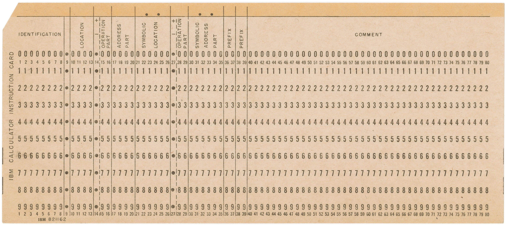

# EXTRAS 

## Day 01

## Day 02

## Day 03

## Day 04

## Day 05

**Fun fact:** Did you know that early computers used punch cards to accept program instructions and code? In the photograph below you can see one such punch card for the [IBM 701](https://en.wikipedia.org/wiki/IBM_701) mainframe computer. As you can see, along with the `operation`, `address`, `location` and other sections, there's also a section devoted to comments which most of the times was intended to be read by the punch card operator. This is the early history of comments in code. 

_([Source](https://homepage.divms.uiowa.edu/~jones/cards/collection/821162IBM701code.jpg))_

