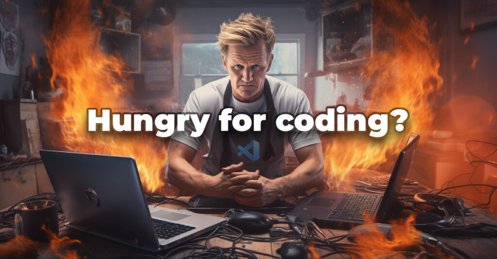

# Web Development X - 180°

## Overview 

  The `Intechgration.io` WDX curriculum consists of several lessons spread over 9 months, covering concepts such as the Internet, World Wide Web, HTML, CSS, JavaScript, Node.js, React and more.

  This course will guide and support students towards the following goals:

  - Gain a firm understanding of computing and basic computer science concepts
  - Understand how the Internet and the Web are working
  - Learn how web clients and web servers work
  - Build websites using web technologies such as HTML, CSS and JavaScript
  - Become frontend developers
  - Get to know how to develop backend web applications
  - Work and interact with databases
  - Get a basic introduction to AI and Machine Learning
  - Become responsible and ethical professionals 

## Tracking your progress

  Once you've joined the course and forked this repository, you'll be tracking your progress by updating several CSV files _(found under your personal `user/` directory)_. You will be evaluating (and re-evaluating) your level of knowledge for each particular concept and self-assess your skills throughout the course. You will be sharing your progress with your instructor(s) and/or mentor(s).

## Syllabus

### Beginner: WDX 60°

  - [**Week 01**: Basics of Computing, How the Internet & the World Wide Web works, intro to HTML, CSS and JavaScript](week01/index.md)
  - [**Week 02**: HTML, Accessibility & Git](week02/index.md)
  - [**Week 03**: CSS, Accessibility & more Git](week03/index.md)
  - [**Week 04**: CSS 2 & Performance](week04/index.md)
  - [**Week 05**: CSS Frameworks](week05/index.md)
  - [**Week 06**: JavaScript Core 1](#) _(🔒 Stay tuned! This module is on the way.)_
  - [**Week 07**: JavaScript Core 2](#) _(🔒 Stay tuned! This module is on the way.)_
  - [**Week 08**: JavaScript Core 3](#) _(🔒 Stay tuned! This module is on the way.)_
  - [**Week 09**: Web APIs 1: DOM, Events, Asynchronous Programming & Ajax](#) _(🔒 Stay tuned! This module is on the way.)_
  - [**Week 10**: Web APIs 2: Promises, JSON, Fetch API, Web Storage, Media, Drag and Drop](#) _(🔒 Stay tuned! This module is on the way.)_
  - [**Week 11**: Functional Programming 1, Clean Code & Testing](#) _(🔒 Stay tuned! This module is on the way.)_
  - [**Week 12**: Templating, JavaScript Frameworks & Git Workflow](#) _(🔒 Stay tuned! This module is on the way.)_

### Intermediate: WDX 120°

  - [**Week 13**: JavaScript Intermediate 1 & Git](#) _(🔒 Stay tuned! This module is on the way.)_
  - [**Week 14**: Data Structures](#) _(🔒 Stay tuned! This module is on the way.)_
  - [**Week 15**: Algorithms](#) _(🔒 Stay tuned! This module is on the way.)_
  - [**Week 16**: Web APIs 3: Geolocation, Canvas, Audio API, Web Workers & more](#) _(🔒 Stay tuned! This module is on the way.)_
  - [**Week 17**: JavaScript Intermediate 2: Software Patterns & TypeScript](#) _(🔒 Stay tuned! This module is on the way.)_
  - [**Week 18**: Node.js 1](#) _(🔒 Stay tuned! This module is on the way.)_
  - [**Week 19**: Node.js 2, NoSQL Databases & Docker](#) _(🔒 Stay tuned! This module is on the way.)_
  - [**Week 20**: React 1](#) _(🔒 Stay tuned! This module is on the way.)_
  - [**Week 21**: React 2, Firebase](#) _(🔒 Stay tuned! This module is on the way.)_
  - [**Week 22**: React 3, Redux & Tech Interview](#) _(🔒 Stay tuned! This module is on the way.)_
  - [**Week 23**: Group Project, Tech Interview & Job Hunt](#) _(🔒 Stay tuned! This module is on the way.)_
  - [**Week 24**: Group Project](#) _(🔒 Stay tuned! This module is on the way.)_

### Advanced: WDX 180°

  - [**Week 25**: JavaScript Advanced 1](#) _(🔒 Stay tuned! This module is on the way.)_
  - [**Week 26**: JavaScript Advanced 2, TypeScript Advanced](#) _(🔒 Stay tuned! This module is on the way.)_
  - [**Week 27**: Node.js 3 & Relational Databases](#) _(🔒 Stay tuned! This module is on the way.)_
  - [**Week 28**: Express.js, REST APIs & GraphQL](#) _(🔒 Stay tuned! This module is on the way.)_
  - [**Week 29**: Thinking out-of-the-box: CLI, Browser Extensions & ElectronJS](#) _(🔒 Stay tuned! This module is on the way.)_
  - [**Week 30**: Functional Programming 2, Software Principles & Reading Academic Papers](#) _(🔒 Stay tuned! This module is on the way.)_
  - [**Week 31**: Content Management Systems, WordPress, Eleventy & Serverless Architecture](#) _(🔒 Stay tuned! This module is on the way.)_
  - [**Week 32**: Introduction to AI, Machine Learning & Tensorflow.js](#) _(🔒 Stay tuned! This module is on the way.)_
  - [**Week 33**: Introduction to Data Science & Danfo.js](#) _(🔒 Stay tuned! This module is on the way.)_
  - [**Week 34**: Blockchain & Web3](#) _(🔒 Stay tuned! This module is on the way.)_
  - [**Week 35**: Solo Project](#) _(🔒 Stay tuned! This module is on the way.)_
  - [**Week 36**: Solo Project](#) _(🔒 Stay tuned! This module is on the way.)_
  - [**The Road Ahead**](#) _(🔒 Stay tuned! This module is on the way.)_

---

