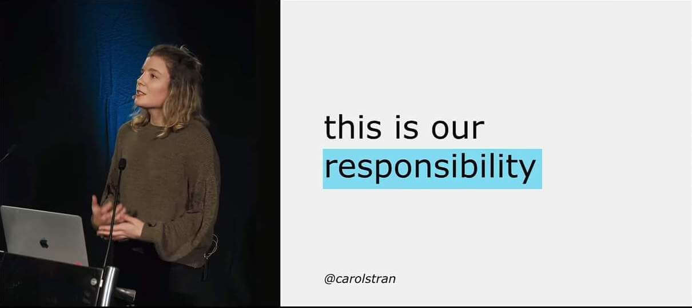

# Accessibility

Learning some HTML, CSS, and JavaScript is useful if you want to become a web developer. Beyond mechanical use, it's important to learn how to use these technologies **responsibly** so that all readers might use your creations on the web. To help you achieve this, this module will cover general best practices (which are demonstrated throughout the HTML, CSS and JavaScript topics), [cross browser testing](https://developer.mozilla.org/en-US/docs/Learn/Tools_and_testing/Cross_browser_testing){:target="_blank"}, and some tips on enforcing accessibility from the start. We'll cover accessibility in special detail. This is probably the **most important aspect of web development**.

Before moving forward, some important facts about disabilities and some disturbing facts about the state of the Web:

> "More than **1 billion**" of the world's population are estimated to live with some form of disability. **110 million** have very highly significant difficulties in functioning."

> "In 2021, out of 1 million websites tested, 97.4% home pages had detectable accessibility failures." ~ Source: WebAIM

Let these facts be a constant reminder for our responsibility and ethical obligations as Web developers.

## Overview

When building `User Interfaces` with Frontend technologies such as HTML, CSS and JavaScript, developers must strive for usability and accessibility. 

According to [W3C](https://www.w3.org/WAI/fundamentals/accessibility-intro/), _"Web accessibility means that websites, tools, and technologies are designed and developed so that people with disabilities can use them."_

Web accessibility also benefits people without disabilities, for example:

- People using mobile phones, smart watches, smart TVs, and other devices with small screens, different input modes, etc.

- Older people with changing abilities due to ageing

- People with “temporary disabilities” such as a broken arm or lost glasses

- People with “situational limitations” such as in bright sunlight or in an environment where they cannot listen to audio

- People using a slow Internet connection, or who have limited or expensive bandwidth

_"Making the web accessible benefits individuals, businesses, and society. International web standards define what is needed for accessibility."_

When someone describes a site as "accessible", they mean that any user can use all its features and content, regardless of how the user accesses the web — even and especially users with physical or mental impairments.

- Sites should be accessible to keyboard, mouse, and touch screen users, and any other way users access the web, including screen readers and voice assistants like Alexa and Google Home.
- Applications should be understandable and usable by people regardless of auditory, visual, physical, or cognitive abilities.
- Sites should also not cause harm: web features like motion can cause migraines or epileptic seizures.

- Watch the [**The Internet's Accessibility Problem — and How To Fix It**](https://www.youtube.com/watch?v=QWPWgaDqbZI){:target="_blank"} TED talk by Clive Loseby to understand how serious the problem of accessible Web is.

There are good news also. **By default, HTML is accessible, if used correctly.** Web accessibility involves ensuring that content remains accessible, regardless of who and how the web is accessed.

The Browser Accessibility developer tools (like for example the Firefox Accessibility Inspector or the Chrome DevTools Accessibility panel) are very useful tools for checking out accessibility issues on web pages. The following video provides a nice introduction to the Firefox Accessibility Inspector:

- [Watch: **Understand Website Accessibility with the Firefox Accessibility Inspector**](https://www.youtube.com/watch?v=7mqqgIxX_NU)
  - Description: When building a website, understanding what's happening with accessibility can help you make certain your site can be used by everyone. Firefox DevTools now has a new Accessibility Inspector that shows an outline of the accessibility tree, and lists problems with contrast or missing labels, and much more. Jen Simmons gives you a tour.
  - Duration: 8min

- [Watch: **Which airline apps fail blind people? - Which?**](https://www.youtube.com/watch?v=TUfM2IeZp54) to understand more about why Accessibility matters and why your responsibility as a web developer is crucial to the well-being of other human beings.

- [Read: **What is accessibility?**](https://developer.mozilla.org/en-US/docs/Learn/Accessibility/What_is_accessibility){:target="_blank"}
  - Description: This article starts off the module with a good look at what accessibility is — this includes what groups of people we need to consider and why, what tools different people use to interact with the web, and how we can make accessibility part of our web development workflow.

- [HTML: A good basis for accessibility](https://developer.mozilla.org/en-US/docs/Learn/Accessibility/HTML){:target="_blank"}
  - Description: A great deal of web content can be made accessible just by making sure the correct HTML elements are always used for the correct purpose. This article looks in detail at how HTML can be used to ensure maximum accessibility.

- Watch as many lessons as you can from the [Start Building Accessible Web Applications Today](https://egghead.io/courses/start-building-accessible-web-applications-today){:target="_blank"} excellent excellent series of video tutorials by Marcy Sutton.

**See also:**

Check out the following resources and make sure to cover the material included in there as you progress in this course and your web development journey:

- [Deque University resources](https://dequeuniversity.com/resources/){:target="_blank"} — includes code examples, screen reader references, and other useful resources.

- [WebAIM resources](https://webaim.org/resources/){:target="_blank"} — includes guides, checklists, tools, and more.

- [Web Accessibility Evaluation Tools List](https://www.w3.org/WAI/ER/tools/){:target="_blank"} — includes a list of web accessibility evaluation tools.
