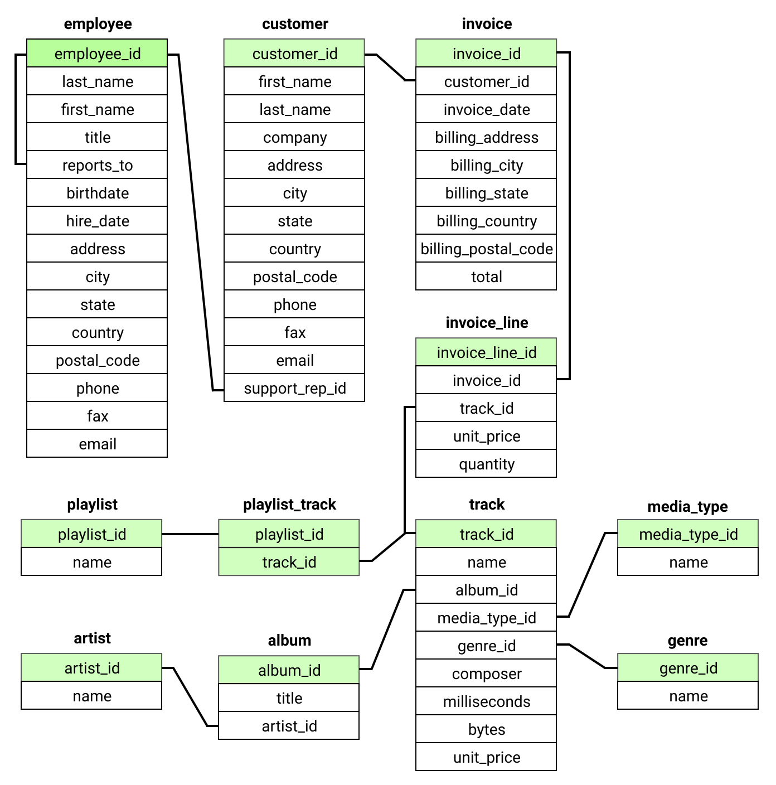
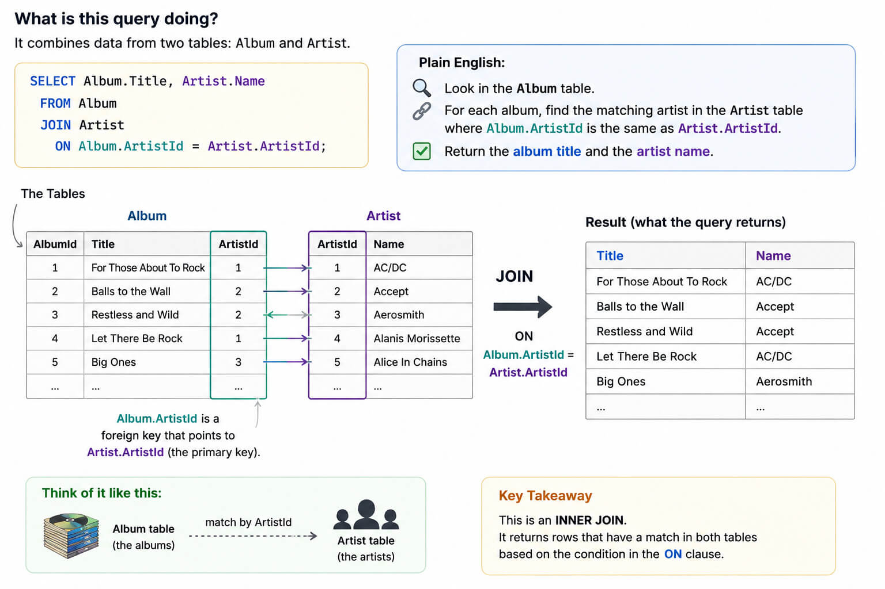
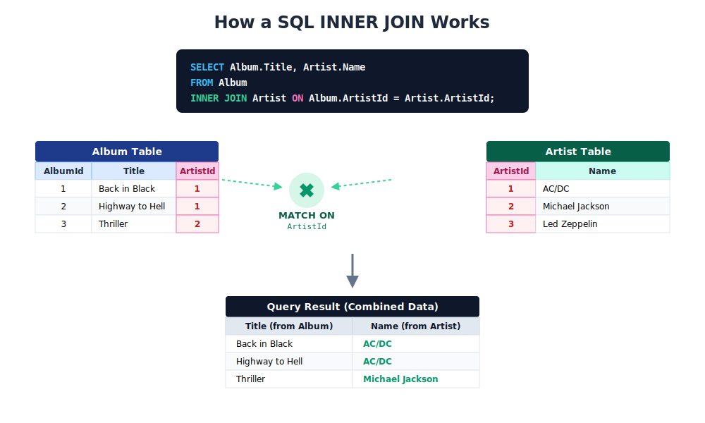

# Introduction to SQL (via SQLite)


## The Chinook Database Challenge

  In this module you are going to explore SQL by querying
  an SQLite database called `Chinook`.

  [Chinook](https://github.com/lerocha/chinook-database/) is a sample database that contains a digital media store, including tables for artists, albums, media tracks, invoices and customers.

  This guide will provide:

  - A realistic workplace story
  - Progressive SQL challenges (easy-to-hard)
  - Explanations for every concept
  - Practical business-style queries
  - Various SQL concepts: joins, grouping, aggregation, sorting, filtering
  - A proper initiation ritual into databases

## Getting started

  1. Download the `Chinook` Database [here](https://raw.githubusercontent.com/in-tech-gration/WDX-180/refs/heads/main/curriculum/modules/backend/databases/sql/sqlite/Chinook_Sqlite.sql)
  2. Open [SQLime](https://sqlime.org) in your Browser (or in VSCode's integrated browser)
  3. Import the `Chinook` database file into `SQLime` by clicking on `open file`.
  4. Follow the step-by-step guide below

## Welcome to Chinook Records

  You just got hired as a junior developer at **Chinook Records**, a digital music store.

  Your boss, Elena, has exactly three moods:

  1. Coffee
  2. SQL
  3. Panic

  Today she walks into the office holding a spreadsheet like it personally insulted her family.

  > “The reporting dashboard is broken! Marketing wants customer stats, finance wants revenue reports, and somehow nobody knows which artists actually make money. Welcome to the team.”

  Congratulations.
  You are now the person between civilization and 47 Excel files named:

  ```text
  final_v2_REAL_final_USE_THIS.xlsx
  ```

  Your mission is to learn SQLite by solving real business problems using the Chinook database.

## Database Overview

  The Chinook database contains these important tables:

  | Table       | Purpose                          |
  | ----------- | -------------------------------- |
  | Artist      | Music artists                    |
  | Album       | Albums created by artists        |
  | Track       | Individual songs                 |
  | Customer    | Customers of the store           |
  | Invoice     | Customer purchases               |
  | InvoiceLine | Individual items inside invoices |
  | Genre       | Music genres                     |
  | Employee    | Employees                        |
  | Playlist    | Music playlists                  |

  Click on the diagrams below to see a full-size visual overview of the table schemas and relations.

  [](./assets/chinook-schema.svg){:target="_blank"}

  [](./assets/chinook.data.model.png){:target="_blank"}

## Understanding Relationships

  ```text
  Artist
    -> Album
        -> Track

  Customer
    -> Invoice
        -> InvoiceLine
            -> Track
  ```

  This is the core idea of relational databases.

  Instead of storing everything in one giant horrifying mega-table from the depths of corporate despair:

  ```text
  customer_name | customer_country | artist_name | album_name | song_name | genre | invoice_total
  ```

  …the data is normalized into separate related tables.

  SQL then reconnects them using JOINs.

  Which is elegant.

  😜 Until somebody forgets a WHERE clause and accidentally returns 14 million rows. 

## LESSON 1 — Reading Data

  **Scenario**

  Elena asks:

  > “Can you show me all artists in the database?”

  This is your first SQL query.

  **Query**

  ```sql
  SELECT * FROM Artist;
  ```

  **Explanation**

  - `SELECT`      -> Chooses columns.
  - `*`           -> Means “all columns”.
  - `FROM Artist` -> Reads data from the Artist table.

  **Challenges:**

  - Show all albums.
  - Show the total count of artists and albums:

## LESSON 1 — Reading Data (SOLUTIONS)

  **Challenge**

  Show all albums.

  **Solution**

  ```sql
  SELECT * FROM Album;
  ```

  **Challenge**

  Show the total count of artists and albums:

  `SELECT COUNT(*) FROM Artist`
  `SELECT COUNT(*) as TotalArtists FROM Artist`

  `SELECT COUNT(*) FROM Album`
  `SELECT COUNT(*) as TotalAlbums FROM Album`

## LESSON 2 — Selecting Specific Columns

  **Scenario**

  Your boss says:

  > “I do NOT need every column. I’m not printing the database onto papyrus.”

  You only want artist names.

  **Query**

  ```sql
  SELECT Name FROM Artist;
  ```

  **Explanation**

  Instead of using `*`, we explicitly request only the columns we need.

  This is faster, cleaner, and avoids sending unnecessary data.

  Production systems love this.

  Cloud bills also love this.

  **Challenge**

  Show:

  * Album title
  * Artist ID

  from the Album table.

## LESSON 2 — Selecting Specific Columns (SOLUTIONS)

  **Challenge**

  Show:

  * Album title
  * Artist ID

  from the Album table.

  **Solution**

  ```sql
  SELECT Title, ArtistId
  FROM Album;
  ```

## LESSON 3 — Filtering Rows with WHERE

  **Scenario**

  Marketing wants all customers from Brazil.

  Apparently Brazil buys a lot of Iron Maiden.

  Reasonable.

  **Query**

  ```sql
  SELECT * FROM Customer WHERE Country = 'Brazil';
  ```

  ⚠️ Watch out for "double" quotes.

  **Explanation**

  - `WHERE` -> Filters rows. Only rows matching the condition are returned.

  **More Examples**

  ```sql
  SELECT *
  FROM Track
  WHERE Milliseconds > 300000;
  ```

  Songs longer than 5 minutes.

  Invoices worth at least $10.

  ```sql
  SELECT *
  FROM Invoice
  WHERE Total >= 10;
  ```

## LESSON 4 — Sorting Results

  **Scenario**

  Finance wants the biggest invoices first.

  Because humans enjoy sorting money from largest to smallest.

  **Query**

  ```sql
  SELECT InvoiceId, Total
  FROM Invoice
  ORDER BY Total DESC;
  ```

  **Explanation**

  - `ORDER BY` -> Sorts results.
  - `DESC` -> Descending order. Largest values first.
  - `ASC` -> Ascending order. Smallest values first.

  **Challenge**

  Show customers ordered alphabetically by last name.

## LESSON 4 — Sorting Results (SOLUTIONS)

  **Challenge**

  Show customers ordered alphabetically by last name.

  **Solution**

  ```sql
  SELECT FirstName, LastName
  FROM Customer
  ORDER BY LastName ASC;
  ```

## LESSON 5 — Limiting Results

  **Scenario**

  Your terminal now prints 400 rows.

  Your laptop fan sounds like a helicopter preparing for takeoff.

  You only need a preview.

  **Query**

  ```sql
  SELECT *
  FROM Track
  LIMIT 5;
  ```

  **Explanation**

  - `LIMIT` -> Restricts the number of returned rows. Very useful during development. 

## LESSON 6 — Understanding JOINs

  **Scenario**

  Elena asks:

  > “Show me albums with their artist names.”

  Problem:

  * Album table has `ArtistId`
  * Artist table has the actual artist name

  We need a JOIN.

  **Query**

  ```sql
  SELECT Album.Title, Artist.Name
  FROM Album
  JOIN Artist
    ON Album.ArtistId = Artist.ArtistId;
  ```

  **Explanation**

  - `JOIN` -> Combines related tables.
  - `ON` -> Defines how rows are matched.

  This:

  ```text
  Album.ArtistId = Artist.ArtistId
  ```

  connects albums to artists.

  This is the heart of relational databases.

  Without joins, databases are just emotionally unavailable spreadsheets.

  Click on the diagrams below to see a visual explanation of `INNER JOINS`:

  [](./assets/SQL.INNER.JOIN.jpg){:target="_blank"}    

  [](./assets/SQL.JOIN.svg){:target="_blank"}    

  **Order Matters**

  Here is an ordered list to remind you about the correct command placement:

  - `SELECT`    -> what to show
  - `FROM`      -> starting table
  - `JOIN`      -> attach tables
  - `ON`        -> matching rule
  - `WHERE`     -> filter rows
  - `GROUP BY`  -> make groups
  - `HAVING`    -> filter groups
  - `ORDER BY`  -> sort
  - `LIMIT`     -> reduce output

  **Challenge**

  Show:

  * Track name
  * Album title

  **Solution**

  ```sql
  SELECT Track.Name, Album.Title
  FROM Track
  JOIN Album
    ON Track.AlbumId = Album.AlbumId;
  ```

## LESSON 6 — Understanding JOINs (SOLUTIONS)

  **Challenge**

  Show:

  * Track name
  * Album title

  **Solution**

  ```sql
  SELECT Track.Name, Album.Title
  FROM Track
  JOIN Album
    ON Track.AlbumId = Album.AlbumId;
  ```

## LESSON 7 — Aggregations

  **Scenario**

  Finance asks:

  > “How much money have we made in total?”

  Now we use aggregate functions.

  **Query**

  ```sql
  SELECT SUM(Total)
  FROM Invoice;
  ```

  **Explanation**

  - `SUM()` -> Adds values together.

  **Other Aggregates**

  ```sql
  SELECT COUNT(*) FROM Customer;
  ```

  Counts rows.

  ```sql
  SELECT AVG(Total) FROM Invoice;
  ```

  Average invoice total.

  ```sql
  SELECT MAX(Total) FROM Invoice;
  SELECT MIN(Total) FROM Invoice;
  ```

  Largest and smallest invoice.

## LESSON 8 — GROUP BY

  **Scenario**

  Marketing asks:

  > “Which countries generate the most customers?”

  This is where SQL becomes genuinely powerful.

  **Query**

  ```sql
  SELECT Country, COUNT(*) AS CustomerCount
  FROM Customer
  GROUP BY Country
  ORDER BY CustomerCount DESC;
  ```

  **Explanation**

  - `GROUP BY` -> Creates groups. Instead of counting all rows together, SQL counts rows inside each country.

  **Result Example**

  ```text
  USA        13
  Canada      8
  Brazil      5
  ```

  **Challenge**

  Which countries generate the most money?

  ```sql
  SELECT BillingCountry, SUM(Total) as CountryTotal 
  FROM Invoice 
  GROUP BY BillingCountry 
  ORDER BY CountryTotal DESC;
  ```

  Which countries generate the most invoices?

  ```sql
  SELECT BillingCountry as Country, COUNT(*) as TotalInvoices 
  FROM Invoice 
  GROUP BY Country 
  ORDER BY TotalInvoices DESC;
  ```

## LESSON 09 — Finding Top Customers

  **Scenario:** Sales wants VIP customers. Who spends the most money?

  **Query**

  ```sql
  SELECT
    Customer.FirstName,
    Customer.LastName,
    SUM(Invoice.Total) AS TotalSpent
  FROM Customer
  JOIN Invoice
    ON Customer.CustomerId = Invoice.CustomerId
  GROUP BY Customer.CustomerId
  ORDER BY TotalSpent DESC
  LIMIT 10;
  ```

  **Explanation**

  We:

  1. Join customers to invoices
  2. Sum invoice totals
  3. Group per customer
  4. Sort descending
  5. Keep top 10

  Classic business analytics.

## LESSON 10 — Multi-Table Business Query

  **Scenario:** The CEO walks in. Which is never good. He asks:

  > “Which artists generate the most revenue?”

  Now we combine:

  * joins
  * aggregations
  * grouping
  * ordering

  This is real reporting SQL.

  **Query**

  ```sql
  SELECT
    Artist.Name,
    SUM(InvoiceLine.UnitPrice * InvoiceLine.Quantity) AS Revenue
  FROM InvoiceLine
  JOIN Track
    ON InvoiceLine.TrackId = Track.TrackId
  JOIN Album
    ON Track.AlbumId = Album.AlbumId
  JOIN Artist
    ON Album.ArtistId = Artist.ArtistId
  GROUP BY Artist.Name
  ORDER BY Revenue DESC;
  ```

  **Explanation**

  We travel through the relationships:

  ```text
  InvoiceLine
    -> Track
        -> Album
            -> Artist
  ```

  Then calculate revenue:

  ```sql
  UnitPrice * Quantity
  ```

  Then sum it per artist. This is how dashboards, analytics systems, and reporting backends work. Just with more meetings and worse coffee.

## References & Resources

  - [Chinook Database](https://github.com/lerocha/chinook-database){:target="_blank"}

  - Installing SQLite on your machine:
    - macOS: `brew install sqlite`
    - Ubuntu: `sudo apt install sqlite3`
    - Verify Installation. Open terminal and type `sqlite3 --version`
  - Opening the Database: `sqlite3 Chinook_Sqlite.sql`
  - Useful commands:
    - Show tables: `.tables`
    - Show table structure: `.schema Artist`
    - Make output readable: `.headers on` and `.mode column`

  - [Answering Business Questions Using SQL](https://sandrajurela.com/posts/answering-business-questions-using-sql/chinook.html){:target="_blank"}

  - Have fun exploring the [Netflix Sample Database](https://github.com/lerocha/netflixdb/releases){:target="_blank"}

---

Generated by `ChatGPT`. Illustrations generated by `ChatGPT` and `Google Gemini`. Curated by Kostas Minaidis.