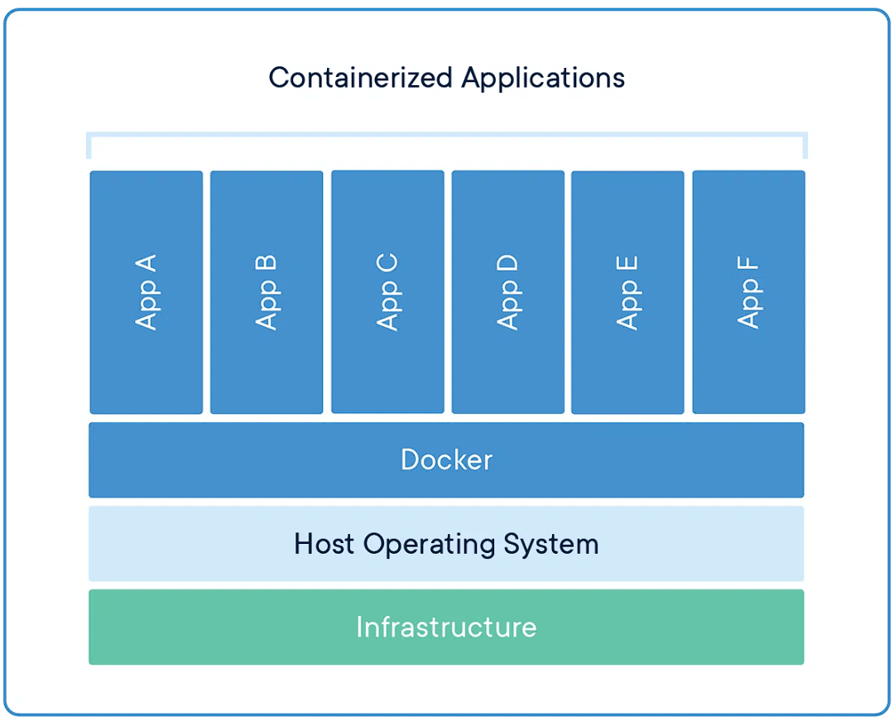
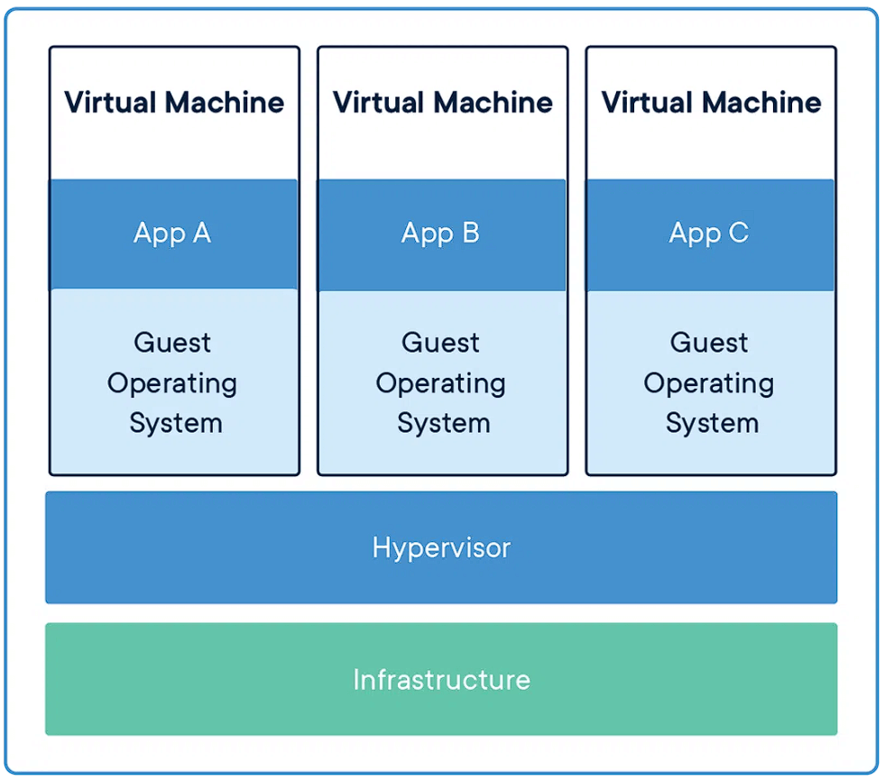
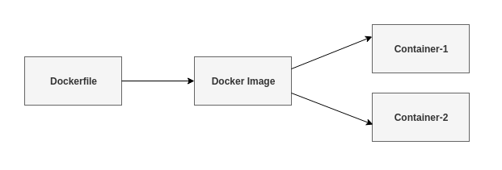
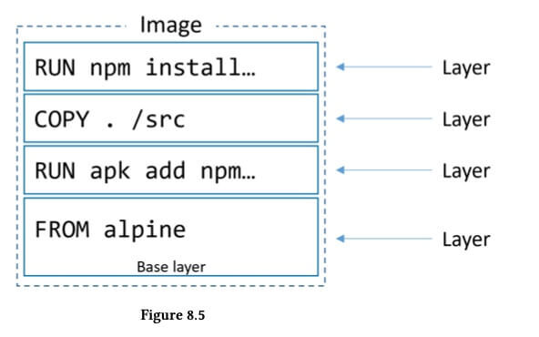
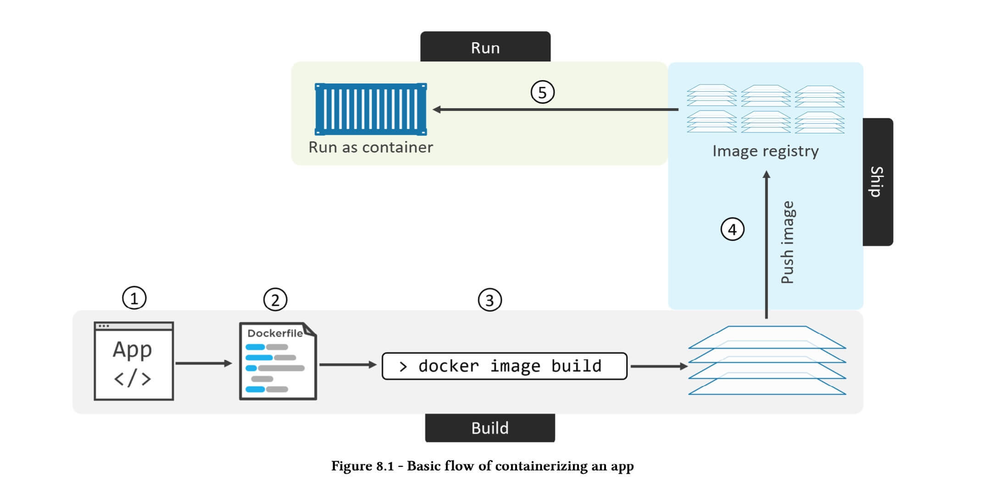

# Containers and Docker

_(Updated: 28/08/2023)_

## What is a container?

A container is a standard unit of software that packages up code and all its dependencies so the application runs quickly and reliably from one computing environment to another. This method is called containerization and allows development teams to move fast, deploy software efficiently, and operate at an unprecedented scale. Containers make it easy to share CPU, memory, storage, and network resources at the operating systems level and offer a logical packaging mechanism in which applications can be abstracted from the environment in which they actually run.

### What are the benefits of containers?

- Separation of responsibility

Containerization provides a clear separation of responsibility, as developers focus on application logic and dependencies, while IT operations teams can focus on deployment and management instead of application details such as specific software versions and configurations.

- Workload portability

Containers can run virtually anywhere, greatly easing development and deployment: on Linux, Windows, and Mac operating systems; on virtual machines or on physical servers; on a developer’s machine or in data centers on-premises; and of course, in the public cloud. 

- Application isolation

Containers virtualize CPU, memory, storage, and network resources at the operating system level, providing developers with a view of the OS logically isolated from other applications.

_(Source: [What are the benefits of containers](https://cloud.google.com/learn/what-are-containers#section-3){:target="_blank"})_

### Comparing Containers and Virtual Machines

Containers and virtual machines have similar resource isolation and allocation benefits, but function differently because containers virtualize the operating system instead of hardware. Containers are more portable and efficient.

**Containers**

Containers are an abstraction at the app layer that packages code and dependencies together. Multiple containers can run on the same machine and share the OS kernel with other containers, each running as isolated processes in user space. Containers take up less space than VMs (container images are typically tens of MBs in size), can handle more applications and require fewer VMs and Operating systems.

**Virtual Machines**

Virtual machines (VMs) are an abstraction of physical hardware turning one server into many servers. The hypervisor allows multiple VMs to run on a single machine. Each VM includes a full copy of an operating system, the application, necessary binaries and libraries – taking up tens of GBs. VMs can also be slow to boot.

_(Source: [What is a container?](https://www.docker.com/resources/what-container/){:target="_blank"})_

## What is Docker?

Docker is an open platform for developing, shipping, and running applications.

Docker allows you to separate your applications from your infrastructure so you can deliver software quickly. With Docker, you can manage your infrastructure in the same ways you manage your applications.

By taking advantage of Docker’s methodologies for shipping, testing, and deploying code quickly, you can significantly reduce the delay between writing code and running it in production.

### Why use Docker?

Docker is so popular today that “Docker” and “containers” are used interchangeably. But the first container-related technologies were available for years, even decades, before Docker was released to the public in 2013. 

Most notably, in 2008, LinuXContainers (LXC) was implemented in the Linux kernel, fully enabling virtualization for a single instance of Linux. While LXC is still used today, newer technologies using the Linux kernel are available. Ubuntu, a modern, open-source Linux operating system, also provides this capability. 

Docker lets developers access these native containerization capabilities using simple commands, and automate them through a work-saving application programming interface (API). Compared to LXC, Docker offers:

**Improved and seamless container portability**: While LXC containers often reference machine-specific configurations, Docker containers run without modification across any desktop, data center and cloud environment.

**Even lighter weight and more granular updates**: With LXC, multiple processes can be combined within a single container. This makes it possible to build an application that can continue running while one of its parts is taken down for an update or repair. 

**Automated container creation**: Docker can automatically build a container based on application source code. 

**Container versioning**: Docker can track versions of a container image, roll back to previous versions, and trace who built a version and how. It can even upload only the deltas between an existing version and a new one. 

**Container reuse**: Existing containers can be used as base images—essentially like templates for building new containers. 

**Shared container libraries**: Developers can access an open-source registry containing thousands of user-contributed containers.

Today Docker containerization also works with Microsoft Windows and Apple MacOS. Developers can run Docker containers on any operating system, and most leading cloud providers, including Amazon Web Services (AWS), Microsoft Azure, and IBM Cloud offer specific services to help developers build, deploy and run applications containerized with Docker.

_(Source: [Why use Docker?](https://www.ibm.com/topics/docker#Why+use+Docker%3F){:target="_blank"})_

## What are Docker Images and the Dockerfile?

Now that you have a good grasp of what a container is, it's time to dig deeper and start learning about Docker Images!

Docker images contain executable application source code as well as all the tools, libraries, and dependencies that the application code needs to run as a container. When you run the Docker image, it becomes one instance (or multiple instances) of the container. 

It’s possible to build a Docker image from scratch, but most developers pull them down from common repositories. Multiple Docker images can be created from a single base image, and they’ll share the commonalities of their stack. 

Docker images are made up of layers, and each layer corresponds to a version of the image. Whenever a developer makes changes to the image, a new top layer is created, and this top layer replaces the previous top layer as the current version of the image. Previous layers are saved for rollbacks or to be re-used in other projects.

Each time a container is created from a Docker image, yet another new layer called the container layer is created. Changes made to the container—such as the addition or deletion of files—are saved to the container layer only and exist only while the container is running. This iterative image-creation process enables increased overall efficiency since multiple live container instances can run from just a single base image, and when they do so, they leverage a common stack.

But how can we create an image? How do we specify all the tools, libraries and dependencies of our application? Here is where the Dockerfile comes into play.

Every Docker container starts with a simple text file containing instructions for how to build the Docker container image. DockerFile automates the process of Docker image creation. It’s essentially a list of command-line interface (CLI) instructions that Docker Engine will run in order to assemble the image. The list of Docker commands is huge, but standardized: Docker operations work the same regardless of contents, infrastructure, or other environment variables.

_(Source: [Docker tools and terms](https://www.ibm.com/topics/docker#Docker+tools+and+terms){:target="_blank"})_

## What is the Docker Engine and Docker Registry?

### Docker Engine

The Docker Engine is the core of the Docker platform. It manages the creation, deployment, and execution of Docker containers. It interfaces with the host operating system to manage container processes and resources. Some of its key components are:

1. The **Docker Daemon** is a background service that runs on the host system. It's responsible for managing Docker containers and images.
2. The **Docker CLI** is a command-line tool that allows users to interact with the Docker Daemon.
3. **Docker Volumes** are a way to persist data generated by and used by containers.
4. Docker provides **Networking** capabilities that allow containers to communicate with each other and the external world.
5. Docker manages the **State and Lifecycle** of containers and ensures that containers are isolated from each other and from the host system, providing security and resource management.
6. **Resource Management**: Docker Engine manages the allocation and utilization of resources like CPU and memory for containers.

### Docker Registry

A Docker Registry is a central repository that stores Docker images, making them available for distribution and sharing across different systems and environments. It plays a crucial role in the Docker ecosystem, allowing developers to publish, share, and retrieve container images easily. The most well-known Docker registry is Docker Hub, but you can also set up private registries for added control and security.

## How to set up Docker on your machine

As mentioned before, Docker has been very popular over the past few years. There are a lot of guides and tutorials on how to set up Docker on your machine, but there is nothing better than the Official Documentation of Docker Desktop.

So, without any hesitation, visit the [following link](https://docs.docker.com/desktop/){:target="_blank"} and in less than 5 minutes you'll have successfully installed Docker Desktop!

After the installation finishes and you open Docker Desktop, you will be prompted to sign in with your Docker Hub account. Think of Docker Hub just like GitHub, but instead you can pull Docker Images from various users and foundations or even push your own straight to your profile. An extremely useful service that every developer uses nowadays!

<!-- TODO: Make sure to change NodeJS link with another since it's not found -->
## How to 'Dockerize' your first NodeJS app

Since you are familiar with NodeJS, why shouldn't you try and 'dockerize' a simple NodeJS app to put everything you've learned up until now to use and test your skills?

As mentioned before, there is no better source than the Official Documentation to follow for any tool you come across. Of course, NodeJS has a very detailed guide on how to dockerize a NodeJS app and will show you the basics and get you ready for applying them to any other project you like!

[Click here](https://nodejs.org/en/docs/guides/nodejs-docker-webapp){:target="_blank"} and start getting your hands dirty with Docker and NodeJS!

### Sources and Attributions

- [What is a container? | Docker](https://www.docker.com/resources/what-container/){:target="_blank"}
- [What are containers? | Google Cloud](https://cloud.google.com/learn/what-are-containers){:target="_blank"}
- [What is Docker? | IBM](https://www.ibm.com/topics/docker){:target="_blank"}
- [Overview of Docker Desktop](https://docs.docker.com/desktop/){:target="_blank"}
- [Dockerizing a Node.js web app](https://nodejs.org/en/docs/guides/nodejs-docker-webapp){:target="_blank"}
