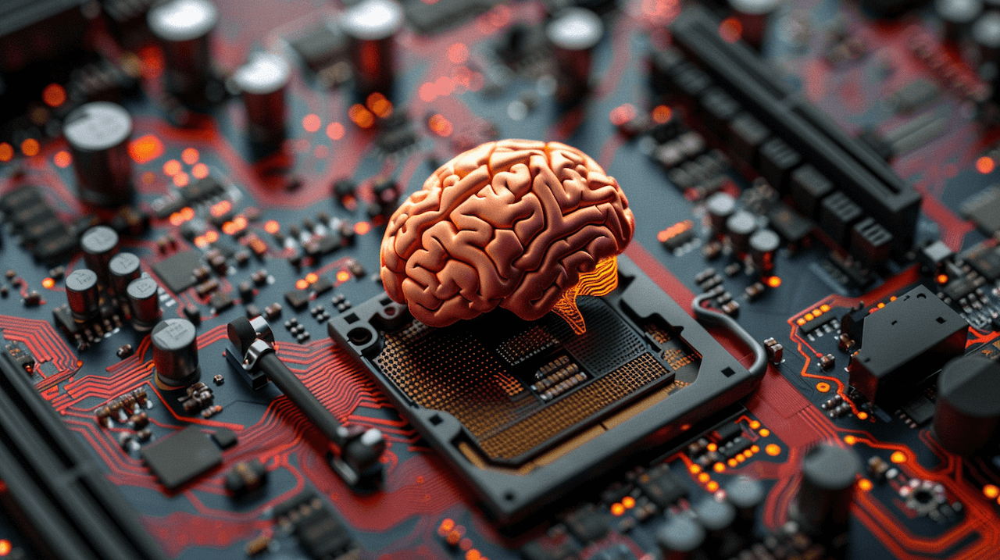
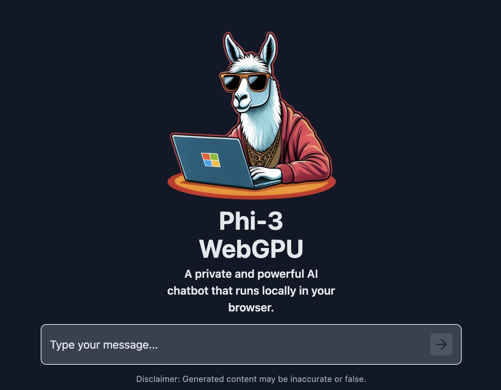

<!-- ### Schedule

  - [Study](#study-plan-NN)
  - [Exercises](#exercises-NN)
  - [Extra Resources](#extra-resources-NN) -->

### Study Plan

  **What is a `Large Language Model` (or LLM for short)?**

  > "Large language models are AI systems that are designed to process and analyze vast amounts of natural language data and then use that information to generate responses to user prompts." 
  
  > "These systems are trained on massive data sets using advanced machine learning algorithms to learn the patterns and structures of human language, and are capable of generating natural language responses to a wide range of written inputs. Large language models are becoming increasingly important in a variety of applications such as natural language processing, sentiment analysis, chatbots and virtual assistants, machine translation, code and text generation, and more."

  <small>_Source: [A Compact Guide to Large Language Models](https://www.databricks.com/sites/default/files/2023-06/compact-guide-to-large-language-models.pdf)_</small>

  Go through the following material to learn more about LLMs and get a basic understanding of what an LLM is and how it works:

  - [What are Large Language Models (LLMs)?](https://www.youtube.com/watch?v=iR2O2GPbB0E){:target="_blank"} (YouTube: 6min)

  <iframe width="100%" height="480" src="https://www.youtube.com/embed/iR2O2GPbB0E" title="YouTube video player" frameborder="0" allow="accelerometer; autoplay; clipboard-write; encrypted-media; gyroscope; picture-in-picture; web-share" allowfullscreen></iframe>

  - [Introduction to Large Language Models (LLMs)](https://www.youtube.com/watch?v=ibr5wmtinG0){:target="_blank"} (YouTube: 8min)

  - [How does ChatGPT work? Explained by Deep-Fake Ryan Gosling.](https://www.youtube.com/watch?v=xU_MFS_ACrU){:target="_blank"} (YouTube: 9min)

  - [LLM Explained \| What is LLM](https://www.youtube.com/watch?v=67_aMPDk2zw){:target="_blank"} (YouTube: 4min)

  - Last, but not least, download and read the [Compact Guide to Large Language Models](https://pages.databricks.com/rs/094-YMS-629/images/compact-guide-to-large-language-models.pdf){:target="_blank"} eBook by `DataBricks`.
  - If the link is not available, you can download the eBook from [this page](https://www.databricks.com/resources/ebook/tap-full-potential-llm){:target="_blank"}

  **Why not let an LLM explain what an LLM is?**

  {:target="_blank"}

  Visit [this page](../experimental-phi3-webgpu/index.html){:target="_blank"}, load the `Phi3` LLM model (**warning it's going to download around 2.4GB on your machine**, but this is a one-time only thing) and start asking questions. For example, you can ask:

  > **Phi-3** is a family of Language Models created and maintained by Microsoft. They are available for use through various platforms and tools, such as Microsoft Azure AI Studio, Hugging Face, Ollama and other. They come is all sorts of sizes and flavours: mini, small, medium, vision for general visual reasoning tasks and more. The Phi-3 models can run on the cloud but can also be downloaded and run directly on the device and they can run on GPU or CPU. They belong to a family of Language Models known as SLM (Small Language Models) due to their size and number of parameters and support 20+ languages, like arabic, chinese, german, english, turkish and more.

  - `Can you explain what a Large Language Model is in layman's terms?`  
  - `What is a Large Language Model?`
  - `How does an LLM work?`
  - `Can you explain what a Large Language Model is to a non-technical person?`

<!-- ### Summary -->

<!-- ### Exercises -->

### Extra Resources

  - Subscribe to our YouTube channel and keep an eye on our [LLM Compendium playlist](https://www.youtube.com/playlist?list=PLdo7hJB0agEmQWPHM6kPe1vNUobuR1sUb){:target="_blank"}, where we try to explain various concepts related to Large Language Models.

  - [The Phi3 LLM running in the browser](https://huggingface.co/spaces/Xenova/experimental-phi3-webgpu){:target="_blank"}
    - [The source code](https://huggingface.co/spaces/Xenova/experimental-phi3-webgpu/tree/main){:target="_blank"}

  - [Data Science Pronto! - What are LLMs?](https://www.youtube.com/watch?v=n7VJzw94QfQ){:target="_blank"}

<!-- ### Sources and Attributions -->

---

> **Questions, comments, suggestions? Please leave them on the comment section below.**

