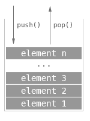

### Schedule

  - **Study the suggested material**
  - **Practice on the topics and share your questions**

### Study Plan

  Whether you're building games or developing web applications,
  creating an API service or an AI-enabled mobile application,
  data structures and algorithms are a crucial ingredient for 
  all sorts of software challenges.

  Data structures give us the ability to take our raw data 
  and organize them in a way that makes it easy and efficient
  to store, search, traverse and manipulate. 

  Algorithms are the magic recipes that help us break down 
  problems into small steps that can be fed into any programming
  language.

  FreeCodeCamp has a great video tutorial on some of the most
  popular and useful algorithms and data structures.

  We highly recommend that you spend the next 3 days, studying 
  and replicating each of the chapters of this great video.

  Let's start with the first 3 data structures:

  

  - [**Stacks**](https://www.youtube.com/watch?v=t2CEgPsws3U&t=20s){:target="_blank"}

  - [**Sets**](https://www.youtube.com/watch?v=t2CEgPsws3U&t=544s){:target="_blank"}

  .svg.png)

  - [**Queues**](https://www.youtube.com/watch?v=t2CEgPsws3U&t=1164s){:target="_blank"}

### Summary

### Exercises

  Make sure to implement and test every single data structure and algorithm
  on your local environment, either in the Browser or through Node.js.

### Extra Resources
