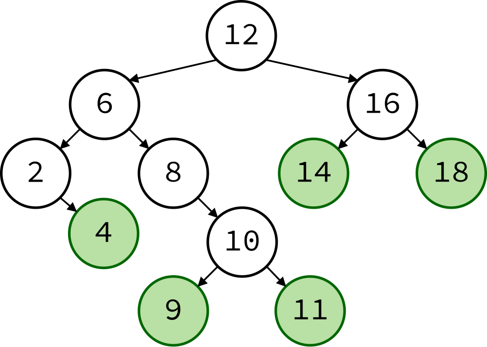
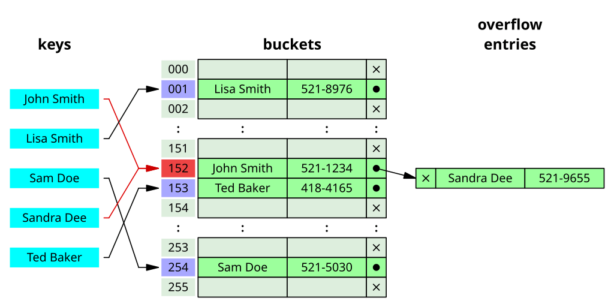

### Schedule

  - **Study the suggested material**
  - **Practice on the topics and share your questions**

### Study Plan

  This is part 2 of watching the Data Structures and Algorithms
  course from FreeCodeCamp and coding along.

  Let's see the next 3 data structures and algorithms:

  

  - [**Binary Search Tree**](https://www.youtube.com/watch?v=t2CEgPsws3U&t=1563s){:target="_blank"}

  

  - [**Hash Table**](https://www.youtube.com/watch?v=t2CEgPsws3U&t=3200s){:target="_blank"}

  

  - [**Linked List**](https://www.youtube.com/watch?v=t2CEgPsws3U&t=3785s){:target="_blank"}

### Summary

### Exercises

  Make sure to implement and test every single data structure and algorithm
  on your local environment, either in the Browser or through Node.js.

### Extra Resources
