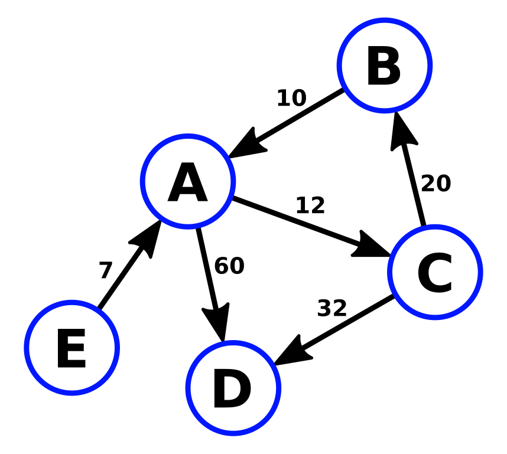

### Schedule

  - **Study the suggested material**
  - **Practice on the topics and share your questions**

### Study Plan

  This is part 3 of watching the Data Structures and Algorithms
  course from FreeCodeCamp and coding along.

  Let's see the last 3 data structures and algorithms mentioned:

  

  - [**Trie**](https://www.youtube.com/watch?v=t2CEgPsws3U&t=4500s){:target="_blank"}

  - [**Heap**](https://www.youtube.com/watch?v=t2CEgPsws3U&t=5249s){:target="_blank"}

  

  - [**Graph**](https://www.youtube.com/watch?v=t2CEgPsws3U&t=6128s){:target="_blank"}

### Summary

### Exercises

  Make sure to implement and test every single data structure and algorithm
  on your local environment, either in the Browser or through Node.js.

### Extra Resources