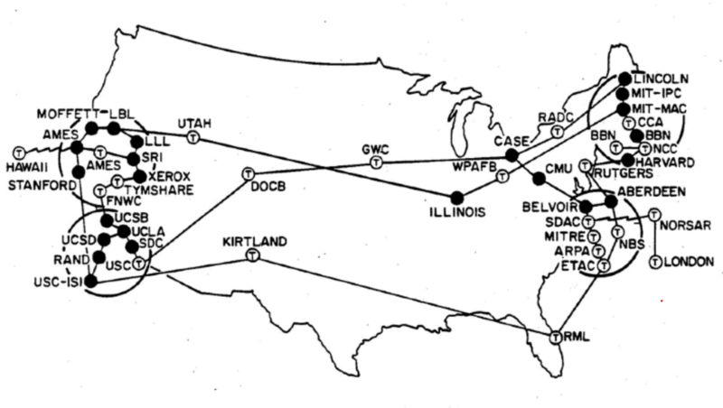

# Introduction

At its most basic, the Internet is **a large network of computers which communicate all together**.

The **Internet** is also the backbone of the World Wide Web (or Web, for short), the technical infrastructure that makes the Web possible. 

# History of the Internet

[The history of the Internet is somewhat obscure](https://en.wikipedia.org/wiki/Internet#History){:target="_blank"}. It began in the 1960s as a US-army-funded research project, then evolved into a public infrastructure in the 1980s with the support of many public universities and private companies. The various technologies that support the Internet have evolved over time, but the way it works hasn't changed that much: Internet is a way to connect computers all together and ensure that, whatever happens, they find a way to stay connected.

# How the Internet works

We bet you use the Internet every day. But do you actually know what happens when you type an address like `https://djangogirls.org` into your browser and press `enter`?

The first thing you need to understand is that **a website consists of a bunch of files saved on a hard disk** -- just like your movies, music, or pictures.
However, there is one part that is unique for websites: they include computer code called HTML.

If you're not familiar with programming, it can be hard to grasp HTML at first, but your web browsers (like Chrome, Safari, Firefox, etc.) love it. **Web browsers are designed to understand this code,
follow its instructions, and present these files that your website is made of, exactly the way you want.**

As with every file, we need to store HTML files somewhere on a hard disk. For the Internet, we use special, powerful computers called ***servers***. They don't have
a screen, mouse or a keyboard, because **their main purpose is to store data and serve it. That's why they're called *servers* – because they *serve* you data.**

OK, but you want to know how the Internet looks, right?

Here's what the Internet (also called the ARPANet) looked in the early days:

And, here's how the Internet looked like in 2005!

_(click the image to see a full-size version)_ / [_source_](https://commons.wikimedia.org/wiki/File:Internet_map_4096.png)

Each line is drawn between two ***nodes*** (computers connected to the network), representing two IP addresses.

And, here's a closeup of that map where each node is accompanied by its IP address.

Looks like a mess, right? In fact **it is a network of connected machines (the above-mentioned *servers*). Hundreds of thousands of machines!** Many, many kilometers of cables around the world! You can visit a Submarine Cable Map website ([http://submarinecablemap.com](http://submarinecablemap.com){:target="_blank"}) to see how complicated the net is. Here is a screenshot from the website:

It is fascinating, isn't it? But it is not possible to have a wire between every machine connected to the Internet. So, to reach a machine (for example, the one where `https://djangogirls.org` is saved) we need to pass a request through many, many different machines.

It looks like this:

Imagine that when you type `https://djangogirls.org`, you send a letter that says: "Dear Django Girls, I want to see the djangogirls.org website. Send it to me, please!"

Your letter goes to the post office closest to you. Then it goes to another that is a bit nearer to your addressee, then to another, and another until it is delivered at its destination. The only unique thing is that if you send many letters (***data packets***) to the same place, they could go through totally different post offices (***routers***). This depends on how they are distributed at each office.

That's how it works - you send messages and you expect some response. Instead of paper and pen you use bytes of data, but the idea is the same!

Instead of addresses with a street name, city, zip code and country name, we use **IP addresses**. Your computer first asks the **DNS (Domain Name System)** to translate `djangogirls.org` into an IP address. **DNS works a little bit like old-fashioned phonebooks** where you can look up the name of the person you want to contact and find their phone number and address.

When you send a letter, it needs to have certain features to be delivered correctly: an address, a stamp, etc. You also use a language that the receiver understands, right? The same applies to the *data packets* you send to see a website. We use a protocol called **HTTP** (Hypertext Transfer Protocol).

So, basically, when you have a website, you need to have a *server* (machine) where it lives. When the *server* receives an incoming ***request*** (in a letter), it sends back your website as a ***response*** (in another letter).

## Deeper dive

### A simple network

When two computers need to communicate, you have to link them, either physically (usually with an [Ethernet cable](https://en.wikipedia.org/wiki/Ethernet_crossover_cable){:target="_blank"}) or wirelessly (for example with [Wi-Fi](https://en.wikipedia.org/wiki/WiFi){:target="_blank"} or [Bluetooth](https://en.wikipedia.org/wiki/Bluetooth){:target="_blank"} systems). All modern computers can sustain any of those connections.

> **Note:** For the rest of this article, we will only talk about physical cables, but wireless networks work the same.

Such a network is not limited to two computers. You can connect as many computers as you wish. But it gets complicated quickly. If you're trying to connect, say, ten computers, you need 45 cables, with nine plugs per computer!

To solve this problem, each computer on a network is connected to a special tiny computer called a _router_. This _router_ has only one job: like a signaler at a railway station, **it makes sure that a message sent from a given computer arrives at the right destination computer**. To send a message to computer B, computer A must send the message to the router, which in turn forwards the message to computer B and makes sure the message is not delivered to computer C.

Once we add a router to the system, our network of 10 computers only requires 10 cables: a single plug for each computer and a router with 10 plugs.

### A network of networks

So far so good. But what about connecting hundreds, thousands, billions of computers? Of course a single _router_ can't scale that far, but, if you read carefully, we said that a _router_ is a computer like any other, so what keeps us from connecting two _routers_ together? Nothing, so let's do that.

By connecting computers to routers, then routers to routers, we are able to scale infinitely.

Such a network comes very close to what we call the Internet, but we're missing something. We built that network for our own purposes. There are other networks out there: your friends, your neighbors, anyone can have their own network of computers. But it's not really possible to set cables up between your house and the rest of the world, so how can you handle this? Well, there are already cables linked to your house, for example, electric power and telephone. The telephone infrastructure already connects your house with anyone in the world so it is the perfect wire we need. To connect our network to the telephone infrastructure, we need a special piece of equipment called a _modem_. This _modem_ turns the information from our network into information manageable by the telephone infrastructure and vice versa.

So we are connected to the telephone infrastructure. The next step is to send the messages from our network to the network we want to reach. To do that, we will connect our network to an Internet Service Provider (ISP). An ISP is a company that manages some special _routers_ that are all linked together and can also access other ISPs' routers. So the message from our network is carried through the network of ISP networks to the destination network. The Internet consists of this whole infrastructure of networks.

### Finding computers

If you want to send a message to a computer, you have to specify which one. Thus **any computer linked to a network has a unique address that identifies it, called an "IP address"** (where IP stands for _Internet Protocol_). It's an address made of a series of four numbers separated by dots, for example: `192.0.2.172`.

That's perfectly fine for computers, but we human beings have a hard time remembering that sort of address. To make things easier, we can alias an IP address with a human-readable name called a _domain name_. For example (at the time of writing; IP addresses can change) `google.com` is the domain name used on top of the IP address `142.250.190.78`. So using the domain name is the easiest way for us to reach a computer over the Internet.

### Internet and the web

As you might notice, when we browse the Web with a Web browser, we usually use the domain name to reach a website. Does that mean the Internet and the Web are the same thing? It's not that simple. As we saw, the Internet is a technical infrastructure which allows billions of computers to be connected all together. Among those computers, some computers (called _Web servers_) can send messages intelligible to web browsers. **The _Internet_ is an infrastructure, whereas the _Web_ is a service built on top of the infrastructure**. It is worth noting there are several other services built on top of the Internet, such as email and [IRC](https://developer.mozilla.org/en-US/docs/Glossary/IRC){:target="_blank"}.

### Intranets and Extranets

Intranets are _private_ networks that are restricted to members of a particular organization.
They are commonly used to provide a portal for members to securely access shared resources, collaborate and communicate.
For example, an organization's intranet might host web pages for sharing department or team information, shared drives for managing key documents and files,
portals for performing business administration tasks, and collaboration tools like wikis, discussion boards, and messaging systems.

Extranets are very similar to Intranets, except they open all or part of a private network to allow sharing and collaboration with other organizations.
They are typically used to safely and securely share information with clients and stakeholders who work closely with a business.
Often their functions are similar to those provided by an intranet: information and file sharing, collaboration tools, discussion boards, etc.

Both intranets and extranets run on the same kind of infrastructure as the Internet, and use the same protocols.
They can therefore be accessed by authorized members from different physical locations.

---

### Sources and Attributions

**Content is based on the following sources:**

- [How the Internet works](https://tutorial.djangogirls.org/en/how_the_internet_works/){:target="_blank"} tutorial, created and maintained by [Django Girls](https://djangogirls.org/en/){:target="_blank"}. The original source code can be found [here](https://github.com/DjangoGirls/tutorial/tree/master/en/how_the_internet_works){:target="_blank"}. If you found this resource helpful, **please consider adding a star** on these 2 GitHub repositories as a token of your appreciation: [Django Girls Tutorial](https://github.com/DjangoGirls/tutorial/tree/master){:target="_blank"} / [WDX-180](https://github.com/in-tech-gration/WDX-180){:target="_blank"}.

- **MDN**
    - [How does the Internet work?](https://developer.mozilla.org/en-US/docs/Learn/Common_questions/Web_mechanics/How_does_the_Internet_work) [(Permalink)](https://github.com/mdn/content/blob/0231ed58f0455cb0a83c5f2c4c9c4f5c69391a70/files/en-us/learn/common_questions/web_mechanics/how_does_the_internet_work/index.md)

---

This post is licensed under the GNU General Public License version 3 (GPLv3).
