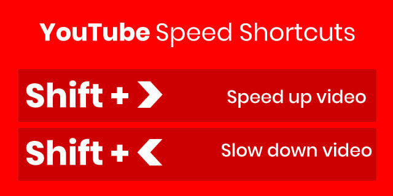

### Schedule

  > Inspirational Quote of the Day: _"If you fail, never give up because F.A.I.L. means FIRST ATTEMPT IN LEARNING"_

  Welcome to the first part of our curriculum, WDX 60°. The goal of this first part, that will span 60 days, is to give you a basic understanding of how computers and the Internet work, how the World Wide Web _(or Web for short)_ which is built on top of them works and connects people and ideas together through the use of these 3 building blocks: HTML, CSS and JavaScript. By the end of this part of the course, you'd be able to code in these 3 languages and deploy your websites and web applications on the Web.  

  Before you dive in, **make sure that you have your notebook** and colored pens besides your computer, in order to pause and take those invaluable notes as you move along the curriculum.

  At this point, it's extremely important to let you know that **sharing solutions** on Slack is **not allowed** and will be removed upon first notice. 

  We encourage you to **help and support each other** but in a constructive and helpful manner: guiding other participants towards the right direction by asking questions, providing hints, suggesting alternatives and generally cultivating a problem solving mindset instead of depriving others of the capacity to process a problem by handing them a ready-made solution. 

  - Welcome Session _(*enrolled students)_
  - Setting up and getting to know each other
  - [Study](#study-plan)
  - [Exercises](#exercises)
  - [Extra Resources](#extra-resources)

### Setting up

  **Required extension:** Before you start your week, make sure to install the following Extension for VSCode: [VSCode WDX Extension Pack](https://marketplace.visualstudio.com/items?itemName=kostasx.vscode-wdx-extension-pack){:target="_blank"}. 
  
  This is an `Extension Pack`, which automatically installs various extensions that are recommended for your first steps. Check the **Included Extensions** section to find out more about the extensions.

  Please, don't forget to star our [GitHub repo](https://github.com/in-tech-gration/VSCode-WDX-Extension-Pack){:target="_blank"} and subscribe to our [YouTube Channel](https://www.youtube.com/@in-tech-gration){:target="_blank"}. 🙏

### Study Plan

  Watch [this video](https://youtu.be/CAek8fVB70M){:target="_blank"} that will guide you through the process of keeping your forked WDX-180 repo up-to-date with our latest content and curriculum updates.

  Next, watch the following videos which give a brief introduction to the 0s and 1s that make computers tick. The total duration of these videos is around 31 minutes.

  **YouTube Tips - (1) grabbing screenshots and (2) customizing the playback speed:** 
  
  (1) Sometimes you want to easily grab screenshots from particular segments of a video, e.g. a nice diagram, a frame that contains a code sample or a part that contains links. You can install and use [this Chrome extension](https://chrome.google.com/webstore/detail/screenshot-youtube/gjoijpfmdhbjkkgnmahganhoinjjpohk){:target="_blank"} to easily grab a screenshot at any point.  
  
  (2) When watching YouTube videos that are either too slow or too fast for you to follow along, remember these speed shortcuts:

  

  **What you'll learn:**

  - Binary digits (bits)
  - How we represent text, images, video and audio using binary
  - ASCII, Unicode & UTF-8
  - Pixels (picture elements)
  - Digital file compression
  - How we calculate storage in computers 
  - Hexadecimal number system

  **Some of the questions you'll be able to answer:**

  - How many numbers can you store with 8 bits?
  - What is Lossy and Lossless Compression?
  - How is color stored and represented in computers?
  - What is the difference between a Kilobyte and a Kibibyte?
  - What is ASCII?
  - What is the standard text encoding for the Web?
  - How do computers deal with large numbers?
  - How do computers deal with negative numbers?
  - How do computers deal with floating point numbers?

  **Here's the watch list:**

  - [Watch: **How Computers Work: Binary & Data**](https://www.youtube.com/watch?v=USCBCmwMCDA){:target="_blank"}
    - Duration: 6min
    - Level: Beginner 
    - Captions: Yes

  - [Watch: **Representing Numbers and Letters with Binary: Crash Course Computer Science #4**](https://www.youtube.com/watch?v=1GSjbWt0c9M){:target="_blank"}
    - Duration: 11min
    - Level: Beginner
    - Captions: EN

  **Demo time:** take a short break before the next video and play around with this cool [ASCII-to-Binary](https://mothereff.in/binary-ascii){:target="_blank"} tool! _(Don't forget to star the [GitHub repo](https://github.com/mathiasbynens/mothereff.in){:target="_blank"} if you found this tool helpful.)_

  - [Watch: **Characters, Symbols and the Unicode Miracle - Computerphile**](https://www.youtube.com/watch?v=MijmeoH9LT4){:target="_blank"}
    - Duration: 10min
    - Level: Beginner

  - [Download: **Primer on Character Encodings** Guide](https://roadmap.sh/guides/character-encodings){:target="_blank"}

  

  - [Watch: **Images, Pixels and RGB**](https://www.youtube.com/watch?v=15aqFQQVBWU){:target="_blank"}
    - Duration: 6min
    - Level: Beginner
    - Captions: Yes

  - [Watch: **Digital Compression explained by Aloe Blacc**](https://www.youtube.com/watch?v=By30SCp-Tsw){:target="_blank"}
    - Duration: 4min
    - Level: Beginner
    - Captions: Yes

  - [Read: **Why do computers understand only 0 & 1 logic?**](https://www.quora.com/Why-do-computers-understand-only-0-1-logic/answers/92646682){:target="_blank"} to understand why digital computers* are limited to and revolve around the binary system.
    - _(*[Quantum computers](https://www.youtube.com/watch?v=OWJCfOvochA){:target="_blank"} on the other hand, work in a much different way.)_

  - [Watch: **Tutorial 1 About Bits & Bytes**](https://www.youtube.com/watch?v=H2kTzmJJ79E){:target="_blank"}
    - Duration: 5min
    - Level: Beginner

  - [Read: **Positional Notation, Binary, Octal and Hexadecimal numeric systems**](resources/Hexadecimal/index.md)

### Summary

  _"There are 10 types of people in this world, those who understand binary and those who don't."_

### Exercises

  - **Decode the secret message**: watch this [video](https://www.youtube.com/watch?v=OSZOf9pyepc) from an episode of [Silicon Valley](https://www.imdb.com/title/tt2575988/) series and try to find and decode the hidden geeky message.

  Make sure to complete all the tasks found in the **daily Progress Sheet** and update the sheet accordingly. Once you've updated the sheet, don't forget to `commit` and `push`. The progress draft sheets are found in the `/user/weekXX/progress` folder, for example `user/week01/progress/progress.draft.w01.d01.csv`. You should **NEVER** update the `draft` sheets directly, but rather work on a copy of them according to the instructions [found here](resources/PROGRESS-WORKFLOW.md).

  **It is absolutely crucial** at this point to remind you that updating the `Confidence` column in the progress sheets should reflect an honest and accurate self-evaluation score. You should not overestimate nor underestimate your level of confidence. A score that is closer to your real level of confidence will help you and others attend to your real needs and put focus on the parts that need some further knowledge re-enforcement and engagement.
  
### Extra Resources
