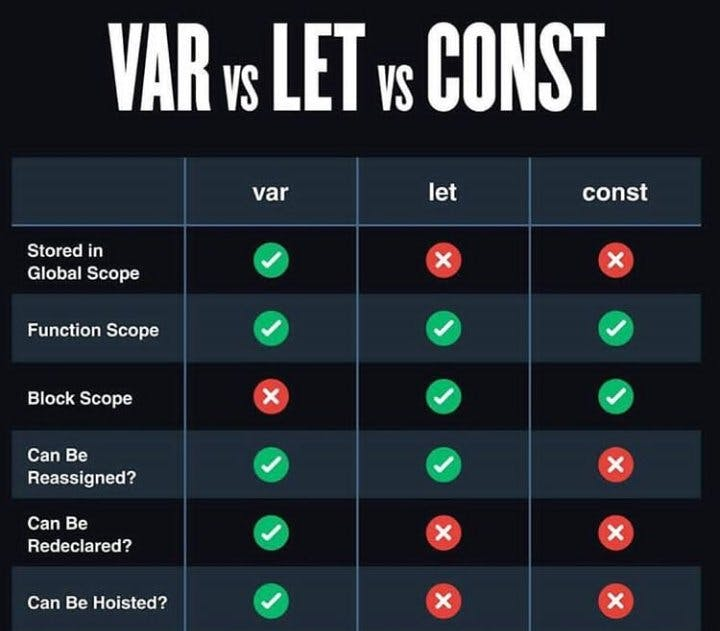

### Schedule

  - [Study](#study-plan-NN)
  - [Exercises](#exercises-NN)
  - [Extra Resources](#extra-resources-NN)

### Study Plan

### Summary

  

  Let's begin by reading about [What is a Software Post-Mortem and How Do You Write One?](https://www.freecodecamp.org/news/what-is-a-software-post-mortem/){:target="_blank"}

  After having read the article, open up the code [found here](https://github.com/in-tech-gration/WDX-180/tree/main/curriculum/modules/javascript/misc/post_mortem){:target="_blank"} debug the program and write a short post mortem.

  ---

  Next, we are going to explore some pretty useful and cool CSS features (that you probably didn't know exist). Let's go!

  - Go through [**this article**](https://www.lambdatest.com/blog/advanced-css-tricks-and-techniques/){:target="_blank"} that covers quite a lot of features. For each one, you should check the appropriate MDN article for more details and play around with the feature in your local development environment. Perhaps it's a good idea at this point to create a file named `advanced-css-tricks.html` and work on it.

  The point of this module is to become aware and familiar with these really handy CSS tools. Unless you practice, of course, there's no point in moving forward, so let's use these tricks to build a web page that includes every single feature in the list.

  - **Responsive CSS Grids**
  - **Vertically Align with Flexbox**
  - **SVG for Icons and Logos**
  - **Masking**
  - **Shape Outside**
  - **Zoom on Hover**
  - **Scroll Snapping**
  - **Variable Fonts**
  - **Generate Text Animation**
  - **Initial Letter**
  - **Logical Properties and Values**
  - **CSS Subgrids**
  - **Smart Quotes in HTML/CSS**
  - **Comma-Separated Lists**
  - **Feature Query**
  - **Background Repeat**
  - **CSS Gradients**
  - **Truncate Strings**

  <!-- SGEN:META:TESTS:name=Test Exercise: 'Advanced CSS Tricks'|type=exist|user_folder=advanced-css-tricks|files=advanced-css-tricks.html -->

  <!-- SGEN:META:PROGRESS:task=Create a reference page that includes all the cool CSS tricks that you learned -->
  On top of that, you want to create a page that includes every single feature with a small description taken from the MDN docs and a small example (containing both the code used and the actual displayed output).

### Exercises

  - Build a replica of the [**var/let/const table**](./assets/var-let-const.jpg){:target="_blank"} using HTML and CSS. Sprinkle the table with some JavaScript if you feel like it. 

  

  You can use some emojis for the ❌ and ✅ or you can recreate them using plain CSS!

  - [Check Mark](https://emojipedia.org/check-mark-button){:target="_blank"}
  - [Cross Mark](https://emojipedia.org/cross-mark){:target="_blank"}

  If you go with the CSS route for the symbols, you can use the following HTML entities
  and find some CSS rules to apply colors, background, borders, circles, etc. to these characters
  - `&check;`
  - `&CircleTimes;`

  Refs:
  - [Unicode Character “⊗” (U+2297)](https://www.compart.com/en/unicode/U+2297){:target="_blank"}
  - [Unicode Character “✓” (U+2713)](https://www.compart.com/en/unicode/U+2713){:target="_blank"}

  You can of course, build the structure in many ways, but the `<table>` element is the most appropriate here.
  In case you've started building using another element, feel free to do so, and we'll check how different layouts
  and structure look later on.

### Extra Resources

  _(Nothing here yet. Feel free to contribute if you've found some useful resources.)_

### Sources and Attributions

  - [18 Advanced CSS Tricks And Tips [2023]](https://www.lambdatest.com/blog/advanced-css-tricks-and-techniques/){:target="_blank"}