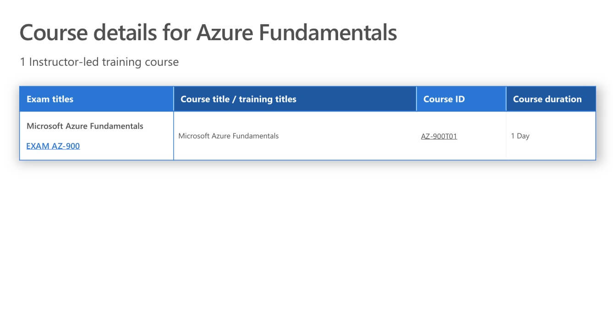
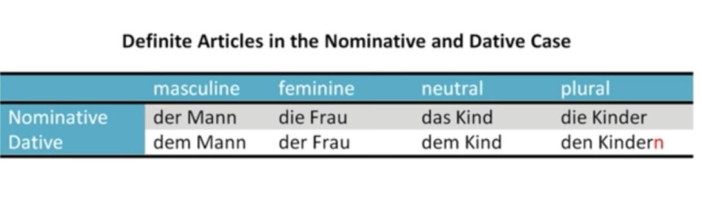

### Schedule

  - [Study](#study-plan)

### Study Plan

{{ SGEN:INCLUDES:skip_mdn_suggestions }}

  <!-- SGEN:META:PROGRESS:task=Read 'Styling tables' -->
  - [Read: **Styling tables**](https://developer.mozilla.org/en-US/docs/Learn/CSS/Building_blocks/Styling_tables){:target="_blank"}
    - Level: Beginner

  <!-- SGEN:META:PROGRESS:task=Read 'Debugging CSS' -->
  - [Read: **Debugging CSS**](https://developer.mozilla.org/en-US/docs/Learn/CSS/Building_blocks/Debugging_CSS){:target="_blank"}
    - Level: Beginner

  <!-- SGEN:META:PROGRESS:task=Read 'Organizing your CSS' -->
  - [Read: **Organizing your CSS**](https://developer.mozilla.org/en-US/docs/Learn/CSS/Building_blocks/Organizing){:target="_blank"}
    - Level: Beginner

### Summary

### Exercises

  <!-- SGEN:META:PROGRESS:task=Complete the 'Recreate Azure HTML Table'|user_folder=azure_table|files=azure_table.html -->
  - Create a file named `azure_table.html` and try to recreate the table below using your HTML and CSS skills.

  

  <!-- SGEN:META:PROGRESS:task=Complete the 'Recreate German HTML Table'|user_folder=german_table|files=german_table.html -->
  - Create a file named `german_table.html` and try to recreate the table below using your HTML and CSS skills.

  

  <!-- SGEN:META:PROGRESS:task=Complete the exercise 'Test your skills: Tables'|user_folder=tables_tasks -->
  <!-- SGEN:META:TESTS:name=Test Exercise: 'Test your skills: Tables'|type=exist|user_folder=tables_tasks|files=table.html -->
  - [MDN's Assessment: **Test your skills: Tables**](/WDX-180/curriculum/modules/css/misc/tables_tasks){:target="_blank"}
  
  <!-- SGEN:META:PROGRESS:task=Complete the exercise 'Fundamental CSS comprehension'|user_folder=fundamental_css_comprehension -->
  <!-- SGEN:META:TESTS:name=Test Exercise: 'Fundamental CSS comprehension'|type=exist|user_folder=fundamental_css_comprehension|files=index.html,styles.css,chris.jpg -->
  - [MDN's Assessment: **Fundamental CSS comprehension**](/WDX-180/curriculum/modules/css/building_blocks/fundamental_css_comprehension){:target="_blank"}

### Extra Resources

  <!-- SGEN:META:PROGRESS:task=Complete the exercise 'Creating fancy letterheaded paper'|user_folder=creating_fancy_letterheaded_paper -->
  <!-- SGEN:META:TESTS:name=Test Exercise: 'Creating fancy letterheaded paper'|type=exist|user_folder=creating_fancy_letterheaded_paper|files=index.html,styles.css,top-image.png,bottom-image.png,logo.png -->
  - [MDN's Assessment: **Creating fancy letterheaded paper**](/WDX-180/curriculum/modules/css/building_blocks/creating_fancy_letterheaded_paper){:target="_blank"}

  <!-- SGEN:META:PROGRESS:task=Complete the exercise 'A cool-looking box'|user_folder=a_cool_looking_box -->
  <!-- SGEN:META:TESTS:name=Test Exercise: 'A cool-looking box'|type=exist|user_folder=a_cool_looking_box|files=index.html,styles.css -->
  - [MDN's Assessment: **A cool-looking box**](/WDX-180/curriculum/modules/css/building_blocks/a_cool_looking_box){:target="_blank"}

### Sources and Attributions
