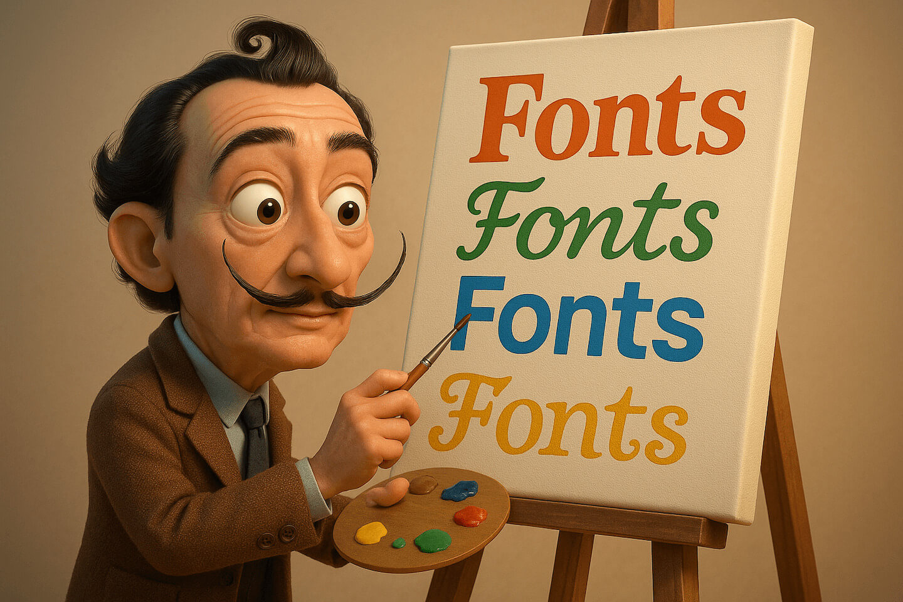

### Schedule

  - [Study](#study-plan-1)

### Study Plan

  > Inspirational quote of the day: How learning works.
  > 
  > **One fourth 1/4 from the teacher**
  > 
  > **One fourth 1/4 from your own intelligence**
  > 
  > **One fourth 1/4 from your classmates**
  > 
  > **One fourth 1/4 from time**

  ---

  With the basics of the CSS language covered, the next CSS topic for you to concentrate on is styling text — one of the most common things you'll do with CSS. 
  
  

  Here we look at text styling fundamentals including setting font, boldness, italics, line and letter spacing, drop shadows, and other text features. We round off the module by looking at applying custom fonts to your page, and styling lists and links.

  <!-- SGEN:META:PROGRESS:task=Read 'Fundamental text and font styling' -->
  - [Read : **Fundamental text and font styling**](https://developer.mozilla.org/en-US/docs/Learn/CSS/Styling_text/Fundamentals){:target="_blank"}
    - Level: Beginner

  <!-- SGEN:META:PROGRESS:task=Read 'Styling lists' -->
  - [Read : **Styling lists**](https://developer.mozilla.org/en-US/docs/Learn/CSS/Styling_text/Styling_lists){:target="_blank"}
    - Level: Beginner

  <!-- SGEN:META:PROGRESS:task=Read 'Styling links' -->
  - [Read : **Styling links**](https://developer.mozilla.org/en-US/docs/Learn/CSS/Styling_text/Styling_links){:target="_blank"}
    - Level: Beginner

  <!-- SGEN:META:PROGRESS:task=Read 'Web fonts' -->
  - [Read : **Web fonts**](https://developer.mozilla.org/en-US/docs/Learn/CSS/Styling_text/Web_fonts){:target="_blank"}
    - Level: Beginner

### Summary

### Exercises

  <!-- SGEN:META:PROGRESS:task=Complete the exercise 'Typesetting a community school homepage'|user_folder=typesetting_a_homepage -->
  <!-- SGEN:META:TESTS:name=Test Exercise: 'Typesetting a community school homepage'|type=exist|user_folder=typesetting_a_homepage|files=index.html,styles.css -->
  - [MDN's Assessment: **Typesetting a community school homepage**](https://developer.mozilla.org/en-US/docs/Learn/CSS/Styling_text/Typesetting_a_homepage){:target="_blank"}

### Extra Resources

### Sources and Attributions