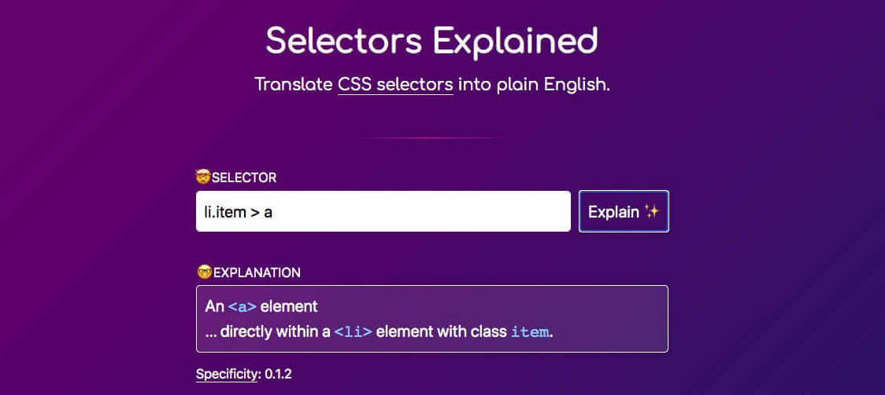

### Schedule

  - [Study](#study-plan-2)
  - [Exercises](#exercises-2)
  - [Extra Resources](#extra-resources-2)

### Study Plan

  Now that you've gained familiarity with the language and its syntax, and got some basic experience using it, it's time to dive a bit deeper. **CSS Selectors** is the part of CSS that defines which element(s) will be `selected` from the HTML page and what styling rules will be applied to them. Let's see them in detail:

  - Let's start by watching a super quick intro to [**CSS Selectors**](https://www.youtube.com/watch?v=rLZWAGrY6cU) just to get a first taste of what they are.

  Now let's dive deeper into CSS Selectors _(because nobody became a professional Web developer by watching 1-minute coding videos)_.

  - [Read: **CSS Selectors**](resources/css_building_blocks/css_selectors/index.md){:target="_blank"}
    - Level: Beginner
  
  - [Read: **Type, class, and ID selectors**](resources/css_building_blocks/css_selectors/type_class_and_id_selectors/index.md){:target="_blank"}
    - Level: Beginner
  
  - [Read: **Attribute Selectors**](resources/css_building_blocks/css_selectors/attribute_selectors/index.md){:target="_blank"}
    - Level: Beginner
  
  - [Read: **Pseudo-classes and Pseudo-elements**](resources/css_building_blocks/css_selectors/pseudo-classes_and_pseudo-elements/index.md){:target="_blank"}
    - Level: Beginner
  
  - [Read: **Combinators**](resources/css_building_blocks/css_selectors/combinators/index.md){:target="_blank"}
    - Level: Beginner

  Let's recap CSS Selectors by watching Kyle (from `WebDevSimplified`) going through every CSS Selector in his [**Learn Every CSS Selector In 20 Minutes**](https://www.youtube.com/watch?v=l1mER1bV0N0){:target="_blank"} video. 

  ---
  
  **Still confused?** Let's try this [**little tool**](/WDX-180/resources/css/selectors-explained/index.html){:target="_blank"} that explains CSS selectors. If you find this tool useful, keep a bookmark and please don't forget to star the [author's repo](https://github.com/KittyGiraudel/selectors-explained){:target="_blank"}.

  

### Summary

  Now that you've finished studying this Module's content, you've learned about a wide variety of CSS selectors that are available, allowing for fine-grained precision when selecting elements to style in a Web page. It's time to put this information to the test with the following exercises!

### Exercises

  - Let's quickly practice some CSS Selectors [here](/WDX-180/resources/css/css-selector-game/index.html){:target="_blank"}.

  - [Play: **CSS Diner**](https://flukeout.github.io/){:target="_blank"}
    - An awesome exercise as a game, consisting of 32 levels to help you understand how CSS selectors work, in a very fun way!
    - Take a screenshot of the max level you have successfully completed, name it `completed-level.png` and move it to folder `user/week03/exercises/day03/`

  - [MDN's Assessment: **Test your skills: Selectors**](exercises/selectors_tasks/index.md)

  As for the CSS Diner, if you've  enjoyed the experience and it has helped you learn something, do not forget to star (⭐) the [repo](https://github.com/flukeout/css-diner){:target="_blank"} of this awesome game!

### Extra Resources

### Sources and Attributions

  **Content is based on the following sources:**

  - [The CSS-Selector-Game](https://github.com/toolness/css-selector-game) _(Please give the original author a star!)_

  - [Selectors Explained: A CSS selector to plain English translator](https://github.com/KittyGiraudel/selectors-explained)

  - **MDN:**
    - [CSS Selectors](https://developer.mozilla.org/en-US/docs/Learn/CSS/Building_blocks/Selectors){:target="_blank"}
    - [Type, class, and ID selectors](https://developer.mozilla.org/en-US/docs/Learn/CSS/Building_blocks/Selectors/Type_Class_and_ID_Selectors){:target="_blank"}
    - [Attribute Selectors](https://developer.mozilla.org/en-US/docs/Learn/CSS/Building_blocks/Selectors/Attribute_selectors){:target="_blank"}
    - [Pseudo-classes and pseudo-elements](https://developer.mozilla.org/en-US/docs/Learn/CSS/Building_blocks/Selectors/Pseudo-classes_and_pseudo-elements){:target="_blank"}
    - [Combinators](https://developer.mozilla.org/en-US/docs/Learn/CSS/Building_blocks/Selectors/Combinators){:target="_blank"}
    - [Test your skills: Selectors](https://developer.mozilla.org/en-US/docs/Learn/CSS/Building_blocks/Selectors/Selectors_Tasks){:target="_blank"} [(Permalink)](https://github.com/mdn/content/blob/a77137e6239ef445ac67b2ffb7067d6332907910/files/en-us/learn/css/building_blocks/selectors/selectors_tasks/index.md){:target="_blank"}
  - **CSS Diner:**
    - [CSS Diner Github Repo](https://github.com/flukeout/css-diner){:target="_blank"}