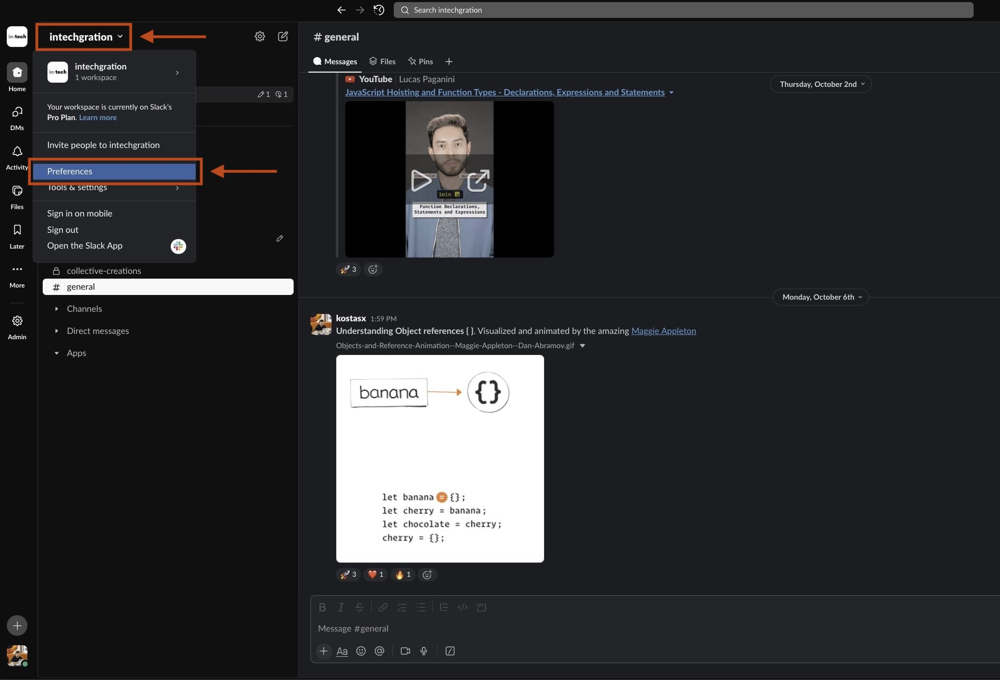
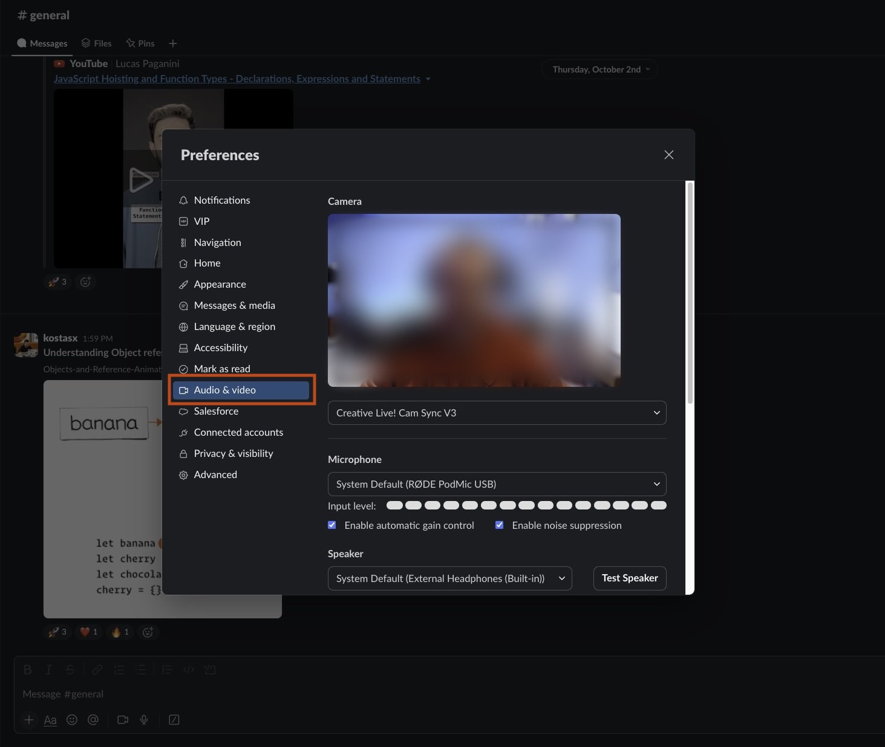
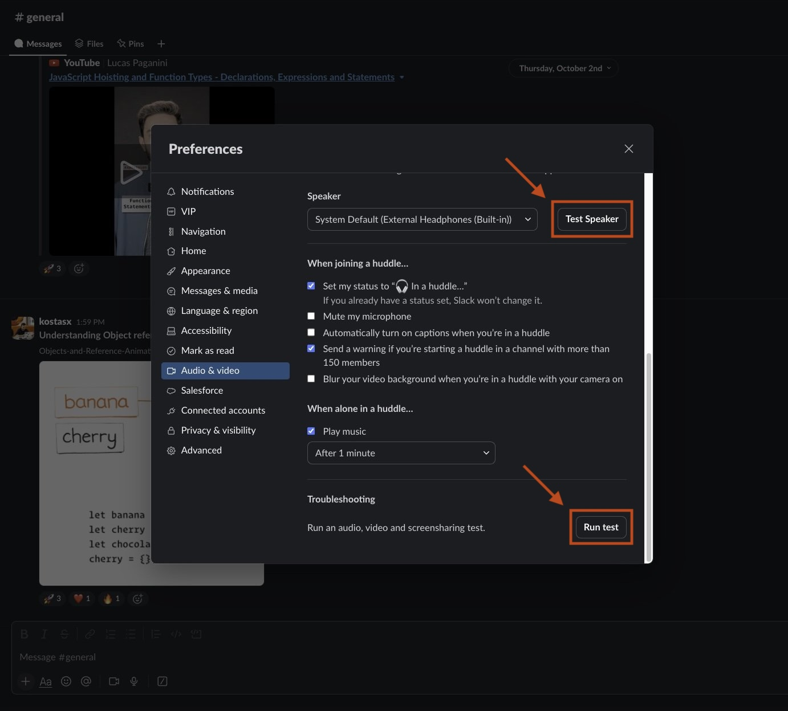

# Communication | Slack

## Testing Audio, Video & Screen-sharing

  Before using Slack for online communication, especially
  when using Slack's [Huddle](https://slack.com/help/articles/4402059015315-Use-huddles-in-Slack){:target="_blank"} feature,
  we must ensure that our audio (microphone), video (web camera)
  and screen sharing capabilities all work as expected.

  Here are the necessary steps to ensure that you are 
  ready for connecting with your peers:

  1) Click in the **intechgration** dropdown at the top left corner and select **Preferences**:

  {:target="_blank"}
  > Click on the photo to see a full size version.

  2) Go to the **Audio & video** section: 

  {:target="_blank"}
  > Click on the photo to see a full size version.

  3) Run the **Test Speaker** and **Run Tests** tests to ensure that everything
  works as expected:

  {:target="_blank"}
  > Click on the photo to see a full size version.