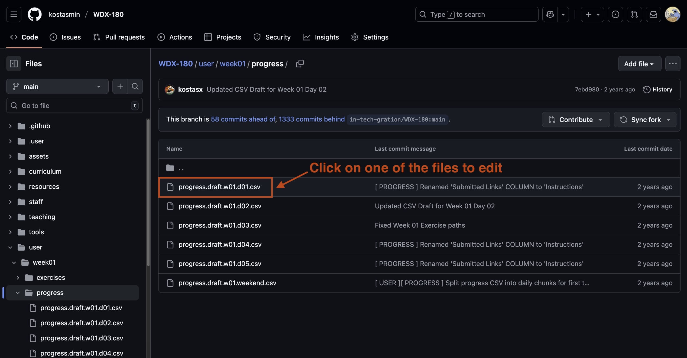
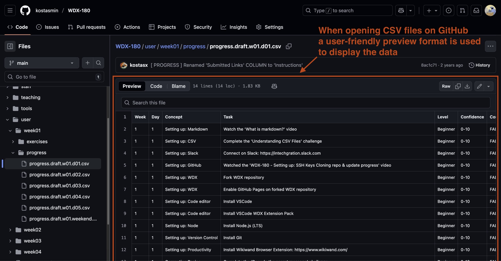
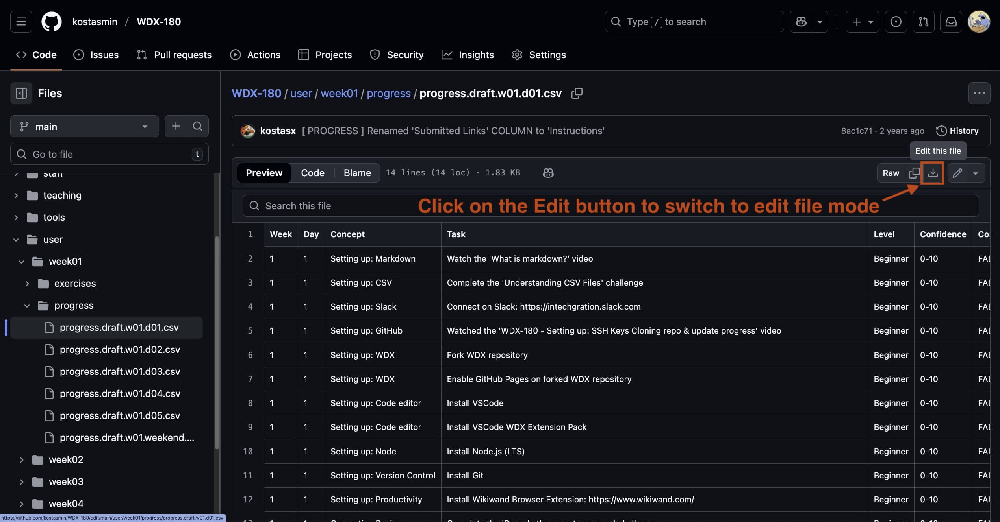
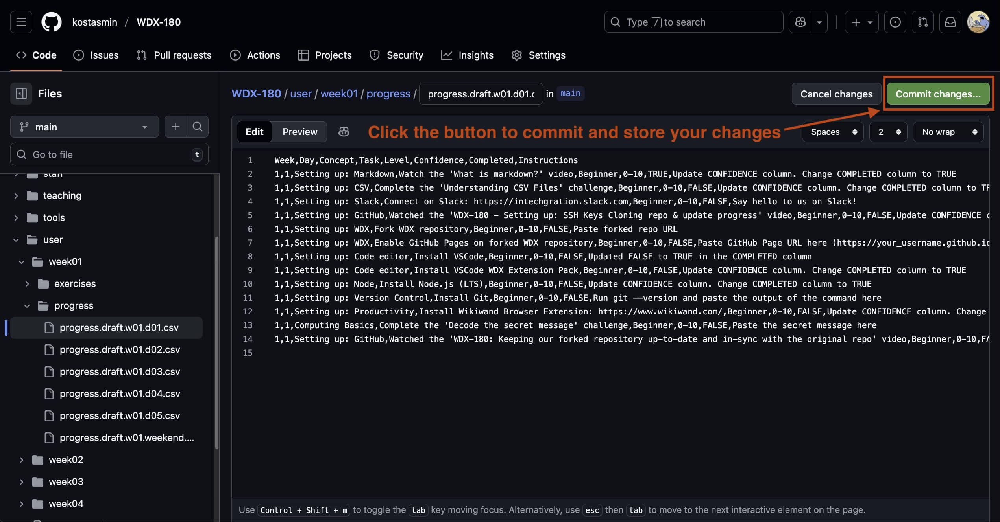
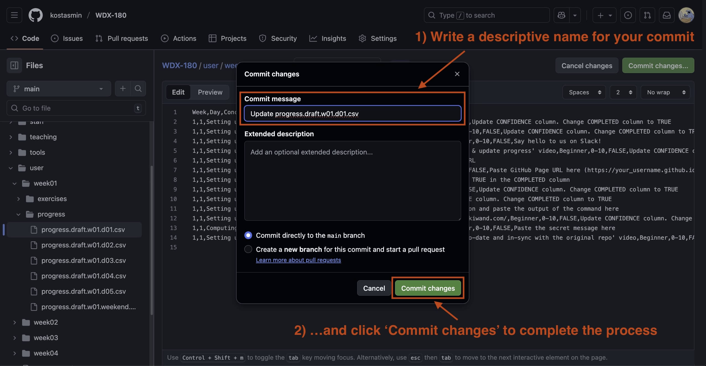

# Guide: How to update your CSV progress files

**Click on the images to open a large version of the image in a new Tab**

---

**Step 01**

{:target="_blank"}

**Step 02**

{:target="_blank"}

**Step 03**

{:target="_blank"}

**Step 04**

{:target="_blank"}

**Step 05**

{:target="_blank"}
