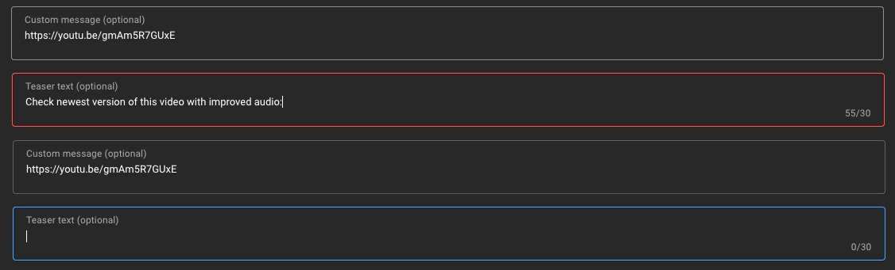

### Schedule

  - [Study](#study-plan)
  - [Exercises](#exercises)
  - [Extra Resources](#extra-resources)

### Study Plan

  <!--  -->

  > Inspirational quote of the week:
  >
  > ___"If I ran a school, I’d give the average grade to the ones 
  > who gave me all the right answers, for being good parrots. 
  > I’d give the top grades to those who made a lot of mistakes 
  > and told me about them, and then told me what they learned from them."___
  >
  > R. Buckminster Fuller

  ---

  This Module is about replicating some real-life User Interfaces and specifically the form fields found in the [**YouTube Studio**](https://www.youtube.com/playlist?list=PLpjK416fmKwQ42eDY75Q05uM0g3N9WNXU) video editor page.

  {:target="_blank"}

  _(Click on the screenshot to see it in full scale)_

  The process, of course, involves coding but also doing some research to find out more about the required HTML and CSS to complete the project.

  Scroll down to the [**Exercises section**](#exercises) to find all the details and start the project. 

### Summary

### Exercises

**What are you building?**

**Requirements**

- For this project, we need all the CSS colors to be stored in [**CSS variables**](https://developer.mozilla.org/en-US/docs/Web/CSS/Using_CSS_custom_properties) that follow [**good naming practices**](https://stackoverflow.com/a/74253999/4861760). 

**Study Resources**

- [Naming CSS Stuff Is Really Hard](https://sparkbox.com/foundry/naming_css_stuff_is_really_hard)

### Extra Resources

### Sources and Attributions
