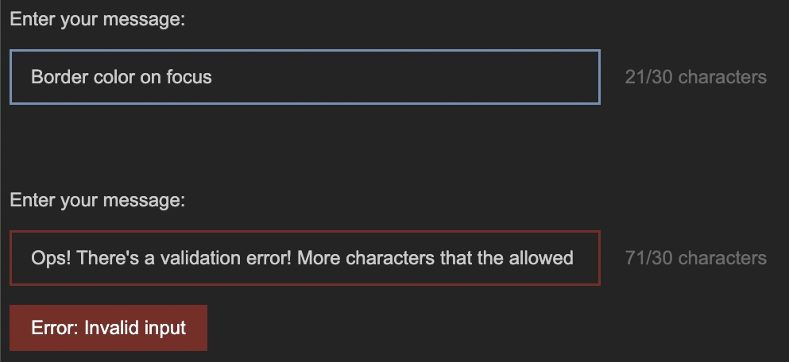

### Schedule

  - [Study](#study-plan)
  - [Exercises](#exercises)
  - [Extra Resources](#extra-resources)

### Study Plan

  <!--  -->

  > Inspirational quote of the week:
  >
  > ___"If I ran a school, I’d give the average grade to the ones 
  > who gave me all the right answers, for being good parrots. 
  > I’d give the top grades to those who made a lot of mistakes 
  > and told me about them, and then told me what they learned from them."___
  >
  > R. Buckminster Fuller

  ---

  This Module is about replicating some real-life User Interfaces and specifically the form fields found in the [**YouTube Studio**](https://www.youtube.com/playlist?list=PLpjK416fmKwQ42eDY75Q05uM0g3N9WNXU){:target="_blank"} video editor page.

  {:target="_blank"}

  _(Click on the screenshot to see it in full scale)_

  The process, of course, involves coding but also doing some research to find out more about the required HTML and CSS to complete the project.

  Before starting the project, we have a tiny bit of theory for you. Check the next short video about the BEM CSS methodology before starting the exercise:

  - [Watch: **Why I use the BEM naming convention for my CSS**](https://www.youtube.com/watch?v=SLjHSVwXYq4){:target="_blank"}
    - **Duration:** 7min
  
  Now that you have rough idea about organizing CSS code using the BEM methodology, scroll down to the [**Exercises section**](#exercises) to find all the details and start the project. 

### Summary

### Exercises

<!-- WDX:META:PROGRESS:task=Complete the 'Form Input Field' practice challenge|user_folder=input_fields_practice -->

**What are you building?**

Take a close look at the screenshot below to understand what you are building:

We are basically creating a single `<input>` form field of type `text`. In the screenshot, you are seeing various states of this input field. You won't be creating 5 different input fields but just one. Check the Requirements below to learn more about the various states and behavior that we want this element to exhibit.

**Requirements**

- Here are the color you must use:
  - Background color for the page: `#282828`
  - The input text color (for the user values) is: `#d0d0d0`
  - The `placeholder` text color is: `#767676`
  - The border color is: `#4c4c4c`
  - The border color on hover is: `#8f8f8f`
  - The border color on focus is: `#7c9dbd`
  - When there is a validation error on some input, the border color is: `#862e2a`

1. For this project, we need all the CSS colors to be stored in [**CSS variables**](https://developer.mozilla.org/en-US/docs/Web/CSS/Using_CSS_custom_properties){:target="_blank"} that follow [**good naming practices**](https://stackoverflow.com/a/74253999/4861760){:target="_blank"}. 

2. The font family for all text should be: `Arial, Helvetica, sans-serif;`

3. There should be special validation rule for this input field, so that the only permitted characters are the following: `A-Z`, `a-z`, `0-9` and the special characters `!, @, _, -, $, ( and )`. Also, there is a limit on how many characters should be permitted: **maximum 30 chars**. If the user has entered more than 30 characters or any non-permitted character, the input border should change to the error color (as seen in the last input example in the screenshot).

4. The input field must be accompanied by a special section that indicates the number of current characters along with the limit (30) as seen in the screenshot. This does not need to change dynamically. For now, you'll just want this element to contain the text: `0/30 characters`. Once you've learned about JavaScript, you'll be able to dynamically update these numbers.

5. The input field must also be accompanied by a `<label>` element (as depicted in the screenshot) with the informative text: `Enter your message`. The `<input>` and `<label>` elements **should be paired together** so that when the user clicks on the label, the input should receive focus. Also, when the user hovers over the label, the input should change its border color to the appropriate focus color (see list of colors above). The label should use the same color as the input text value.

6. You should validate your HTML code using the `W3C Validator` service and make sure to fix all warnings and errors.

7. You should check your web page using the Chrome [**Lighthouse**](https://developer.chrome.com/docs/lighthouse/overview/){:target="_blank"} checker and make sure that you have a green score (>90%) on the `Accessibility` checks. If the score is lower than 90%, make sure to do any necessary fixes.

**Extra Challenges**

- Whenever the input value is invalid, a specially crafted HTML element should appear beneath the input element, displaying an error notification: `("Error: Invalid input")`. You **do not need JavaScript** for this one to work. Do your research and come up with a plain HTML/CSS solution.

{:target="_blank"}

**Study Resources**

- [Naming CSS Stuff Is Really Hard](https://sparkbox.com/foundry/naming_css_stuff_is_really_hard){:target="_blank"}

- [Input pseudo-classes](https://developer.mozilla.org/en-US/docs/Web/CSS/Pseudo-classes#input_pseudo-classes){:target="_blank"}

### Extra Resources

### Sources and Attributions
