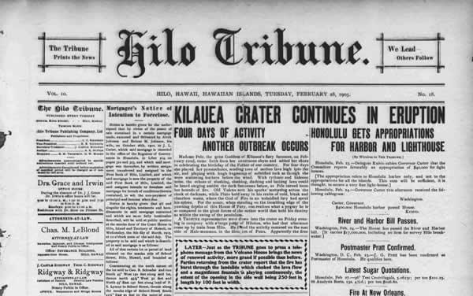
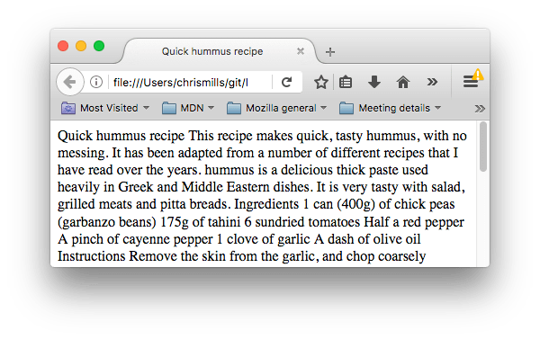
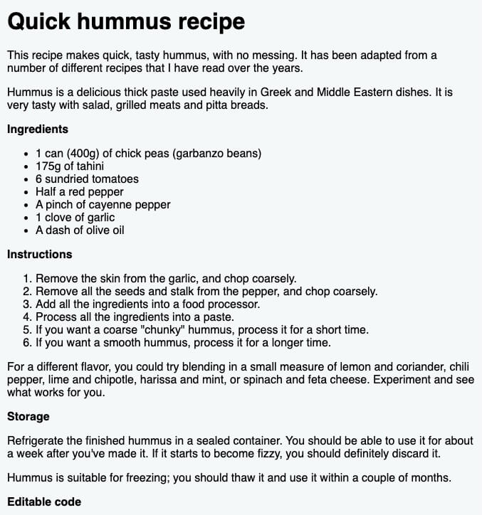
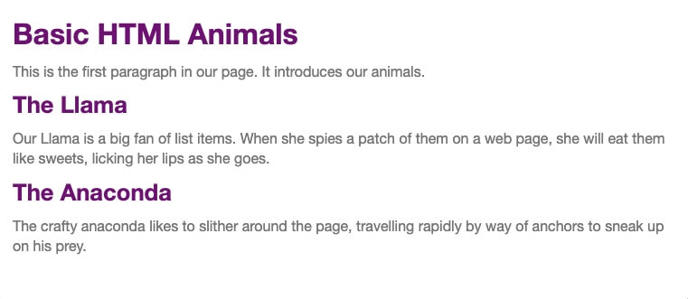
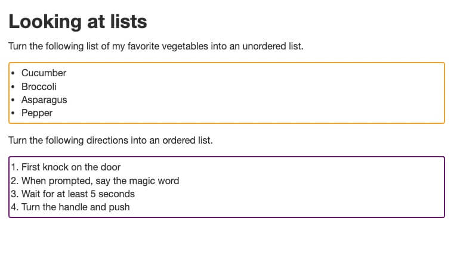
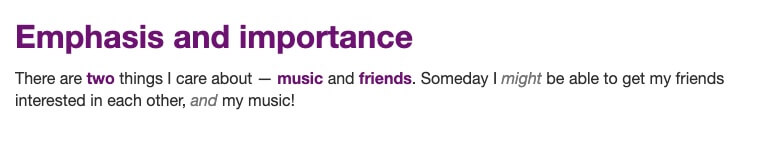

# HTML text fundamentals

One of HTML's main jobs is to give text structure so that a browser can display an HTML document the way its developer intends. This article explains the way [HTML](https://developer.mozilla.org/en-US/docs/Glossary/HTML) can be used to structure a page of text by adding headings and paragraphs, emphasizing words, creating lists, and more.

**Prerequisites:**

- Basic HTML familiarity

**Objective:**

- Learn how to mark up a basic page of text to give it structure and meaning — including paragraphs, headings, lists, emphasis, and quotations.

## The basics: headings and paragraphs

Most structured text consists of headings and paragraphs, whether you are reading a story, a newspaper, a college textbook, a magazine, etc.



**Structured content makes the reading experience easier and more enjoyable.**

In HTML, each paragraph has to be wrapped in a [`<p>`](https://developer.mozilla.org/en-US/docs/Web/HTML/Element/p) element, like so:

```html
<p>I am a paragraph, oh yes I am.</p>
```

Each heading has to be wrapped in a heading element:

```html
<h1>I am the title of the story.</h1>
```

There are six heading elements: [`<h1>`](https://developer.mozilla.org/en-US/docs/Web/HTML/Element/Heading_Elements), [`<h2>`](https://developer.mozilla.org/en-US/docs/Web/HTML/Element/Heading_Elements), [`<h3>`](https://developer.mozilla.org/en-US/docs/Web/HTML/Element/Heading_Elements), [`<h4>`](https://developer.mozilla.org/en-US/docs/Web/HTML/Element/Heading_Elements), [`<h5>`](https://developer.mozilla.org/en-US/docs/Web/HTML/Element/Heading_Elements), and [`<h6>`](https://developer.mozilla.org/en-US/docs/Web/HTML/Element/Heading_Elements). Each element represents a different level of content in the document; `<h1>` represents the main heading, `<h2>` represents subheadings, `<h3>` represents sub-subheadings, and so on.

### Implementing structural hierarchy

For example, in this story, the `<h1>` element represents the title of the story, the `<h2>` elements represent the title of each chapter, and the `<h3>` elements represent sub-sections of each chapter:

```html
<h1>The Crushing Bore</h1>

<p>By Chris Mills</p>

<h2>Chapter 1: The dark night</h2>

<p>
  It was a dark night. Somewhere, an owl hooted. The rain lashed down on the…
</p>

<h2>Chapter 2: The eternal silence</h2>

<p>Our protagonist could not so much as a whisper out of the shadowy figure…</p>

<h3>The specter speaks</h3>

<p>
  Several more hours had passed, when all of a sudden the specter sat bolt
  upright and exclaimed, "Please have mercy on my soul!"
</p>
```

It's really up to you what the elements involved represent, as long as the hierarchy makes sense. You just need to bear in mind a few best practices as you create such structures:

- Preferably, you should **use a single `<h1>` per page** —this is the top level heading, and all others sit below this in the hierarchy.
- Make sure you **use the headings in the correct order** in the hierarchy. Don't use `<h3>` elements to represent subheadings, followed by `<h2>` elements to represent sub-subheadings—that doesn't make sense and will lead to weird results.
- Of the six heading levels available, you should **aim to use no more than three per page**, unless you feel it is necessary. Documents with many levels (for example, a deep heading hierarchy) become unwieldy and difficult to navigate. On such occasions, it is advisable to spread the content over multiple pages if possible.

### Why do we need structure?

To answer this question, let's take a look at the following HTML:

```html
<!DOCTYPE html>
<html lang="en-us">
  <head>
    <meta charset="utf-8">
    <meta name="viewport" content="width=device-width">
    <title>Quick hummus recipe</title>
  </head>
  <body>
    Quick hummus recipe

    This recipe makes quick, tasty hummus, with no messing. It has been adapted from a number of different recipes that I have read over the years.

    Hummus is a delicious thick paste used heavily in Greek and Middle Eastern dishes. It is very tasty with salad, grilled meats and pitta breads.

    Ingredients

    1 can (400g) of chick peas (garbanzo beans)
    175g of tahini
    6 sundried tomatoes
    Half a red pepper
    A pinch of cayenne pepper
    1 clove of garlic
    A dash of olive oil

    Instructions

    Remove the skin from the garlic, and chop coarsely
    Remove all the seeds and stalk from the pepper, and chop coarsely
    Add all the ingredients into a food processor
    Process all the ingredients into a paste.
    If you want a coarse "chunky" hummus, process it for a short time
    If you want a smooth hummus, process it for a longer time

    For a different flavour, you could try blending in a small measure of lemon and coriander, chili pepper, lime and chipotle, harissa and mint, or spinach and feta cheese. Experiment and see what works for you.

    Storage

    Refrigerate the finished hummus in a sealed container. You should be able to use it for about a week after you've made it. If it starts to become fizzy, you should definitely discard it.

    Hummus is suitable for freezing; you should thaw it and use it within a couple of months.


  </body>
</html>
```

You should save a copy of this file (`text-start.html`) on your local machine, as you'll need it for the exercises later on. This document's body currently contains multiple pieces of content. They aren't marked up in any way, but they are separated with line breaks (Enter/Return pressed to go onto the next line).

However, when you open the document in your browser, you'll see that the text appears as a big chunk!



This is because there are no elements to give the content structure, so the browser does not know what is a heading and what is a paragraph. Furthermore:

- Users looking at a web page tend to **scan quickly to find relevant content**, often just reading the headings, to begin with. (We usually [spend a very short time on a web page](https://www.nngroup.com/articles/how-long-do-users-stay-on-web-pages/).) If they can't see anything useful within a few seconds, they'll likely get frustrated and go somewhere else.

- **Search engines indexing your page consider the contents of headings as important keywords for influencing the page's search rankings.** Without headings, your page will perform poorly in terms of [SEO](https://developer.mozilla.org/en-US/docs/Glossary/SEO) (Search Engine Optimization).

- **Severely visually impaired people** often don't read web pages; they listen to them instead. This is done with software called a [screen reader](https://en.wikipedia.org/wiki/Screen_reader). This software provides ways to get fast access to given text content. Among the various techniques used, they provide an outline of the document by reading out the headings, allowing their users to **find the information they need quickly**. If headings are not available, they will be forced to listen to the whole document read out loud.

- To **style content** with [CSS](https://developer.mozilla.org/en-US/docs/Glossary/CSS), or make it **do interesting things with [JavaScript](https://developer.mozilla.org/en-US/docs/Glossary/JavaScript)**, you need to have elements wrapping the relevant content, so CSS/JavaScript can effectively target it.

Therefore, we need to give our content structural markup.

<!-- SGEN:META:PROGRESS:task=Complete the exercise 'Active learning: Giving our content structure'|user_folder=html_text_fundamentals -->
<!-- SGEN:META:TESTS:name=Test Exercise: 'Active learning: Giving our content structure'|type=exist|user_folder=html_text_fundamentals|files=short-story.html -->
### Active learning: Giving our content structure

Let's jump straight in with an example. Create a basic HTML file (named `short-story.html`) and add the following text inside the `<body>` tags:

```
My short story I am a statistician and my name is Trish.

My legs are made of cardboard and I am married to a fish.
```

> 💡 You can always use the `!` or `html:5` shortcuts in Visual Studio Code to [quickly create an HTML5 boilerplate](https://www.youtube.com/watch?v=99g_BJiiLqk).

Now, go ahead and enclose the title (`My short story`) in a Heading 1 element and separate the two paragraphs using `<p>` tags.

> ▶️ Here's a [**video walkthrough**](https://www.youtube.com/watch?v=V-VrI-s6vXQ) in case you need some help. 
>
> _(Don't forget to always check the video description for resources, links and updates that accompany it.)_ 🙂 

<!-- 
 {{ EmbedLiveSample('Active_learning_Giving_our_content_structure', 700, 400, "", "") }} 
 -->

### Why do we need semantics?

Semantics are relied on everywhere around us—we rely on previous experience to tell us what the function of an everyday object is; when we see something, we know what its function will be. So, for example, we expect a red traffic light to mean "stop," and a green traffic light to mean "go." Things can get tricky very quickly if the wrong semantics are applied. (Do any countries use red to mean "go"? We hope not.)

In a similar way, we need to make sure we are using the correct elements, giving our content the correct meaning, function, or appearance. In this context, the [`<h1>`](https://developer.mozilla.org/en-US/docs/Web/HTML/Element/Heading_Elements) element is also a semantic element, which gives the text it wraps around the role (or meaning) of "a top level heading on your page."

```html
<h1>This is a top level heading</h1>
```

By default, the browser will give it a large font size to make it look like a heading (although **you could style it to look like anything you wanted** using CSS). More importantly, **its semantic value will be used in multiple ways, for example by search engines and screen readers** (as mentioned above).

On the other hand, you could make any element _look_ like a top level heading. Consider the following:

```html
<span style="font-size: 32px; margin: 21px 0; display: block;">
  Is this a top level heading?
</span>
```

This is a [`<span>`](https://developer.mozilla.org/en-US/docs/Web/HTML/Element/span) element. It has no semantics. You use it to wrap content when you want to apply CSS to it (or do something to it with JavaScript) without giving it any extra meaning. (You'll find out more about these later on in the course.) We've applied some CSS to it to make it look like a top level heading, but since it has no semantic value, **it will not get any of the extra benefits described above**. It is a good idea to **use the relevant HTML element for the job**.

## Lists

Now let's turn our attention to lists. Lists are everywhere in life—from your shopping list to the list of directions you subconsciously follow to get to your house every day, to the lists of instructions you are following in these tutorials! Lists are everywhere on the web, too, and we've got three different types to worry about.

### Unordered

Unordered lists are used to mark up lists of items for which the order of the items doesn't matter. Let's take a shopping list as an example:

```plain
milk
eggs
bread
hummus
```

Every unordered list starts off with a [`<ul>`](https://developer.mozilla.org/en-US/docs/Web/HTML/Element/ul) element—this wraps around all the list items:

```html-nolint
<ul>
  milk
  eggs
  bread
  hummus
</ul>
```

The last step is to wrap each list item in a [`<li>`](https://developer.mozilla.org/en-US/docs/Web/HTML/Element/li) (list item) element:

```html
<ul>
  <li>milk</li>
  <li>eggs</li>
  <li>bread</li>
  <li>hummus</li>
</ul>
```
<!-- SGEN:META:PROGRESS:task=Complete the exercise 'Active learning: Marking up an unordered list'|user_folder=html_text_fundamentals -->
<!-- SGEN:META:TESTS:name=Test Exercise: 'Active learning: Marking up an unordered list'|type=exist|user_folder=html_text_fundamentals|files=shopping-list.html -->
#### Active learning: Marking up an unordered list

Create an HTML file (`shopping-list.html`) and create an unordered list containing the following items:

```
milk eggs bread hummus
```

> ▶️ Here's a [**video walkthrough**](https://www.youtube.com/watch?v=5iva3_W0q2Y) that demonstrates 3 ways of creating unordered lists in VSCode. 🙂

<!-- 
 {{ EmbedLiveSample('Active_learning_Marking_up_an_unordered_list', 700, 400, "", "") }} 
 -->


### Ordered

Ordered lists are lists in which the order of the items _does_ matter. Let's take a set of directions as an example:

```plain
Drive to the end of the road
Turn right
Go straight across the first two roundabouts
Turn left at the third roundabout
The school is on your right, 300 meters up the road
```

The markup structure is the same as for unordered lists, except that you have to wrap the list items in an [`<ol>`](https://developer.mozilla.org/en-US/docs/Web/HTML/Element/ol) element, rather than `<ul>`:

```html
<ol>
  <li>Drive to the end of the road</li>
  <li>Turn right</li>
  <li>Go straight across the first two roundabouts</li>
  <li>Turn left at the third roundabout</li>
  <li>The school is on your right, 300 meters up the road</li>
</ol>
```
<!-- SGEN:META:PROGRESS:task=Complete the exercise 'Active learning: Marking up an ordered list'|user_folder=html_text_fundamentals -->
<!-- SGEN:META:TESTS:name=Test Exercise: 'Active learning: Marking up an ordered list'|type=exist|user_folder=html_text_fundamentals|files=directions.html -->
#### Active learning: Marking up an ordered list

Try turning the text content below into an ordered list in a file named `directions.html`.

```
Drive to the end of the road
Turn right
Go straight across the first two roundabouts
Turn left at the third roundabout
The school is on your right, 300 meters up the road
```

<!-- 
 {{ EmbedLiveSample('Active_learning_Marking_up_an_ordered_list', 700, 500, "", "") }} 
 -->

<!-- SGEN:META:PROGRESS:task=Complete the exercise 'Active learning: Marking up our recipe page'|user_folder=html_text_fundamentals -->
<!-- SGEN:META:TESTS:name=Test Exercise: 'Active learning: Marking up our recipe page'|type=exist|user_folder=html_text_fundamentals|files=recipe-page.html -->
### Active learning: Marking up our recipe page

Create a file named `recipe-page.html` and turn the following text content into an HTML structure that looks like this:



Here is the text content:

```
Quick hummus recipe This recipe makes quick, tasty hummus, with no messing. It has been adapted from a number of different recipes that I have read over the years. Hummus is a delicious thick paste used heavily in Greek and Middle Eastern dishes. It is very tasty with salad, grilled meats and pitta breads. Ingredients 1 can (400g) of chick peas (garbanzo beans) 175g of tahini 6 sundried tomatoes Half a red pepper A pinch of cayenne pepper 1 clove of garlic A dash of olive oil Instructions Remove the skin from the garlic, and chop coarsely Remove all the seeds and stalk from the pepper, and chop coarsely Add all the ingredients into a food processor Process all the ingredients into a paste If you want a coarse "chunky" hummus, process it for a short time If you want a smooth hummus, process it for a longer time For a different flavor, you could try blending in a small measure of lemon and coriander, chili pepper, lime and chipotle, harissa and mint, or spinach and feta cheese. Experiment and see what works for you. Storage Refrigerate the finished hummus in a sealed container. You should be able to use it for about a week after you've made it. If it starts to become fizzy, you should definitely discard it. Hummus is suitable for freezing; you should thaw it and use it within a couple of months.
```

> ▶️ Here's a [**video walkthrough**](https://www.youtube.com/watch?v=KOJzA1WJvJ8) of solving the exercise, in case you need help. 

> 💡 If you have watched a couple of these video walkthroughs, you've probably realized that VSCode provides **a lot of** shortcuts that make our web developer life easier. You can download a PDF containing the keyboard shortcuts for Visual Studio Code [**for Windows**](https://code.visualstudio.com/shortcuts/keyboard-shortcuts-windows.pdf), [**for Mac**](https://code.visualstudio.com/shortcuts/keyboard-shortcuts-macos.pdf) or for [**for Linux**](https://code.visualstudio.com/shortcuts/keyboard-shortcuts-linux.pdf).


<!-- 
 {{ EmbedLiveSample('Active_learning_Marking_up_our_recipe_page', 900, 620, "", "") }} 
 -->

### Nesting lists

It is perfectly OK to nest one list inside another one. You might want to have some sub-bullets sitting below a top-level bullet. Let's take the second list from our recipe example:

```html
<ol>
  <li>Remove the skin from the garlic, and chop coarsely.</li>
  <li>Remove all the seeds and stalk from the pepper, and chop coarsely.</li>
  <li>Add all the ingredients into a food processor.</li>
  <li>Process all the ingredients into a paste.</li>
  <li>If you want a coarse "chunky" hummus, process it for a short time.</li>
  <li>If you want a smooth hummus, process it for a longer time.</li>
</ol>
```

Since the last two bullets are very closely related to the one before them (they read like sub-instructions or choices that fit below that bullet), it might make sense to nest them inside their own unordered list and put that list inside the current fourth bullet. This would look like so:

```html
<ol>
  <li>Remove the skin from the garlic, and chop coarsely.</li>
  <li>Remove all the seeds and stalk from the pepper, and chop coarsely.</li>
  <li>Add all the ingredients into a food processor.</li>
  <li>
    Process all the ingredients into a paste.
    <ul>
      <li>
        If you want a coarse "chunky" hummus, process it for a short time.
      </li>
      <li>If you want a smooth hummus, process it for a longer time.</li>
    </ul>
  </li>
</ol>
```

Try going back to the previous active learning example and updating the second list like this. Save the file in `user/week02/exercises/html_text_fundamentals/recipe-page2.html`.

## Emphasis and importance

In human language, we often emphasize certain words to alter the meaning of a sentence, and we often want to mark certain words as important or different in some way. HTML provides various semantic elements to allow us to mark up textual content with such effects, and in this section, we'll look at a few of the most common ones.

### Emphasis

When we want to add emphasis in spoken language, we _stress_ certain words, subtly altering the meaning of what we are saying. Similarly, in written language we tend to stress words by putting them in italics. For example, the following two sentences have different meanings.

> I am glad you weren't late.
>
> I am _glad_ you weren't _late_.

The first sentence sounds genuinely relieved that the person wasn't late. In contrast, the second one, with both the words "glad" and "late" in italics, sounds sarcastic or passive-aggressive, expressing annoyance that the person arrived a bit late.

In HTML we use the [`<em>`](https://developer.mozilla.org/en-US/docs/Web/HTML/Element/em) (emphasis) element to mark up such instances. As well as making the document more interesting to read, **these are recognized by screen readers**, which can be configured to **speak them in a different tone of voice**. Browsers style this as italic by default, but you shouldn't use this tag purely to get italic styling. To do that, you'd use a [`<span>`](https://developer.mozilla.org/en-US/docs/Web/HTML/Element/span) element and some CSS, or perhaps an [`<i>`](https://developer.mozilla.org/en-US/docs/Web/HTML/Element/i) element (see below).

```html
<p>I am <em>glad</em> you weren't <em>late</em>.</p>
```

### Strong importance

To emphasize important words, we tend to stress them in spoken language and **bold** them in written language. For example:

> This liquid is **highly toxic**.
>
> I am counting on you. **Do not** be late!

In HTML we use the [`<strong>`](https://developer.mozilla.org/en-US/docs/Web/HTML/Element/strong) (strong importance) element to mark up such instances. As well as making the document more useful, again these are recognized by screen readers, which can be configured to speak them in a different tone of voice. Browsers style this as bold text by default, but you shouldn't use this tag purely to get bold styling. To do that, you'd use a [`<span>`](https://developer.mozilla.org/en-US/docs/Web/HTML/Element/span) element and some CSS, or perhaps a [`<b>`](https://developer.mozilla.org/en-US/docs/Web/HTML/Element/b) element (see below).

```html
<p>This liquid is <strong>highly toxic</strong>.</p>

<p>I am counting on you. <strong>Do not</strong> be late!</p>
```

You can nest strong and emphasis inside one another if desired:

```html-nolint
<p>This liquid is <strong>highly toxic</strong> — if you drink it, <strong>you may <em>die</em></strong>.</p>
```

<!-- 
 {{EmbedLiveSample('Strong importance')}} 
 -->

<!-- 
 {{ EmbedLiveSample('Active_learning_Lets_be_important', 700, 520, "", "") }} 
 -->


### Italic, bold, underline…

The elements we've discussed so far have clearcut associated semantics. The situation with [`<b>`](https://developer.mozilla.org/en-US/docs/Web/HTML/Element/b), [`<i>`](https://developer.mozilla.org/en-US/docs/Web/HTML/Element/i), and [`<u>`](https://developer.mozilla.org/en-US/docs/Web/HTML/Element/u) is somewhat more complicated. They came about so people could write bold, italics, or underlined text in an era when CSS was still supported poorly or not at all. Elements like this, which only affect presentation and not semantics, are known as **presentational elements** and should no longer be used because, as we've seen before, semantics is so important to accessibility, SEO, etc.

HTML5 redefined `<b>`, `<i>`, and `<u>` with new, somewhat confusing, semantic roles.

Here's the best rule you can remember: It's only appropriate to use `<b>`, `<i>`, or `<u>` to convey a meaning traditionally conveyed with bold, italics, or underline when there isn't a more suitable element; and there usually is. Consider whether `<strong>`, `<em>`, `<mark>`, or `<span>` might be more appropriate.

**Always keep an accessibility mindset.** The concept of italics isn't very helpful to people using screen readers, or to people using a writing system other than the Latin alphabet.

- [`<i>`](https://developer.mozilla.org/en-US/docs/Web/HTML/Element/i) is used to convey a meaning traditionally conveyed by italic: foreign words, taxonomic designation, technical terms, a thought…
- [`<b>`](https://developer.mozilla.org/en-US/docs/Web/HTML/Element/b) is used to convey a meaning traditionally conveyed by bold: keywords, product names, lead sentence…
- [`<u>`](https://developer.mozilla.org/en-US/docs/Web/HTML/Element/u) is used to convey a meaning traditionally conveyed by underline: proper name, misspelling…

> **Note:** People strongly associate underlining with hyperlinks. Therefore, on the web, **it's best to only underline links**. Use the `<u>` element when it's semantically appropriate, but consider using CSS to change the default underline to something more appropriate on the web. The example below illustrates how it can be done.

```html
<!-- scientific names -->
<p>
  The Ruby-throated Hummingbird (<i>Archilochus colubris</i>) is the most common
  hummingbird in Eastern North America.
</p>

<!-- foreign words -->
<p>
  The menu was a sea of exotic words like <i lang="uk-latn">vatrushka</i>,
  <i lang="id">nasi goreng</i> and <i lang="fr">soupe à l'oignon</i>.
</p>

<!-- a known misspelling -->
<p>Someday I'll learn how to <u class="spelling-error">spel</u> better.</p>

<!-- term being defined when used in a definition -->
<dl>
  <dt>Semantic HTML</dt>
  <dd>
    Use the elements based on their <b>semantic</b> meaning, not their
    appearance.
  </dd>
</dl>
```

<!-- 
 {{EmbedLiveSample('Italic, bold, underline…','100%','270')}} 
 -->


## Test your skills!

The aim of this skill test is to assess whether you understand how to mark up text in HTML to give it structure and meaning.

<!-- SGEN:META:PROGRESS:task=Complete the exercise 'Test your skills: HTML text fundamentals Task 1'|user_folder=html_text_fundamentals -->
<!-- SGEN:META:TESTS:name=Test Exercise: 'Test your skills: HTML text fundamentals Task 1'|type=exist|user_folder=html_text_fundamentals|files=basic-text1.html -->
## Task 1

In this task, we want you to mark up the provided HTML using semantic heading and paragraph elements.

Save the provided HTML in `basic-text1.html` and try to make it look like the screenshot below:

HTML:

```html
<!DOCTYPE html>
<html lang="en">
  <head>
    <meta charset="utf-8"/>
    <title>Basic HTML text: Task 1</title>
    <style>
      body {
        background-color: #fff;
        color: #333;
        font: 1em / 1.4 Helvetica Neue, Helvetica, Arial, sans-serif;
        padding: 1em;
        margin: 0;
      }
      h1 {
        font-size: 2rem;
        margin: 0;
      }
      h2 {
        font-size: 1.6rem;
        margin: 0;
      }
      h1, h2 {
        color: purple;
      }
      p {
        color: gray;
        margin: 0.5em 0;
      }
      * {
        box-sizing: border-box;
      }
    </style>
  </head>

  <body>

  Basic HTML Animals

  This is the first paragraph in our page. It introduces our animals.

  The Llama

  Our Llama is a big fan of list items. When she spies a patch of them on a web page, she will eat them like sweets, licking her lips as she goes.

  The Anaconda

  The crafty anaconda likes to slither around the page, travelling rapidly by way of anchors to sneak up on his prey.

  </body>
</html>
```

The finished example should look like this:



<!-- SGEN:META:PROGRESS:task=Complete the exercise 'Test your skills: HTML text fundamentals Task 2'|user_folder=html_text_fundamentals -->
<!-- SGEN:META:TESTS:name=Test Exercise: 'Test your skills: HTML text fundamentals Task 2'|type=exist|user_folder=html_text_fundamentals|files=basic-text2.html -->
## Task 2

In this task, we want you to turn the first un-marked up list into an unordered list, and the second one into an ordered list. Save the code in a file named `basic-text2.html`.

```html
<!DOCTYPE html>
<html lang="en">
  <head>
    <meta charset="utf-8"/>
    <title>Basic HTML text: Task 2</title>
    <style>
      body {
        background-color: #fff;
        color: #333;
        font: 1em / 1.4 Helvetica Neue, Helvetica, Arial, sans-serif;
        padding: 1em;
        margin: 0;
      }

      h1 {
        font-size: 2rem;
        margin: 0;
      }

      h2 {
        font-size: 1.6rem;
        margin: 0;
      }

      p {
        margin: 0.5em 0;
      }

      ol {
        border: 2px solid purple;
      }

      ul {
        border: 2px solid orange;
      }

      ol, ul {
        padding: 5px 20px;
        border-radius: 4px;
      }
    </style>
  </head>

  <body>

    <h1>Looking at lists</h1>

    <p>Turn the following list of my favorite vegetables into an unordered list.</p>

      Cucumber
      Broccoli
      Asparagus
      Pepper

    <p>Turn the following directions into an ordered list.</p>

      First knock on the door
      When prompted, say the magic word
      Wait for at least 5 seconds
      Turn the handle and push

  </body>
</html>
```

The finished example should look like this:



<!-- SGEN:META:PROGRESS:task=Complete the exercise 'Test your skills: HTML text fundamentals Task 3'|user_folder=html_text_fundamentals -->
<!-- SGEN:META:TESTS:name=Test Exercise: 'Test your skills: HTML text fundamentals Task 3'|type=exist|user_folder=html_text_fundamentals|files=basic-text3.html -->
## Task 3

In this task, you are provided with a paragraph, and your aim is to use some inline elements to mark up a couple of appropriate words with strong importance, and a couple with emphasis. Save the file in `basic-text3.html`.

```html
<!DOCTYPE html>
<html lang="en">
  <head>
    <meta charset="utf-8"/>
    <title>Basic HTML text: Task 3</title>
    <style>
      body {
        background-color: #fff;
        color: #333;
        font: 1em / 1.4 Helvetica Neue, Helvetica, Arial, sans-serif;
        padding: 1em;
        margin: 0;
      }

      h1 {
        font-size: 2rem;
        margin: 0;
      }

      h2 {
        font-size: 1.6rem;
        margin: 0;
      }

      h1, h2, strong {
        color: purple;
      }

      p, em {
        color: gray;
        margin: 0.5em 0;
      }

      * {
        box-sizing: border-box;
      }
    </style>
  </head>

  <body>

  <h1>Emphasis and importance</h1>

  <p>There are two things I care about — music and friends. Someday I might be able to get my friends interested in each other, and my music!</p>

  </body>
</html>
```

The finished example should look like this:



## Summary

That's it for now! This article should have given you a good idea of how to start marking up text in HTML and introduced you to some of the most important elements in this area. There are a lot more semantic elements to cover in this area, and we'll look at a lot more in our upcoming Modules. 

### Sources and Attributions

**Content is based on the following sources:**

- **MDN:**
  - [HTML text fundamentals](https://developer.mozilla.org/en-US/docs/Learn/HTML/Introduction_to_HTML/HTML_text_fundamentals#active_learning_lets_be_important){:target="_blank"}
  - [Test your skills: HTML text basics](https://developer.mozilla.org/en-US/docs/Learn/HTML/Introduction_to_HTML/Test_your_skills:_HTML_text_basics){:target="_blank"} [(Permalink)](https://github.com/mdn/content/blob/fe36fe6e46bc87566759c0f167f315b3779d2ed6/files/en-us/learn/html/introduction_to_html/test_your_skills_colon__html_text_basics/index.md){:target="_blank"}
