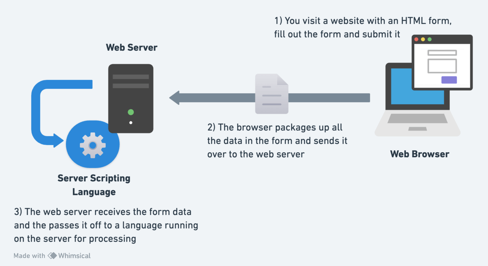

# HTML Forms

**What you'll learn:**

- (Almost) all about HTML Forms!

**Web forms — Working with user data**

This module provides a series of articles that will help you master the essentials of web forms. Web forms are a very powerful tool for interacting with users — most commonly they are used for collecting data from users, or allowing them to control a user interface. However, for historical and technical reasons, it's not always obvious how to use them to their full potential. In the articles listed below, we'll cover most of the essential aspects of Web forms.

**Prerequisites**

- HTML

**High level overview:**

**Introductory guides:**

<!-- SGEN:META:PROGRESS:task=Complete the exercise 'Active learning: Implementing our form HTML'|user_folder=your_first_form -->
<!-- SGEN:META:TESTS:name=Test Exercise: 'Active learning: Implementing our form HTML'|type=exist|user_folder=your_first_form|files=first-form.html -->

<!-- SGEN:META:PROGRESS:task=Complete the exercise 'Basic form styling'|user_folder=your_first_form -->
<!-- SGEN:META:TESTS:name=Test Exercise: 'Basic form styling'|type=exist|user_folder=your_first_form|files=first-form-styled.html -->
- [Read: **Your first form**](https://developer.mozilla.org/en-US/docs/Learn/Forms/Your_first_form) and complete all the challenges _(e.g. Active Learning sections, etc.)_.
  - **Description:** The first article in our series provides you with your very first experience of creating a web form, including designing a simple form, implementing it using the right HTML form controls and other HTML elements, adding some very simple styling via CSS, and describing how data is sent to a server. 
  - **Level:** Beginner

<!-- SGEN:META:PROGRESS:task=Complete the exercise 'Active learning: building a form structure'|user_folder=how_to_structure_a_web_form -->
<!-- SGEN:META:TESTS:name=Test Exercise: 'Active learning: building a form structure'|type=exist|user_folder=how_to_structure_a_web_form|files=payment-form.html -->
- [Read: **How to structure a web form**](https://developer.mozilla.org/en-US/docs/Learn/Forms/How_to_structure_a_web_form) and complete all the challenges _(e.g. Active Learning sections, etc.)_.
  - **Description:** With the basics out of the way, we'll now look in more detail at the elements used to provide structure and meaning to the different parts of a form.
  - **Level:** Beginner

<!-- SGEN:META:PROGRESS:task=Complete the exercise 'Test your skills: Form structure'|user_folder=test_your_skills_form_structure -->
<!-- SGEN:META:TESTS:name=Test Exercise: 'Test your skills: Form structure'|type=exist|user_folder=test_your_skills_form_structure|files=form-structure1-download.html -->
- [Complete the: **Test your skills: Form structure** challenge](https://developer.mozilla.org/en-US/docs/Learn/Forms/How_to_structure_a_web_form)

**The different form controls:**

- [Read: **Basic native form controls**](https://developer.mozilla.org/en-US/docs/Learn/Forms/Basic_native_form_controls)
  - **Description:** In this particular article, we will look at the original set of form controls, available in all browsers since the early days of the web.
  - **Level:** Beginner

<!-- SGEN:META:PROGRESS:task=Complete the exercise 'Test_your_skills:_Basic_controls'|user_folder=test_your_skills_basic_controls -->
<!-- SGEN:META:TESTS:name=Test Exercise: 'Test_your_skills:_Basic_controls'|type=exist|user_folder=test_your_skills_basic_controls|files=basic-controls1-download.html,basic-controls2-download.html,basic-controls3-download.html -->
- [Complete the: **Test your skills: Basic controls** challenge](https://developer.mozilla.org/en-US/docs/Learn/Forms/Test_your_skills:_Basic_controls)

## Sources and Attributions

**Content is based on the following sources:**

- **MDN**:
  - [Web forms — Working with user data](https://developer.mozilla.org/en-US/docs/Learn/Forms){:target="_blank"} / [(Permalink)](https://github.com/mdn/content/blob/26f68076bcd8e3d5893cffcd9c1c01ff949318a9/files/en-us/learn/forms/index.md){:target="_blank"}
  - [Accessibility](https://developer.mozilla.org/en-US/docs/Learn/Accessibility){:target="_blank"} / [Permalink](https://github.com/mdn/content/blob/26f68076bcd8e3d5893cffcd9c1c01ff949318a9/files/en-us/learn/accessibility/index.md){:target="_blank"}