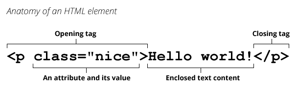
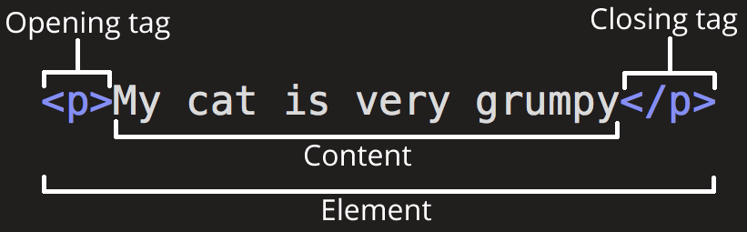
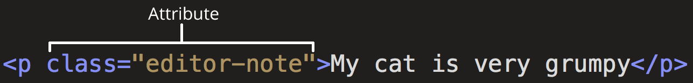
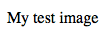

# HTML Basics

_(Updated: 06/10/2025)_

HTML (**H**yper**T**ext **M**arkup **L**anguage) is the code that is used to structure a web page and its content. For example, content could be structured within a set of paragraphs, a list of bulleted points, or using images and data tables. As the title suggests, this article will give you a basic understanding of HTML and its functions.

## So what is HTML?

HTML is a _markup language_ that defines the structure of your content. HTML consists of a series of **elements**, which you use to enclose, or wrap, different parts of the content to make it appear a certain way, or act a certain way. 

An **element** is a part of a webpage. In [XML](https://developer.mozilla.org/en-US/docs/Glossary/XML) and [HTML](https://developer.mozilla.org/en-US/docs/Glossary/HTML), an element may contain a data item or a chunk of text or an image, or perhaps nothing. A typical element includes an opening tag with some [attributes](https://developer.mozilla.org/en-US/docs/Glossary/Attribute), enclosed text content, and a closing tag.



In short, **in [HTML](https://developer.mozilla.org/en-US/docs/Glossary/HTML) a `<tag>` is used for creating an [element](https://developer.mozilla.org/en-US/docs/Glossary/Element)**.

The enclosing **tags** can turn a word or an image into a [**hyperlink**](#links) _(more on this later)_, can italicize words, can make the font bigger or smaller, and so on. For example, take the following line of content:

```
My cat is very grumpy
```

If we wanted the line to stand by itself, we could specify that it is a paragraph by enclosing it in paragraph tags:

```html
<p>My cat is very grumpy</p>
```

The name of an HTML element is the name that appears at the beginning of the element's start tag and at the end of the element's end tag (if the element has an end tag). For example, the `p` in the `<p>` start tag and `</p>` end tag is the name of the HTML paragraph element. Note that an element name in an end tag is preceded by a slash character: `</p>`, and that for [void elements](https://developer.mozilla.org/en-US/docs/Glossary/Void_element), the end tag is neither required nor allowed.

**Elements and [tags](https://developer.mozilla.org/en-US/docs/Glossary/Tag) are _not_ the same things**. Tags begin or end an element in source code, whereas elements are part of the [DOM](https://developer.mozilla.org/en-US/docs/Glossary/DOM), the document model for displaying the page in the [browser](https://developer.mozilla.org/en-US/docs/Glossary/Browser).

### Anatomy of an HTML element

Let's explore this paragraph element a bit further.



The main parts of our element are as follows:

1. **The opening tag:** This consists of the name of the element (in this case, p), wrapped in opening and closing **angle brackets**. This states where the element begins or starts to take effect — in this case where the paragraph begins.
2. **The closing tag:** This is the same as the opening tag, except that it includes a _forward slash_ before the element name. This states where the element ends — in this case where the paragraph ends. **Failing to add a closing tag is one of the standard beginner errors and can lead to strange results**.
3. **The content:** This is the content of the element, which in this case, is just text.
4. **The element:** The opening tag, the closing tag, and the content together comprise the element.

### Attributes

Elements can also have attributes that look like the following:



Attributes contain extra information about the element that you don't want to appear in the actual content. Here, `class` is the attribute _name_ and `editor-note` is the attribute _value_. The `class` attribute allows you to give the element a non-unique identifier that can be used to target it (and any other elements with the same `class` value) with style information and other things.
Some attributes have no value, such as [`required`](https://developer.mozilla.org/en-US/docs/Web/HTML/Attributes/required):

```html
<input required type="password">
```

Attributes that set a value always have:

1. A space between it and the element name (or the previous attribute, if the element already has one or more attributes).
2. The attribute name followed by an equal sign.
3. The attribute value wrapped by opening and closing quotation marks.

> **Note:** Simple attribute values that don't contain ASCII whitespace (or any of the characters `"` `'` `` ` `` `=` `<` `>`) can remain unquoted, but **it is recommended that you quote all attribute values**, as it makes the code more consistent and understandable.

An **attribute** extends an HTML or XML [element](https://developer.mozilla.org/en-US/docs/Glossary/Element), changing its behavior or providing metadata.

An attribute always has the form `name="value"` (the attribute's identifier followed by its associated value).

### Boolean attributes

Sometimes you will see attributes written without values. This is entirely acceptable. These are called Boolean attributes. Boolean attributes can only have one value, which is generally the same as the attribute name. For example, consider the [`disabled`](https://developer.mozilla.org/en-US/docs/Web/HTML/Attributes/disabled) attribute, which you can assign to form input elements. (You use this to _disable_ the form input elements so the user can't make entries. The disabled elements typically have a grayed-out appearance.) For example:

```html
<input type="text" disabled="disabled" />
```

As shorthand, it is acceptable to write this as follows:

```html
<!-- using the disabled attribute prevents the end user from entering text into the input box -->
<input type="text" disabled />

<!-- text input is allowed, as it doesn't contain the disabled attribute -->
<input type="text" />
```

More examples, using the `required` boolean attribute:

```html
<input required />
<!-- is the same as… -->
<input required="" />
<!-- or -->
<input required="required" />
```

### Omitting quotes around attribute values

If you look at code for a lot of other sites, you might come across a number of strange markup styles, including attribute values without quotes. This is permitted in certain circumstances, but it can also break your markup in other circumstances. For example we could write something like this:

```html
<a href=https://www.mozilla.org/>favorite website</a>
```

However, as soon as we add the `title` attribute in this way, there are problems:

```html
<a href=https://www.mozilla.org/ title=The Mozilla homepage>favorite website</a>
```

As written above, the browser misinterprets the markup, mistaking the `title` attribute for three attributes: a title attribute with the value `The`, and two Boolean attributes, `Mozilla` and `homepage`. Obviously, this is not intended! It will cause errors or unexpected behavior. If you hover over the link, you will only see the word "The" being displayed after a few seconds.

**Always include the attribute quotes. It avoids such problems, and results in more readable code.**

### Single or double quotes?

In this article, you will also notice that the attributes are wrapped in double quotes. However, you might see single quotes in some HTML code. This is a matter of style. You can feel free to choose which one you prefer. Both of these lines are equivalent:

```html
<a href='https://www.example.com'>A link to my example.</a>

<a href="https://www.example.com">A link to my example.</a>
```

Make sure you **don't mix single quotes and double quotes**. This example (below) shows a kind of mixing of quotes that will go wrong:

```html
<a href="https://www.example.com'>A link to my example.</a>
```

However, if you use one type of quote, you can include the other type of quote _inside_ your attribute values:

```html
<a href="https://www.example.com" title="Isn't this fun?">
  A link to my example.
</a>
```

To use quote marks inside other quote marks of the same type (single quote or double quote), use [HTML entities](#entity-references-including-special-characters-in-html). For example, this will break:

```html
<a href="https://www.example.com" title="An "interesting" reference">A link to my example.</a>
```

Instead, you need to do this:

```html
<a href="https://www.example.com" title="An &quot;interesting&quot; reference">A link to my example.</a>
```

### Nesting elements

You can put elements inside other elements too — this is called **nesting**. If we wanted to state that our cat is **very** grumpy, we could wrap the word "very" in a [strong](https://developer.mozilla.org/en-US/docs/Web/HTML/Element/strong) element, which means that the word is to be strongly emphasized:

```html
<p>My cat is <strong>very</strong> grumpy.</p>
```

You do however need to **make sure that your elements are properly nested**. In the example above, we opened the [p](https://developer.mozilla.org/en-US/docs/Web/HTML/Element/p) element first, then the [strong](https://developer.mozilla.org/en-US/docs/Web/HTML/Element/strong) element; therefore, we have to close the [strong](https://developer.mozilla.org/en-US/docs/Web/HTML/Element/strong) element first, then the [p](https://developer.mozilla.org/en-US/docs/Web/HTML/Element/p) element. The following is incorrect:

```html
<p>My cat is <strong>very grumpy.</p></strong>
```

The elements have to open and close correctly so that they are clearly inside or outside one another. If they overlap as shown above, then your web browser will try to make the best guess at what you were trying to say, which can lead to unexpected results. **So don't do it!**

### Void elements

Some elements have no content and are called **[void elements](https://developer.mozilla.org/en-US/docs/Glossary/Void_element)**. Take the [img](https://developer.mozilla.org/en-US/docs/Web/HTML/Element/img) element that we already have in our HTML page:

```html

```

This contains two attributes, but there is no closing `</img>` tag and no inner content. This is because an image element doesn't wrap content to affect it. Its purpose is to embed an image in the HTML page in the place it appears.

### Anatomy of an HTML document

That wraps up the basics of individual HTML elements, but they aren't handy on their own. Now we'll look at how individual elements are combined to form an entire HTML page:

```html
<!doctype html>
<html lang="en-US">
  <head>
    <meta charset="utf-8" />
    <meta name="viewport" content="width=device-width" />
    <title>My test page</title>
  </head>
  <body>
    
  </body>
</html>
```

Here, we have the following:

- `<!DOCTYPE html>` — [doctype](https://developer.mozilla.org/en-US/docs/Glossary/Doctype). It is a required preamble. In the mists of time, when HTML was young (around 1991/92), doctypes were meant to act as links to a set of rules that the HTML page had to follow to be considered good HTML, which could mean automatic error checking and other useful things. However, these days, they don't do much and are basically just needed to make sure your document behaves correctly. That's all you need to know for now.
- `<html></html>` — the [html](https://developer.mozilla.org/en-US/docs/Web/HTML/Element/html) element. This element wraps all the content on the entire page and is sometimes known as the root element. It also includes the `lang` attribute, setting the primary language of the document.
- `<head></head>` — the [head](https://developer.mozilla.org/en-US/docs/Web/HTML/Element/head) element. This element acts as a container for all the stuff you want to include on the HTML page that _isn't_ the content you are showing to your page's viewers. This includes things like [keywords](https://developer.mozilla.org/en-US/docs/Glossary/Keyword) and a page description that you want to appear in search results, CSS to style our content, character set declarations, and more.
- `<meta charset="utf-8">` — This element sets the character set your document should use to UTF-8 which includes most characters from the vast majority of written languages. Essentially, it can now handle any textual content you might put on it. **There is no reason not to set this**, and it can help avoid some problems later on.
- `<meta name="viewport" content="width=device-width">` — This [viewport element](https://developer.mozilla.org/en-US/docs/Web/CSS/Viewport_concepts#mobile_viewports) ensures the page renders at the width of viewport, preventing mobile browsers from rendering pages wider than the viewport and then shrinking them down.
- `<title></title>` — the [title](https://developer.mozilla.org/en-US/docs/Web/HTML/Element/title) element. This sets the title of your page, which is the title that appears in the browser tab the page is loaded in. It is also used to describe the page when you bookmark/favorite it.
- `<body></body>` — the [body](https://developer.mozilla.org/en-US/docs/Web/HTML/Element/body) element. This contains _all_ the content that you want to show to web users when they visit your page, whether that's text, images, videos, games, playable audio tracks, or whatever else.

## Images

Let's turn our attention to the [img](https://developer.mozilla.org/en-US/docs/Web/HTML/Element/img) element again:

```html

```

As we said before, it embeds an image into our page in the position it appears. It does this via the `src` (source) attribute, which contains the path to our image file.

**We have also included an `alt` (alternative) attribute**. In the [`alt` attribute](https://developer.mozilla.org/en-US/docs/Web/HTML/Element/img#authoring_meaningful_alternate_descriptions), you specify descriptive text for users who cannot see the image, possibly because of the following reasons:

1. They are visually impaired. Users with significant visual impairments often use tools called screen readers to read out the alt text to them.
2. Something has gone wrong causing the image not to display. For example, **try deliberately changing the path inside your `src` attribute to make it incorrect.** If you save and reload the page, you should see something like this in place of the image:



The keywords for alt text are "descriptive text". **The alt text you write should provide the reader with enough information to have a good idea of what the image conveys.** In this example, our current text of "My test image" is **no good at all**. A much better alternative for our Firefox logo would be "The Firefox logo: a flaming fox surrounding the Earth."

Try coming up with some better alt text for your image now.

## Marking up text

This section will cover some essential HTML elements you'll use for marking up the text.

### Headings

Heading elements allow you to specify that certain parts of your content are headings — or subheadings. In the same way that a book has the main title, chapter titles, and subtitles, an HTML document can too. HTML contains 6 heading levels, [&lt;h1&gt; - &lt;h6&gt;](https://developer.mozilla.org/en-US/docs/Web/HTML/Element/Heading_Elements), although you'll commonly only use 3 to 4 at most:

```html
<!-- 4 heading levels: -->
<h1>My main title</h1>
<h2>My top level heading</h2>
<h3>My subheading</h3>
<h4>My sub-subheading</h4>
```

> **Note:** Anything in HTML between `<!--` and `-->` is an **HTML comment**. The browser ignores comments as it renders the code. In other words, they are not visible on the page - just in the code. HTML comments are a way for you to write helpful notes about your code or logic.

> **Note:** You'll see that your heading level 1 has an implicit style. **Don't use heading elements to make text bigger or bold**, because they are used for **accessibility** and other reasons such as **SEO***. Try to create a meaningful sequence of headings on your pages, **without skipping levels**.

*_**SEO (Search Engine Optimization)** is the process of making a website more visible in search results, also termed improving search rankings. Search engines crawl the web, following links from page to page, and index the content found. When you search, the search engine displays the indexed content. Crawlers follow rules. If you follow those rules closely when doing SEO for a website, you give the site the best chances of showing up among the first results, increasing traffic and possibly revenue (for e-commerce and ads)._

### Paragraphs

As explained above, [p](https://developer.mozilla.org/en-US/docs/Web/HTML/Element/p) elements are for containing paragraphs of text; you'll use these frequently when marking up regular text content:

```html
<p>This is a single paragraph</p>
```

### Whitespace in HTML

No matter how much whitespace you use inside HTML element content (which can include one or more space characters, but also line breaks), the HTML parser reduces each sequence of whitespace to a single space when rendering the code. For example, these two code snippets are equivalent:

```html
<p id="noWhitespace">Dogs are silly.</p>

<p id="whitespace">Dogs
    are
        silly.</p>
```

Both of them will be rendered the same way in the browser:

```
Dogs are silly.

Dogs are silly.
```

So why use so much whitespace? The answer is readability.

It can be easier to understand what is going on in your code if you have it nicely formatted. 

### Lists

A lot of the web's content is lists and HTML has special elements for these. Marking up lists always consists of at least 2 elements. The most common list types are ordered and unordered lists:

1. **Unordered lists** are for lists where the order of the items doesn't matter, such as a shopping list. These are wrapped in a [ul](https://developer.mozilla.org/en-US/docs/Web/HTML/Element/ul) element.
2. **Ordered lists** are for lists where the order of the items does matter, such as a recipe. These are wrapped in an [ol](https://developer.mozilla.org/en-US/docs/Web/HTML/Element/ol) element.

Each item inside the lists is put inside an [li](https://developer.mozilla.org/en-US/docs/Web/HTML/Element/li) (list item) element.

For example, if we wanted to turn the part of the following paragraph fragment into a list

```html
<p>
  At Mozilla, we're a global community of technologists, thinkers, and builders
  working together…
</p>
```

We could modify the markup to this

```html
<p>At Mozilla, we're a global community of</p>

<ul>
  <li>technologists</li>
  <li>thinkers</li>
  <li>builders</li>
</ul>

<p>working together…</p>
```

## Links

Links are [**very important**](https://www.youtube.com/watch?v=3Va3oY8pfSI) — they are what makes the web a web! To add a link, we need to use a simple element — [a](https://developer.mozilla.org/en-US/docs/Web/HTML/Element/a) — "a" being the short form for "anchor". To make text within your paragraph into a link, follow these steps:

1. Choose some text. We chose the text "Mozilla Manifesto".
2. Wrap the text in an [a](https://developer.mozilla.org/en-US/docs/Web/HTML/Element/a) element, as shown below:

   ```html
   <a>Mozilla Manifesto</a>
   ```

3. Give the [a](https://developer.mozilla.org/en-US/docs/Web/HTML/Element/a) element an `href` attribute, as shown below:

   ```html
   <a href="">Mozilla Manifesto</a>
   ```

4. Fill in the value of this attribute with the web address that you want the link to:

   ```html
   <a href="https://www.mozilla.org/en-US/about/manifesto/">
     Mozilla Manifesto
   </a>
   ```

You might get unexpected results if you omit the `https://` or `http://` part, called the _protocol_, at the beginning of the web address. After making a link, click it to make sure it is sending you where you wanted it to.

> **Note:** `href` might appear like a rather obscure choice for an attribute name at first. If you are having trouble remembering it, remember that it stands for _**h**ypertext **ref**erence_.

Anchors can take a number of attributes, but several are as follows:

- `href`: This attribute's value specifies the web address for the link. For example: `href="https://www.mozilla.org/"`.

- `title`: The `title` attribute specifies extra information about the link, such as a description of the page that is being linked to. For example, `title="The Mozilla homepage"`. This appears as a tooltip when a cursor hovers over the element.

- `target`: The `target` attribute specifies the browsing context used to display the link. For example, `target="_blank"` will display the link in a new tab. If you want to display the linked content in the current tab, just omit this attribute.

## Entity references: Including special characters in HTML

In HTML, the characters `<`, `>`,`"`,`'`, and `&` are special characters. They are parts of the HTML syntax itself. So how do you include one of these special characters in your text? For example, if you want to use an ampersand or less-than sign, and not have it interpreted as code.

You do this with character references. These are special codes that represent characters, to be used in these exact circumstances. Each character reference starts with an ampersand (&), and ends with a semicolon (;).

| Literal character | Character reference equivalent |
| ----------------- | ------------------------------ |
| <                 | `&lt;`                         |
| >                 | `&gt;`                         |
| "                 | `&quot;`                       |
| '                 | `&apos;`                       |
| &                 | `&amp;`                        |

The character reference equivalent could be easily remembered because the text it uses can be seen as less than for '\&lt;', quotation for ' \&quot; ' and similarly for others. To find more about entity references, see [List of XML and HTML character entity references](https://en.wikipedia.org/wiki/List_of_XML_and_HTML_character_entity_references) (Wikipedia).

In the example below, there are two paragraphs:

```html
<p>In HTML, you define a paragraph using the <p> element.</p>

<p>In HTML, you define a paragraph using the &lt;p&gt; element.</p>
```

In the example above, you can see that the first paragraph has gone wrong. The browser interprets the second instance of `<p>` as starting a new paragraph. The second paragraph looks fine because it has angle brackets with character references.

> **Note:** You don't need to use entity references for any other symbols, as modern browsers will handle the actual symbols just fine as long as your HTML's [character encoding is set to UTF-8](https://developer.mozilla.org/en-US/docs/Learn/HTML/Introduction_to_HTML/The_head_metadata_in_HTML#specifying_your_documents_character_encoding).

----

### Sources and Attributions

**Content is based on the following sources:**

- **MDN**
  - [HTML Basics](https://developer.mozilla.org/en-US/docs/Learn/Getting_started_with_the_web/HTML_basics) [(Permalink)](https://github.com/mdn/content/blob/8fb5853ceee5db8ac6e1c564c6dda4b3f5ec86c5/files/en-us/learn/getting_started_with_the_web/html_basics/index.md)
  - [Getting started with HTML](https://developer.mozilla.org/en-US/docs/Learn/HTML/Introduction_to_HTML/Getting_started) [(Permalink)](https://github.com/mdn/content/tree/81fc9ae4093636637e4ea7356edf9c3807594d42/files/en-us/learn/html/introduction_to_html/getting_started)
  - [Element](https://developer.mozilla.org/en-US/docs/Glossary/Element) [(Permalink)](https://github.com/mdn/content/blob/8fb5853ceee5db8ac6e1c564c6dda4b3f5ec86c5/files/en-us/glossary/element/index.md)
  - [Tag](https://developer.mozilla.org/en-US/docs/Glossary/Tag) [(Permalink)](https://github.com/mdn/content/blob/8fb5853ceee5db8ac6e1c564c6dda4b3f5ec86c5/files/en-us/glossary/tag/index.md)
  - [Attribute](https://developer.mozilla.org/en-US/docs/Glossary/Attribute) [(Permalink)](https://github.com/mdn/content/blob/8fb5853ceee5db8ac6e1c564c6dda4b3f5ec86c5/files/en-us/glossary/attribute/index.md)
  - [Void Element](https://developer.mozilla.org/en-US/docs/Glossary/Void_element) [(Permalink)](https://github.com/mdn/content/edit/main/files/en-us/glossary/void_element/index.md)
  - [SEO](https://developer.mozilla.org/en-US/docs/Glossary/SEO)