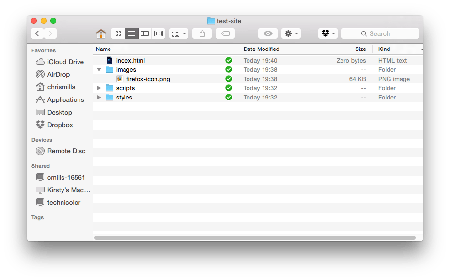

# What will your website look like?

_(Updated: 06/10/2025)_

_What will your website look like?_ discusses the planning and design work you have to do for your website before writing code, including "What information does my website offer?", "What fonts and colors do I want?", and "What does my site do?"

## First things first: planning

Before doing anything, you need some ideas. What should your website actually do? A website can do basically anything, but, for your first try, you should keep things simple. We'll start by creating a simple webpage with a heading, an image, and a few paragraphs.

To begin, you'll need to answer these questions:

1. **What is your website about?** Do you like dogs, New York, or Pac-Man?
2. **What information are you presenting on the subject?** Write a title and a few paragraphs and think of an image you'd like to show on your page.
3. **What does your website look like,** in simple high-level terms? What's the background color? What kind of font is appropriate: formal, cartoony, bold and loud, subtle?

> **Note:** Complex projects need detailed guidelines that go into all the details of colors, fonts, spacing between items on a page, appropriate writing style, and so on. This is sometimes called a design guide, design system, or brand book, and you can see an example at the [Firefox Photon Design System](https://design.firefox.com/photon/){:target="_blank"}.

## Sketching out your design

Next, grab pen and paper and sketch out roughly how you want your site to look. For your first simple webpage, there's not much to sketch out, but you should get in the habit of doing this now. It really helps — you don't have to be Van Gogh!


> **Note:** Even on real, complex websites, the design teams usually start out with rough sketches on paper and later on build digital mockups using a graphics editor or web technologies.
>
> Web teams often include both a graphic designer and a [user experience](https://developer.mozilla.org/en-US/docs/Glossary/UX) (UX*) designer. Graphic designers put together the visuals of the website. UX designers have a somewhat more abstract role in addressing how users will experience and interact with the website.
> 
> ---
> ***UX** is an acronym that stands for User eXperience. It is the study of the interaction between users and a system. Its goal is to make a system easy to interact with from the user's point of view. The system can be any kind of product or application that an end user is meant to interact with. UX studies undertaken on a web page for example can demonstrate whether it is easy for users to understand the page, navigate to different areas, and complete common tasks, and where such processes could have less friction. See also [User experience](https://en.wikipedia.org/wiki/User_experience) on Wikipedia

## Choosing your assets

At this point, it's good to start putting together the content that will eventually appear on your webpage.

### Text

You should still have your paragraphs and title from earlier. Keep these close by.

### Theme color

To choose a color, go to [the Color Picker](https://developer.mozilla.org/en-US/docs/Web/CSS/CSS_colors/Color_picker_tool){:target="_blank"} and find a color you like. When you click on a color, you'll see a strange six-character code like `#660066`. That's called a _hex code_ (short for hexadecimal), and represents your color. Copy the code down somewhere safe for now.


### Images

To choose an image, go to [Google Images](https://www.google.com/imghp?gws_rd=ssl){:target="_blank"} and search for something suitable.

1. When you find the image you want, click on the image to get an enlarged view of it.
2. Right-click the image (Ctrl + click on a Mac), choose _Save Image As…_, and choose a safe place to save your image. Alternatively, copy the image's web address from your browser's address bar for later use.


Note that most images on the web, including in Google Images, are copyrighted. To reduce your likelihood of violating copyright, you can use Google's license filter. Click on the _Tools_ button, then on the resulting _Usage rights_ option that appears below. You should choose the option _Creative Commons licenses_.


### Font

As with images, many fonts are protected by licenses, meaning you cannot freely use them in your site. [Google Fonts](https://developers.google.com/fonts){:target="_blank"} is a web service owned by Google that provides access to many fonts.

Once you have found a font, there are two main ways of using it:

1. Add a reference in your code to load the font from Google's servers.
2. Download the font file to your own system, host the font yourself, and use your hosted copy in your website's code.

> **Note:** Serving fonts hosted on Google Fonts may be incompatible with the European Union's data privacy regulation [GDPR](https://gdpr.eu/what-is-gdpr/){:target="_blank"} as the font service exposes the user's IP address. If this is a potential problem for you, choose the second option.

Alternatively you can use [safe web fonts](https://web.mit.edu/jmorzins/www/fonts.html){:target="_blank"} such as Arial, Times New Roman, or Courier New.

# Website file structure

A website consists of many files: text content, code, stylesheets, media content, and so on. When you're building a website, you need to assemble these files into a sensible structure on your local computer, make sure they can talk to one another, and get all your content looking right before you eventually upload them to a server. This section discusses some issues you should be aware of so you can set up a sensible file structure for your website.

## Where should your website live on your computer?

When you are working on a website locally on your computer, **you should keep all the related files in a single folder that mirrors the published website's file structure on the server**. This folder _(sometimes named 'public', see diagram below)_ can live anywhere you like, but you should put it somewhere where you can easily find it, maybe on your Desktop, in your Home folder, or at the root of your hard drive.


1. Choose a place to store your website projects. Inside your chosen place, create a new folder called `web-projects` (or similar). This is where all your website projects will live.
2. Inside this first folder, create another folder to store your first website in. Call it `test-site` (or something more imaginative).

## An aside on casing and spacing

You'll notice that throughout this article, we ask you to name folders and files completely in lowercase with no spaces. This is because:

1. Many computers, particularly web servers, are case-sensitive. So for example, if you put an image on your website at `test-site/MyImage.jpg` and then in a different file you try to invoke the image as `test-site/myimage.jpg`, it may not work.

2. Browsers, web servers, and programming languages do not handle spaces consistently. For example, if you use spaces in your filename, some systems may treat the filename as two filenames. Some servers will replace the areas in your filenames with "%20" (the character code for spaces in URLs), resulting in all your links being broken. It's better to **separate words with hyphens**, rather than underscores: `my-file.html` vs. `my_file.html`.

The short answer is that you should use a hyphen for your file names. The Google search engine treats a hyphen as a word separator but does not regard an underscore that way. For these reasons, it is best to **get into the habit of writing your folder and file names lowercase with no spaces and with words separated by hyphens**, at least until you know what you're doing. That way you'll bump into fewer problems later down the road.

## What structure should your website have?

Next, let's look at what structure our test site should have. The most common things we'll have on any website project we create are an index HTML file and folders to contain images, style files, and script files. Let's create these now:

1. **`index.html`**: This file will generally contain your homepage content, that is, the text and images that people see when they first go to your site. Using your code editor, create a new file called `index.html` and save it just inside your `test-site` folder.

2. **`images` folder**: This folder will contain all the images that you use on your site. Create a folder called `images`, inside your `test-site` folder.

3. **`styles` folder**: This folder will contain the CSS code used to style your content (for example, setting text and background colors). Create a folder called `styles`, inside your `test-site` folder.

4. **`scripts` folder**: This folder will contain all the JavaScript code used to add interactive functionality to your site (e.g. buttons that load data when clicked). Create a folder called `scripts`, inside your `test-site` folder.

> **Note:** On Windows computers, you might have trouble seeing the file names, because Windows has an option called **Hide extensions for known file types** turned on by default. Generally, you can turn this off by going to Windows Explorer, selecting the **Folder options…** option, unchecking the **Hide extensions for known file types** check box, then clicking **OK**. For more specific information covering your version of Windows, you can search on the web.

## File paths

To make files talk to one another, you have to provide a file path between them — basically a route, so one file knows where another one is. To demonstrate this, we will insert a little bit of HTML into our `index.html` file, and make it display the image you have previously chosen. Alternatively, you can choose an existing image at your disposal, on your computer or from the Web, and use it in the following steps:

1. Copy the image you chose earlier into your `images` folder.
2. Open up your `index.html` file, and insert the following code into the file exactly as shown. Don't worry about what it all means for now — we'll look at the structures in more detail later in the series.

   ```html
   <!doctype html>
   <html lang="en-US">
     <head>
       <meta charset="utf-8" />
       <meta name="viewport" content="width=device-width" />
       <title>My test page</title>
     </head>
     <body>
       
     </body>
   </html>
   ```

3. The line `` is the HTML code that inserts an image into the page. We need to tell the HTML where the image is. The image is inside the _images_ directory, which is in the same directory as `index.html`. To walk down the file structure from `index.html` to our image, the file path we'd need is `images/your-image-filename`. For example, our image is called `firefox-icon.png`, so the file path is `images/firefox-icon.png`.

4. Insert the file path into your HTML code between the double quote marks of the `src=""` code.

5. Change the contents of the `alt` attribute to a description (_see below_) of the image you are including. In this case, `alt="Firefox logo: flaming fox wrapping the world"`.

> **Accessibility concerns:** Authoring meaningful alternate descriptions
>
> An `alt` attribute's value should clearly and concisely describe the image's content. It should not describe the presence of the image itself or the file name of the image. If the `alt` attribute is purposefully left off because the image has no textual equivalent, consider alternate methods to present what the image is trying to communicate.
> <br/><br/>
> ❌ **Don't**: ``
> <br/><br/>
> ✅ *Do*: ``
> <br/><br/>
> When an `alt` attribute is not present on an image, some screen readers may announce the image's file name instead. This can be a confusing experience if the file name isn't representative of the image's contents. [_Source_](https://developer.mozilla.org/en-US/docs/Web/HTML/Element/img#authoring_meaningful_alternate_descriptions)

6. Save your HTML file, then load it in your web browser (double-click the file). You should see your new webpage displaying your image!


Some general rules for file paths:

- To link to a target file in the same directory as the invoking HTML file, just use the filename, e.g. `my-image.jpg`.

- To reference a file in a subdirectory, write the directory name in front of the path, plus a forward slash, e.g. `subdirectory/my-image.jpg`.

- To link to a target file in the directory **above** the invoking HTML file, write two dots. So for example, if `index.html` was inside a subfolder of `test-site` and `my-image.jpg` was inside `test-site`, you could reference `my-image.jpg` from `index.html` using `../my-image.jpg`.

- You can combine these as much as you like, for example `../subdirectory/another-subdirectory/my-image.jpg`.

For now, this is about all you need to know.

> **Note:** The Windows file system tends to use backslashes, not forward slashes, e.g. `C:\Windows`. This doesn't matter in HTML — even if you are developing your website on Windows, you should still use forward slashes in your code.

## What else should be done?

That is about it for now. Your folder structure should look something like this:



## Submission: Upload the website to your user exercises folder

Once you've completed the guide above and recreated the structure locally on your computer, make sure to upload it under your `user/` folder of your forked `WDX-180` repository.

Here is a [short video](https://youtu.be/IF9mgVU0aHY){:target="_blank"} on how to do that.

---

### Sources and Attributions

**Content is based on the following sources:**

- **MDN**
    - [What will your website look like?](https://developer.mozilla.org/en-US/docs/Learn/Getting_started_with_the_web/What_will_your_website_look_like) [(Permalink)](https://github.com/mdn/content/blob/10387e1345e60f93e939b873e953b8ae85557362/files/en-us/learn/getting_started_with_the_web/what_will_your_website_look_like/index.md)
    - [UX](https://developer.mozilla.org/en-US/docs/Glossary/UX) [(Permalink)](https://github.com/mdn/content/blob/10387e1345e60f93e939b873e953b8ae85557362/files/en-us/glossary/ux/index.md)
    - [Dealing with files](https://developer.mozilla.org/en-US/docs/Learn/Getting_started_with_the_web/Dealing_with_files) [(Permalink)](https://github.com/mdn/content/blob/5ce6d5b38ec46374bbbf50b84b6105b5d1750911/files/en-us/learn/getting_started_with_the_web/dealing_with_files/index.md)
    - [``: The Image Embed element](https://developer.mozilla.org/en-US/docs/Web/HTML/Element/img#authoring_meaningful_alternate_descriptions) [(Permalink)](https://github.com/mdn/content/blob/5ce6d5b38ec46374bbbf50b84b6105b5d1750911/files/en-us/web/html/element/img/index.md)

---

<!-- COMMENTS: -->
<script src="https://utteranc.es/client.js"
  repo="in-tech-gration/WDX-180"
  issue-term="pathname"
  theme="github-dark"
  crossorigin="anonymous"
  async>
</script>