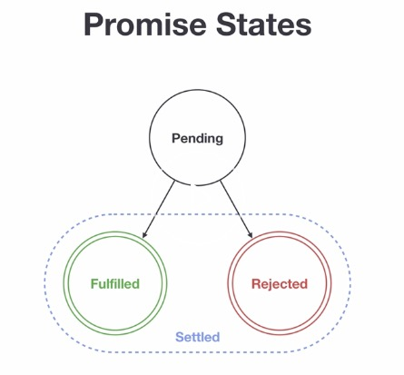

# Promises and Callbacks

## Promise

We human give or receive a promise to do some activity at some point in time. If we keep the promise we make others happy but if we do not keep the promise, it may lead discontentment. Promise in JavaScript has something in common with the above examples.

A Promise is a way to handle asynchronous operations in JavaScript. It allows handlers with an asynchronous action's eventual success value or failure reason. This lets asynchronous methods return values like synchronous methods: instead of immediately returning the final value, the asynchronous method returns a promise to supply the value at some point in the future.

A Promise is in one of these states:

- **pending**: initial state, neither fulfilled nor rejected.
- **fulfilled**: meaning that the operation completed successfully.
- **rejected**: meaning that the operation failed.



A pending promise can either be fulfilled with a value, or rejected with a reason (error). When either of these options happens, the associated handlers queued up by a promise's then method are called. (If the promise has already been fulfilled or rejected when a corresponding handler is attached, the handler will be called, so there is no race condition between an asynchronous operation completing and its handlers being attached.)

As the Promise.prototype.then() and Promise.prototype.catch() methods return promises, they can be chained.

## Callbacks

To understand promise very well let us understand callback first. Let's see the following callbacks. From the following code blocks you will notice, the difference between callback and promises.

- call back
  Let us see a callback function which can take two parameters. The first parameter is `err` and the second is `result`. If the `err` parameter is false, there will not be error other wise it will return an error.

In this case the `err` has a value and it will return the `err` block.

```js
// Callback
const doSomething = (callback) => {
  setTimeout(() => {
    const skills = ['HTML', 'CSS', 'JS']
    callback('It did not go well', skills)
  }, 2000)
}

const dummyFunction = (err, result) => {
  if (err) {
    return console.log(err); // <- We'll end up here...
  }
  return console.log(result);
}

// dummyFunction passed as callback
doSomething(dummyFunction);
```

[&#9658; Live coding](#flems-enable)

```sh
// after 2 seconds it will print
It did not go well
```

In this case the `err` is `false` and it will return the else block which is the result.

```js
const doSomething = (callback) => {
  setTimeout(() => {
    const skills = ['HTML', 'CSS', 'JS'];
    callback(false, skills);
  }, 2000)
}

doSomething((err, result) => {
  if (err) {
    return console.log(err);
  }
  return console.log(result); // We'll end up here...
})
```

[&#9658; Live coding](#flems-enable)

```sh
// after 2 seconds it will print the skills
["HTML", "CSS", "JS"]
```

### Promise constructor

We can create a promise using the Promise constructor. We can create a new promise using the key word `new` followed by the word `Promise` and followed by a parenthesis. Inside the parenthesis, it takes a `callback` function. The promise callback function has two parameters which are the _`resolve`_ and _`reject`_ functions.

```js
// syntax
const promise = new Promise((resolve, reject) => {
  resolve('success')
  reject('failure')
});
```

[&#9658; Live coding](#flems-enable)

```js
// Promise
const doPromise = new Promise((resolve, reject) => {
  setTimeout(() => {
    const skills = ['HTML', 'CSS', 'JS']
    if (skills.length > 0) {
      resolve(skills)
    } else {
      reject('Something wrong has happened')
    }
  }, 2000)
})

doPromise
  .then(result => {
    console.log(result)
  })
  .catch(error => console.log(error))
```

[&#9658; Live coding](#flems-enable)

```sh
["HTML", "CSS", "JS"]
```

The above promise has been settled with resolve.
Let us another example when the promise is settled with reject.

```js
// Promise
const doPromise = new Promise((resolve, reject) => {
  setTimeout(() => {
    const skills = ['HTML', 'CSS', 'JS']
    if (skills.includes('Node')) {
      resolve('fullstack developer')
    } else {
      reject('Something wrong has happened')
    }
  }, 2000)
})

doPromise
  .then(result => {
    console.log(result)
  })
  .catch(error => console.error(error))
```

[&#9658; Live coding](#flems-enable)

```sh
Something wrong has happened
```

### Sources and Attributions

**Content is based on the following sources:**

- [30 Days Of JavaScript: Promises](https://github.com/in-tech-gration/30-Days-Of-JavaScript/blob/master/18_Day_Promises/18_day_promises.md){:target="_blank"} [(Permalink)](https://github.com/in-tech-gration/30-Days-Of-JavaScript/blob/55d8e3dbc0410d64c1dc3ea5915e015a7950cf2a/18_Day_Promises/18_day_promises.md){:target="_blank"}

Don't forget to star this awesome [repo](https://github.com/Asabeneh/30-Days-Of-JavaScript){:target="_blank"}!