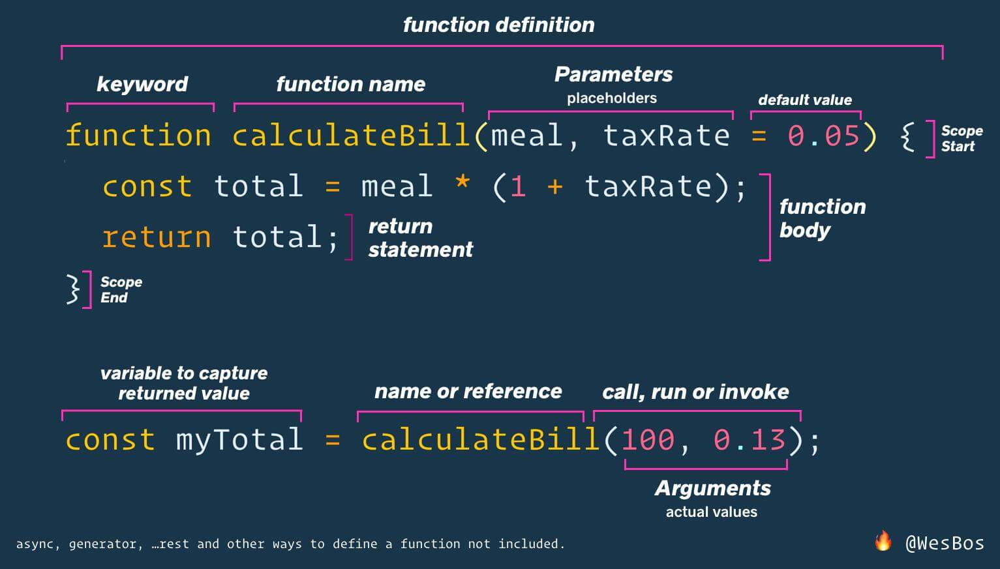

### Schedule

  - [Study](#study-plan-NN)
  - [Exercises](#exercises-NN)
  - [Extra Resources](#extra-resources-NN)

### Study Plan

<!-- WDX:META:PROGRESS:task=Read 'Functions' -->
#### Functions

  A function is a bit of reusable code. Just as we like to re-use CSS classes, we love to re-use code. Let's start with an example:

  ```javascript
  function addTwo(number) {
    return number + 2;
  }

  const finalAnswer = addTwo(5);
  console.log(finalAnswer);
  ```

  This isn't super useful but hopefully, it shows you the mechanics of how a function works. We created a function called `addTwo`. This function takes in one parameter, `number` and it returns that number with 2 added to it. We can now use that `addTwo` function as much as we want! Let's make something a bit more useful.

  ```javascript
  function greet(firstName, lastName, honorific, greeting) {
    return `${greeting} ${honorific} ${lastName}! I’m extremely pleased you could join us, ${firstName}! I hope you enjoy your stay, ${honorific} ${lastName}.`;
  }

  console.log(greet("Brian", "Holt", "Lord", "Salutations"));
  console.log(greet("Jack", "Sparrow", "Captain", "A-hoy"));
  ```

  Now rather than have to repeat ourselves over and over again with that long string, we can just call greet with the appropriate parameters. Here we use four parameters. The order is important that we send in the parameters because this will be the order function receives these parameters. You can have as many or as few parameters as you like.

  The way to **call** a function is you add parens to the end of it, like this: `someFunctionName()`. If you see parentheses after a variable name, you instantly know that that's a function. Inside the parentheses are the parameters. These variables will be passed to the function that is being called in the order that you put them there. These input variables are called **parameters**. Example:

  ```javascript
  const myHomeCity = "Seattle";
  const myHomeState = "Washington";
  const myHomeCountry = "USA";

  function logOutYourHome(city, state, country) {
    console.log(`You are from ${city}, ${state} ${country}.`);
  }

  logOutYourHome(myHomeCity, myHomeState, myHomeCountry);
  ```
  ---

  Keep this next diagram by [Wes Bos](https://wesbos.com/){:target="_blank"} handy, as it depicts all the function parts with their respective terminology. It's always good to know our way around a function's inner parts.

  [](./assets/wes_bos_function_definition.jpg){:target="_blank"}

<!-- WDX:META:PROGRESS:task=Read 'Various Ways of Writing Functions' -->
#### Various Ways of Writing Functions

  There are a few ways to write functions that are mostly the same (there are some differences but for now don't worry about it.)

  ```javascript
  function bark() {
    console.log("woof");
  }

  const meow = function () {
    console.log("meeeeeeeow");
  };

  // the => is just = > put together, the font just combines them to one glyph
  const chirp = () => {
    console.log("chirp chirp");
  };

  bark();
  meow();
  chirp();
  ```

  All of these are functions and work as such. There are very subtle differences in how they work but for now, it's enough to know "those are functions". Most of the time they work exactly the same (as you see here.)

---

<!-- WDX:META:PROGRESS:task=Read 'Scope' -->
#### Scope

  We'll talk about scope multiple times but we'll start off here with it. Every time you call a function, it has its own scope. Other things can't peek into it; it just has its own little workspace for it to work with. Once it's done, any variable that you haven't explicitly held on to or returned at the end is discarded. For example:

  ```javascript
  function addFive(number) {
    const someVariable = "you can't see me outside this function";
    return number + 5;
  }

  addFive(10);
  console.log(someVariable);
  ```

  This is not going to work. `someVariable` is inside of the `addFive` scope and once `addFive` completes, it throws `someVariable` away since it's now out-of-scope.

  ```javascript
  let friendsAtYourParty = 0;
  for (let i = 0; i <= 10; i++) {
    friendsAtYourParty++;
  }
  console.log(i);
  ```

  Even this doesn't work since `i` is only in scope for the loop and then after that, it's thrown away. This can be a difficult one to deal with as someone new to coding because you'll go to log something or use a variable and it's out of scope so it's not there. Just know if that happens, this is probably the problem.

  Scope is hard. And scope is particularly strange in JavaScript (it varies by programming language.) If it feels hard it's because it is. A general, imperfect way for you to think about it right now is that a variable is "alive" (in scope) in between whatever the closest `{` is until that `{` closes its corresponding `}`. A few examples are below, see if you can get it right. Keep in mind that the variable will stay in scope as long as any scope it exists in still exists. If I declare a variable in an outer scope and modify a variable in an inner scope, that variable will survive as long as the outer scope does. **It matters where the variable is declared.**

  ```javascript
  const A = "A";
  let F;

  function doStuff(B) {
    console.log(B);
    const C = "C";
    let H = "H";
    if (1 + 1 === 2) {
      const D = "D";
      H = "something else";
    }
    console.log(D);
    console.log(H);
    F = "F";
  }

  let E = 0;
  while (E < 3) {
    E++;
    console.log(A);
    const G = "G";
  }
  console.log(E);
  console.log(G);

  doStuff("B");
  console.log(B);
  console.log(C);
  console.log(F);
  ```

  This is a pretty convoluted example but see what you think. Once you're ready, the next block will be the answers.

  ```javascript
  const A = "A";
  let F;

  function doStuff(B) {
    console.log(B); // works, B parameter is still in scope
    const C = "C";
    let H = "H";
    if (1 + 1 === 2) {
      const D = "D";
      H = "something else";
    }
    console.log(D); // does not work, D was declared in that if statement block
    console.log(H); // works, H was declared outside the if statement
    F = "F";
  }

  let E = 0;
  while (E < 3) {
    E++;
    console.log(A); // works, the outer block (called the global scope) is still in scope
    const G = "G";
  }
  console.log(E); // works, E was declared outside the while loop
  console.log(G); // does not work, declared inside the while loop and it's over

  doStuff("B");
  console.log(B); // does not work, the B parameter expires after the function call
  console.log(C); // does not work, C was declared inside the function and the function is over
  console.log(F); // works, F was declared in the global scope
  ```
---
<!-- WDX:META:PROGRESS:task=Read 'Built-ins' -->
#### Built-ins

  Lots of functions already exist for you! Smart people have created these commonly-used functions for things we often need. For example, say you have a string and you want to make everything lowercase, you can do this:

  ```javascript
  const sentence = "ThIs HaS wEiRd CaSiNg On It";
  const lowerCaseSentence = sentence.toLowerCase();
  console.log(lowerCaseSentence);
  ```

  Always be looking for the parentheses. And the best place to look all this stuff up is from our friends at Mozilla (makers of Firefox): [the MDN][mdn]. MDN used to stand for "Mozilla Developer Network" I think but now it's just synonymous with the documentation for the web. I literally look at this website several times a day. As I said before, you are not expected to remember everything. Looking things up on the MDN is **not** cheating.

  There are so many builtins there's no way we could ever cover all of them. Here are just a few examples. The rest you'll learn as you go.

  ```javascript
  // want to round a number? use Math!
  const number = 5.3;
  const roundedNumber = Math.round(number);
  console.log(number);
  ```

  ```javascript
  // want to see if a string contains another string?
  const testStringOne = "The quick brown fox jumps over the lazy dog";
  const testStringTwo =
    "Mirror, mirror on the wall, don't say it cause I know I'm cute";
  const stringToLookFor = "cute";

  console.log(testStringOne.includes(stringToLookFor));
  console.log(testStringTwo.includes(stringToLookFor));
  ```
  ```javascript
  // want to know how many milliseconds have elapsed since Jan 1 1970?
  console.log(Date.now());
  ```

### Summary

### Exercises

#### Task 1: JavaScript Functions

  <!-- WDX:META:PROGRESS:task=Complete the exercise 'JavaScript Functions'|user_folder=task_1 -->
  <!-- WDX:META:TESTS:name=Test Exercise: 'JavaScript Functions'|type=exist|user_folder=task_1|files=functions.js,functions.html -->
  In this task, we want you to load the [functions.js](./exercises/functions.js){:target="_blank"} from an HTML named `functions.html` and complete the challenges found inside.

#### Task 2: JavaScript Arrow Functions

  <!-- WDX:META:PROGRESS:task=Complete the exercise 'JavaScript Arrow Functions'|user_folder=task_2 -->
  <!-- WDX:META:TESTS:name=Test Exercise: 'JavaScript Arrow Functions'|type=exist|user_folder=task_2|files=arrow-functions.js,arrow-functions.html -->
  In this task, we want you to load the [arrow-functions.js](./exercises/arrow-functions.js){:target="_blank"} from an HTML named `arrow-functions.html` and complete the challenges found inside.

#### Task 3: JavaScript Higher Order Functions

  <!-- WDX:META:PROGRESS:task=Complete the exercise 'JavaScript Higher Order Functions'|user_folder=task_3 -->
  <!-- WDX:META:TESTS:name=Test Exercise: 'JavaScript Higher Order Functions'|type=exist|user_folder=task_3|files=higher-order-functions.js,higher-order-functions.html -->
  In this task, we want you to load the [higher-order-functions.js](./exercises/higher-order-functions.js){:target="_blank"} from an HTML named `higher-order-functions.html` and complete the challenges found inside.

### Extra Resources

### Sources and Attributions

  **Content is based on the following sources:**

  - [Functions](https://github.com/btholt/complete-intro-to-web-dev-v3/blob/main/lessons/04-javascript/F-functions.md){:target="_blank"} [(Permalink)](https://github.com/btholt/complete-intro-to-web-dev-v3/blob/a46a32bb9d641523163d74c28340ec686c5be2f9/lessons/04-javascript/F-functions.md){:target="_blank"}

  - [Scope](https://github.com/btholt/complete-intro-to-web-dev-v3/blob/main/lessons/04-javascript/G-scope.md){:target="_blank"} [(Permalink)](https://github.com/btholt/complete-intro-to-web-dev-v3/blob/a46a32bb9d641523163d74c28340ec686c5be2f9/lessons/04-javascript/G-scope.md){:target="_blank"}

  - [Built-ins](https://github.com/btholt/complete-intro-to-web-dev-v3/blob/main/lessons/04-javascript/H-builtins.md){:target="_blank"} [(Permalink)](https://github.com/btholt/complete-intro-to-web-dev-v3/blob/a46a32bb9d641523163d74c28340ec686c5be2f9/lessons/04-javascript/H-builtins.md){:target="_blank"}

  Please do not forget to ⭐ the [repo](https://github.com/btholt/complete-intro-to-web-dev-v3){:target="_blank"}!

  **Exercises are based on the following sources:**

  - [TeachMeJavaScriptLikeIm5 arrow-functions](https://github.com/inspirezonetech/TeachMeJavaScriptLikeIm5/blob/main/8-functions/arrow-function.js){:target="_blank"} [(Permalink)](https://github.com/inspirezonetech/TeachMeJavaScriptLikeIm5/blob/bcbe160a29718c0eb832fbf7af113b896ff06deb/8-functions/arrow-function.js){:target="_blank"}

  - [TeachMeJavaScriptLikeIm5 functions](https://github.com/inspirezonetech/TeachMeJavaScriptLikeIm5/blob/main/8-functions/functions.js){:target="_blank"} [(Permalink)](https://github.com/inspirezonetech/TeachMeJavaScriptLikeIm5/blob/bcbe160a29718c0eb832fbf7af113b896ff06deb/8-functions/functions.js){:target="_blank"}

  - [TeachMeJavaScriptLikeIm5 higher-order-functions](https://github.com/inspirezonetech/TeachMeJavaScriptLikeIm5/blob/main/8-functions/higher-order-functions.js){:target="_blank"} [(Permalink)](https://github.com/inspirezonetech/TeachMeJavaScriptLikeIm5/blob/bcbe160a29718c0eb832fbf7af113b896ff06deb/8-functions/higher-order-functions.js){:target="_blank"}

  Please do not forget to ⭐ the [repo](https://github.com/inspirezonetech/TeachMeJavaScriptLikeIm5){:target="_blank"}!