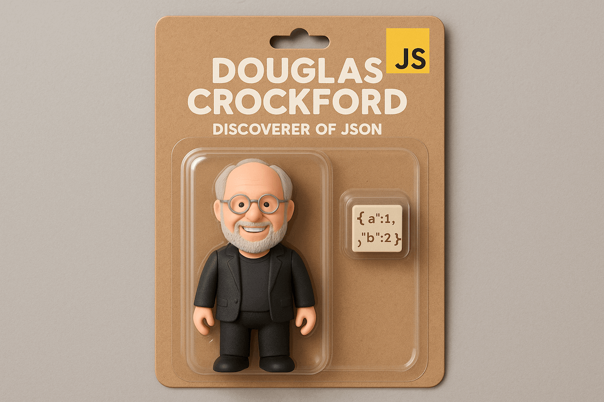

### Schedule

  - [Study](#study-plan-NN)
  - [Exercises](#exercises-NN)
  - [Extra Resources](#extra-resources-NN)

### Study Plan

  > How to become a better programmer? 
  > _"**Fail as fast as you can and as often as you can.**"_ ~ [Scott Hanselman](https://www.hanselman.com/){:target="_blank"}

  ---

  

  <!-- SGEN:META:PROGRESS:task=Read 'Introduction to JSON' -->
  - Read [**Introduction to JSON**](../modules/javascript/core/json/intro/content/index.md){:target="_blank"} to learn about the world's most popular data format. JSON, which stands for `JavaScript Object Notation`, is a plain text, lightweight data format that can be used across different systems and programming languages.

### Summary

  🌕 You are extraordinary. You now know about this light-weight data format which you can use to store data or send it to an HTTP server. Now, let's do some exercises for your brain and your muscle.

  

### Exercises

  **JSON Basics**

  <!-- SGEN:META:PROGRESS:task=Complete the exercise 'JSON Basics'|user_folder=json_basics -->
  <!-- SGEN:META:TESTS:name=Test Exercise: 'JSON Basics'|type=exist|user_folder=json_basics|files=json.html,json.js -->
  Copy the folder `curriculum/week{{ SGEN:WEEK_NUM }}/exercises/json_basics/` inside folder `user/week{{ SGEN:WEEK_NUM }}/exercises/day{{ SGEN:DAY_NUM }}/` and compete all the challenges found inside the JavaScript file.

### Extra Resources

  _(Nothing here yet. Feel free to contribute if you've found some useful resources.)_

### Sources and Attributions

  **Content is based on the following sources:**

  - [30 Days Of JavaScript: JSON](https://github.com/in-tech-gration/30-Days-Of-JavaScript/blob/master/16_Day_JSON/16_day_json.md){:target="_blank"} [(Permalink)](https://github.com/in-tech-gration/30-Days-Of-JavaScript/blob/55d8e3dbc0410d64c1dc3ea5915e015a7950cf2a/16_Day_JSON/16_day_json.md){:target="_blank"}

  Don't forget to star this awesome [repo](https://github.com/Asabeneh/30-Days-Of-JavaScript){:target="_blank"}!

  ---

_Photo by [ROMAN ODINTSOV](https://www.pexels.com/photo/a-a-customer-receiving-a-food-delivery-12725452/){:target="_blank"} on [Pexels](https://www.pexels.com/photo/a-a-customer-receiving-a-food-delivery-12725452/){:target="_blank"}_