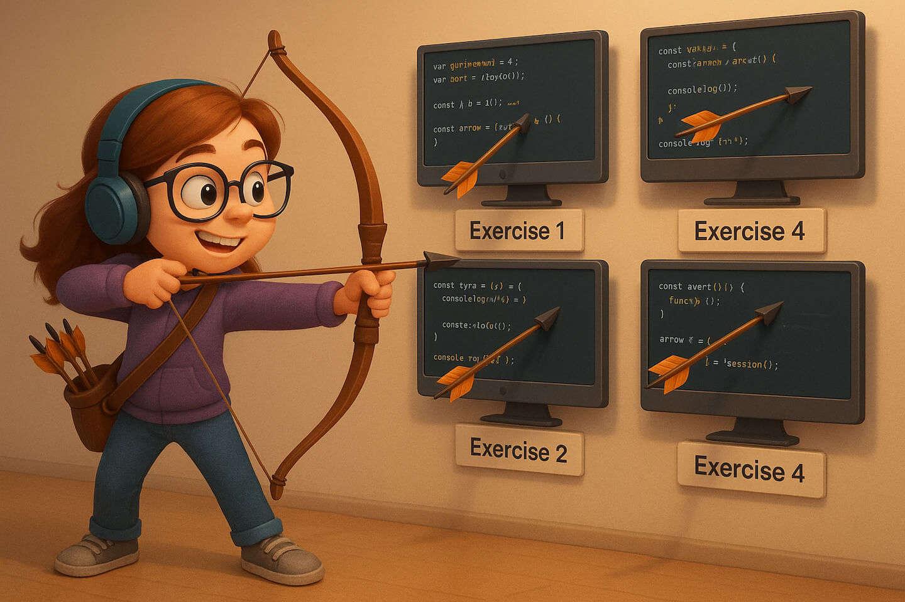

### Schedule

  - [Study](#study-plan-NN)
  - [Exercises](#exercises-NN)
  - [Extra Resources](#extra-resources-NN)

### Study Plan

<!-- WDX:SGEN:PROGRESS:task=Watch 'JavaScript Value vs. Reference (Primitives vs. Objects)' -->
- [Watch **JavaScript Value vs. Reference (Primitives vs. Objects)**](https://www.youtube.com/watch?v=r5rYoJFWfN0){:target="_blank"}
  - Level: Beginner
  - Duration: 21min
  - Captions: Yes

### Exercises

  

  **Let's practice Arrays and Objects!**

  Download the following file and try to solve all the exercises:

  [Array & Object Practice](https://github.com/in-tech-gration/WDX-180/blob/main/curriculum/week09/assets/Object.Exercises.js){:target="_blank"}

<!-- SGEN:META:PROGRESS:task=Complete all the exercises in the Arrays & Objects Practice module -->
