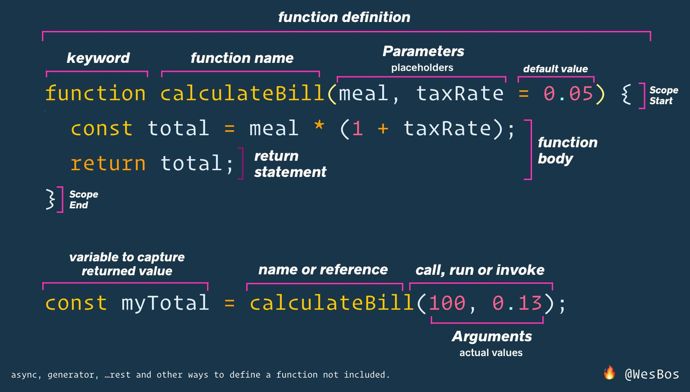

# Functions

> this image is for `function name() {}` functions, you will study
> `const name = () => {}` functions.
>
> the only difference is the keyword `function` is replaced by `=>` and the name
> becomes the variable

