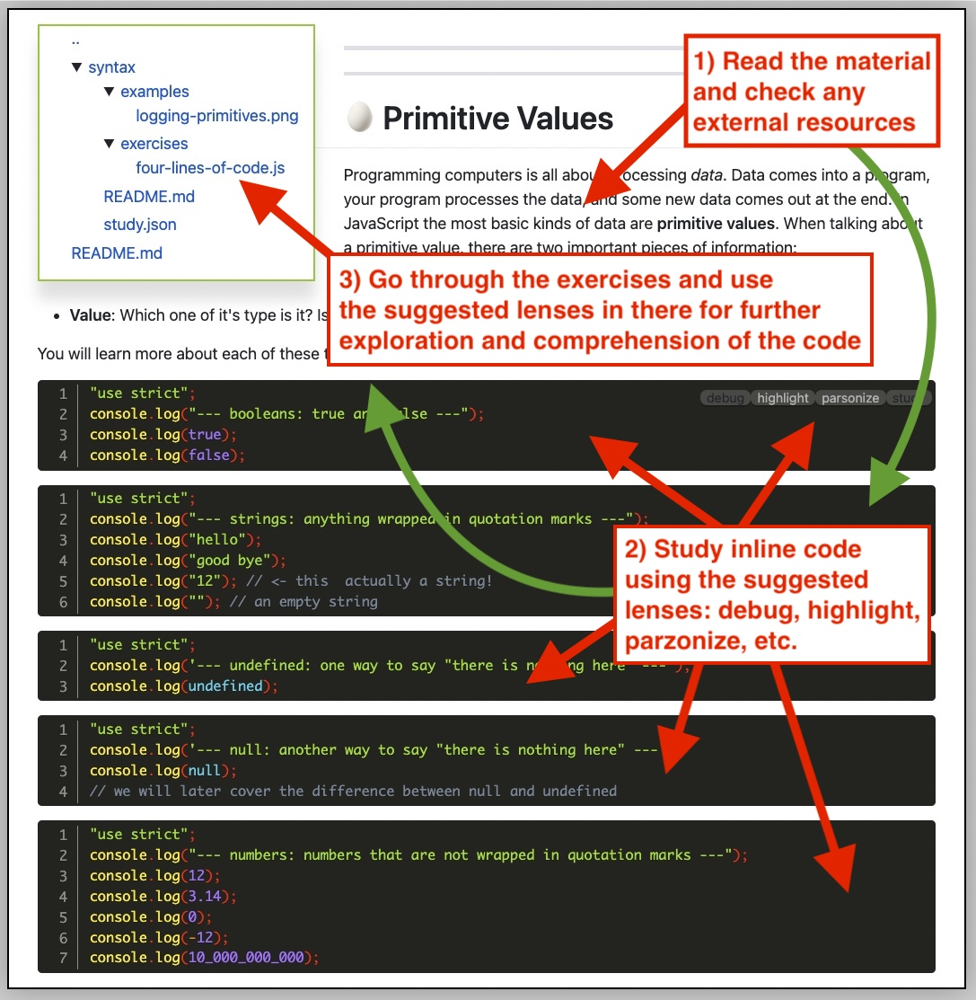
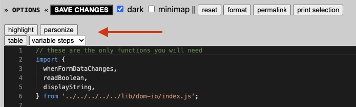

### Schedule

  - [Study](#study-plan-NN)
  - [Exercises](#exercises-NN)
  - [Extra Resources](#extra-resources-NN)

### Study Plan

  This Module is about learning "Just enough JavaScript" in order to understand, trace and debug the execution process of JavaScript programs and learn how to read and comprehend every single line of code that you see. That's probably the most important task, anyone learning a new language (even natural languages), must go through in order to become familiar with this new fascinating territory. 

  In order to follow the material, you will need to install and use the `study-lenses` tool. Follow the instructions from {{ SGEN:MODULE_LINK:javascript/denepo/setting-up-study-lenses/index.md }} to set up Study Lenses (v2) on your System (if you haven't done that already).

  **Launching Study Lenses and following the material**

  Once `lenses2` is properly installed on your system, you can go to your `WDX-180` folder and run `lenses2` with the material for this Module:

  - `cd WDX-180/`
  - `lenses2 curriculum/modules/javascript/denepo/_just-enough-javascript/`

  Here's a basic methodology for going through the material:

  - 1) Read the related material and explore any external resources
  - 2) Study the inline code using the recommended lenses
  - 3) Go through the exercises and try to explore and comprehend the code using the suggested (enabled) lenses
  - 4) Feel free to experiment with more lenses!

  

  Once you are inside an exercise of example code, once again use the recommended lenses displayed above the code to explore and understand the code:

  

  Now it's time to go through the material. For this Module you will only need to go through the following sections:

  - **00-errors**
  - **01-comments-and-logs**
  - **02-primitive-values**
  - **03-operators**
  - **04-booleans**
  - **05-strings**
  - **06-undefined**

### Summary

### Exercises

  <!-- SGEN:META:PROGRESS:task=Explore the '00-errors' section of 'Just Enough JavaScript' -->

  <!-- SGEN:META:PROGRESS:task=Explore the '01-comments-and-logs' section of 'Just Enough JavaScript' -->

  <!-- SGEN:META:PROGRESS:task=Explore the '02-primitive-values' section of 'Just Enough JavaScript' -->

  <!-- SGEN:META:PROGRESS:task=Explore the '03-operators' section of 'Just Enough JavaScript' -->

  <!-- SGEN:META:PROGRESS:task=Explore the '04-booleans' section of 'Just Enough JavaScript' -->
  
  <!-- SGEN:META:PROGRESS:task=Explore the '05-strings' section of 'Just Enough JavaScript' -->

  <!-- SGEN:META:PROGRESS:task=Explore the '06-undefined' section of 'Just Enough JavaScript' -->

### Extra Resources

  _(Nothing here yet. Feel free to contribute if you've found some useful resources.)_

### Sources and Attributions