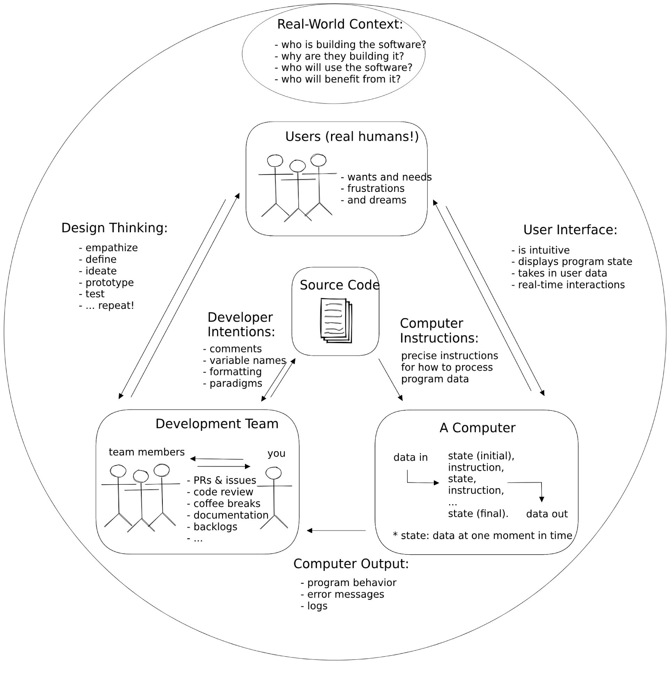

### Schedule

  - [Study](#study-plan-NN)
  - [Exercises](#exercises-NN)
  - [Extra Resources](#extra-resources-NN)

### Study Plan

<!-- WDX:META:PROGRESS:task=Read 'What is programming?' -->
#### What is Programming?

  Programming is communication. It's also a lot of other things, but this
  introduction will focus on the different ways you communicate with your code.

  When you write code you are really just writing a text document, exactly like
  you might write an email or a note. The biggest difference between an email and a computer program is _who you are writing for_.

  When you write an email you're writing for the person who will be reading it.
  When you write a computer program you are writing for 3 very different audiences at the same time! One single document (your code) needs to be understandable to:

  - **Developers**: A developer needs to read your code and understand what you
    were trying to do and why.
  - **Computers**: Your code needs to have _perfect_ syntax so the computer can
    parse it, and you must write instructions that are allowed by the programming language or the computer will throw an error.
  - **Users**: The instructions you give to the computer must create an intuitive and pleasant experience for the user.

  Being a developer means understanding how all these characters interact, and
  then communicating with everyone involved to deliver quality software within
  your project's constraints. This diagram shows the different channels of
  communication in a software project:

  

#### Thinking like a Computer

  In the following video, Evan Cole guides you through the basic concepts of programming and explains the feedback loop that continuously runs through the software cycle as source code is written by developers, subsequently read and executed by the computer which eventually displays the output back to the users.

  - [Watch: **Thinking like a Computer**](https://youtu.be/Lc68CtuMuTM){:target="_blank"}
    - **Duration:** 45min
    - **Level:** Beginner

  ---

  **Programming Languages**

  High-level programming languages like JavaScript are a compromise between how
  people think and how a computer works. Programming languages are not always easy for people to learn but they're definitely easier than directly telling a
  computer what to do (writing 1's and 0's).

  Because humans are so much better at learning and understanding than computers
  are (for now), programming languages have been designed to leave all the hard
  work for us. It's our job to make sure our instructions for the computer are
  perfectly structured and do exactly what we want. The computer just _parses_
  (interprets) our code and follows the instructions without any understanding or thinking.

  You can think of a programming language as the developer's UI for the computer.
  Because this UI isn't very intuitive you will need to spend a lot of time
  studying syntax and other details before you can program with ease. This is why you will be focusing on _understanding_ programs before writing them.

  [**_Learnable Programming_**](http://worrydream.com/LearnableProgramming/){:target="_blank"} said it best:

  > - **Programming is a way of thinking, not a rote skill**. Learning about "for"
  >   loops is not learning to program, any more than learning about pencils is
  >   learning to draw.
  > - **People understand what they can see**. If a programmer cannot see what a
  >   program is doing, she can't understand it.
  >
  > Thus, the goals of a programming system should be:
  >
  > - to support and encourage powerful ways of thinking
  > - to enable programmers to see and understand the execution of their programs
  >
  > ...
  >
  > _How do we get people to understand programming?_
  >
  > We change programming. We turn it into something that's understandable by
  > people.

  Until the future when computers are designed to understand us, we're stuck with programming systems where we do the hard work of understanding computers. 
  
  Hopefully these Modules can make this journey easier.

  ---

### Summary

### Exercises

### Extra Resources

### Sources and Attributions

  - **DeNepo**:
    - [What is Programming](https://github.com/in-tech-gration/welcome-to-js/tree/main/1-what-is-programming) [(Permalink)](https://github.com/in-tech-gration/welcome-to-js/tree/9239360311e64cb81658105b674c7fdfec97bed8/1-what-is-programming)
  
  - [CodeCademy](https://www.codecademy.com/articles/what-is-programming)
  
  - [Khan Academy](https://www.khanacademy.org/computing/computer-programming/programming/intro-to-programming/v/programming-intro)
  
  - [The Coding Train](https://www.youtube.com/watch?v=AImF__7FyzM)
  
  - [Practical Introduction to JS](https://shawnr.gitbooks.io/practical-introduction-to-javascript/content/what-is-programming/)
