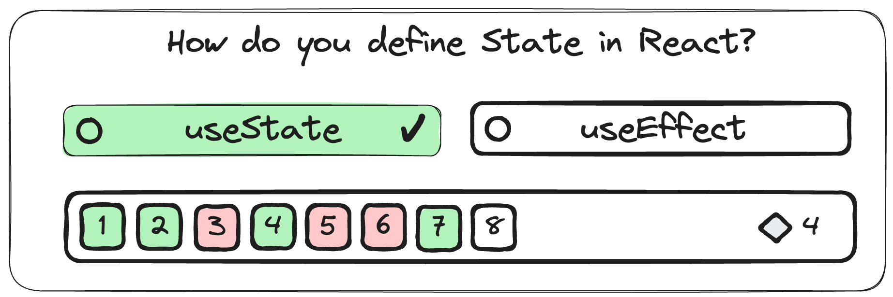
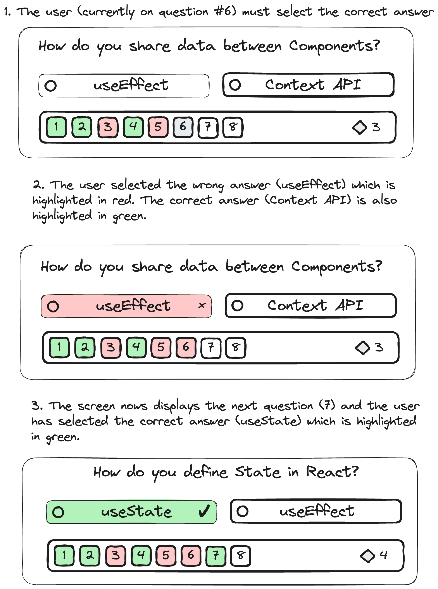
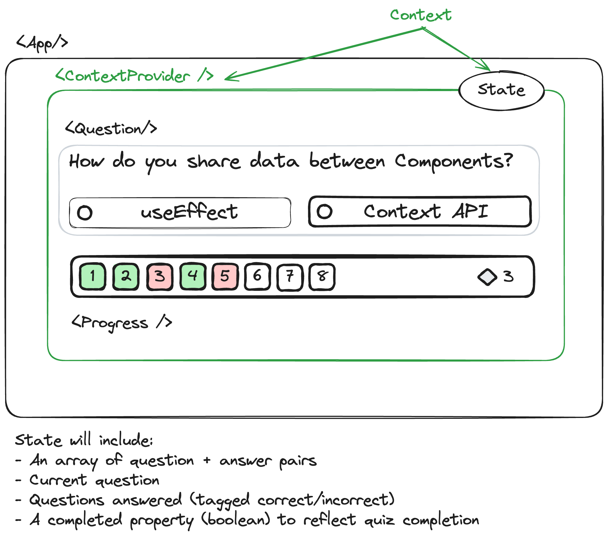
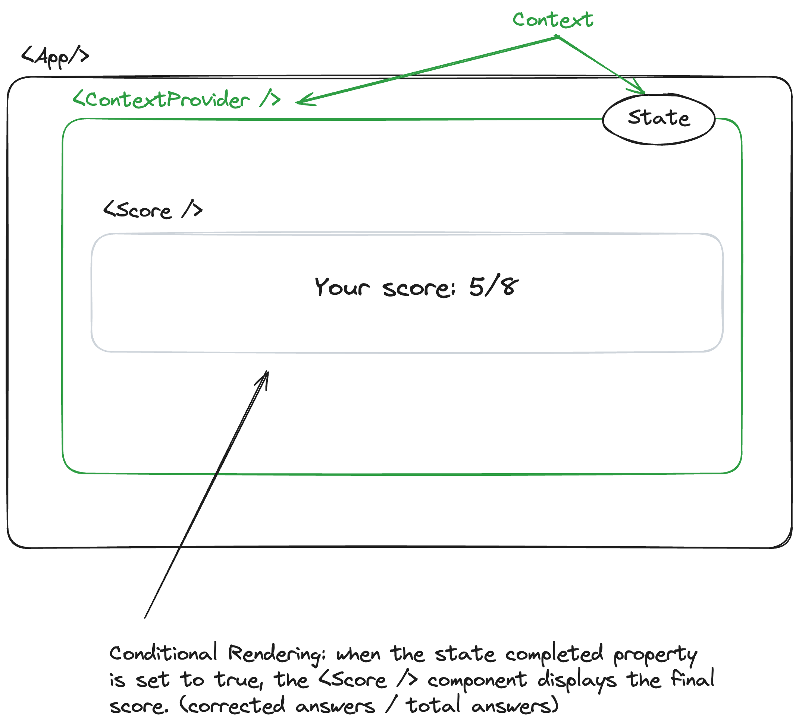

# Simple Quiz

Since, you've mastered the basic concepts of **React** it's time to put those skills into test!

We have a simple yet fun project to get your hands on! A simple quiz is all that we want you to implement! You will provide all the questions, along with two choices for each question, one of them is obviously the correct one!

Follow [this link](https://www.youtube.com/watch?v=3YUI2S7iot8){:target="_blank"} to see a video on how we want your quiz game to look like! 

You can also try the quiz game online through [this link](https://belikeyou.gr/63431/extras/epanelave-i-epanalave-tha-vreis-ton-sosto-typo-prostaktikis-10-rimaton-poy-oloi-kanoyn-lathos.html){:target="_blank"}. 

(_Note: the page and the quiz are in greek, but don't let that bother you. It's all about playing around and grasping the basic functionality._) 

## Requirements

- Create a new [React Vite project](https://vitejs.dev/){:target="_blank"}
- Create as many React components as you see fit! (e.g. Question, ProgressBar, etc.)
- Be creative and include as many cool CSS animations as you like 

Here are some `Excalidraw` diagrams to help you with the functionality of the app:

**Extra challenges:**

- Load all the questions of the game from a local JSON file 
- Give the user the ability to reset the game and start again

Below, you can find a small list of questions around React that you can use for your quiz! Feel free to add more!

**Questions**

1. What is the best way to share state among Components?
  - _A: Context API_
  - B: useEffect
2. Which variable will retain its value upon re-render?
  - A: local variable using `const`
  - _B: A Ref_
3. How many arguments does useEffect accept?
  - _A: 2_
  - B: 1

> HINT: The correct answers are in _italic_.

## Methodology

- You can use a drawing tool like [Excalidraw](){:target="_blank"} to draw the React Component tree and State hierarchy.

Here's one suggested architecture for the app:

Feel free to try out different architectures and break the app in more or fewer Components than the ones depicted in the diagram above.

## Submission

You can work on this project alone or with a partner! Feel free to talk with your classmates and find a suitable partner if you wish!

You final work should be a repository published on your personal GitHub account and you should share it with us through Slack in order to enjoy your first ever Quiz **built on React**!

> Note: If you have any questions, you know where to find us! :)
