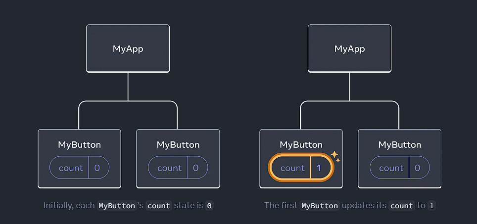
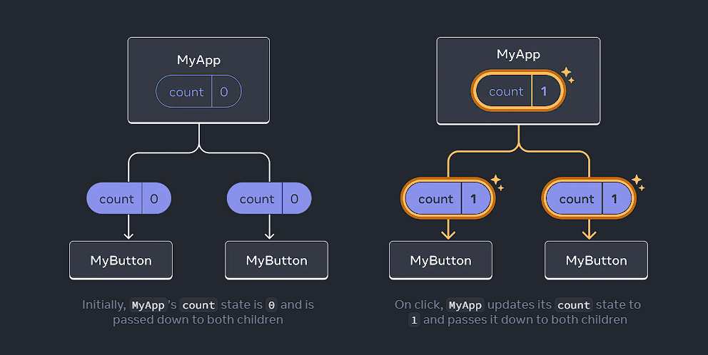

### Schedule

  - [Study](#study-plan-NN)

### Study Plan

  **Intro to React / Part 2**

  

  - How to respond to events and update the screen
  - How to share data between components

## Responding to events

You can respond to events by declaring *event handler* functions inside your components:

<!-- ```js {2-4,7} -->
```jsx
function MyButton() {
  function handleClick() {
    alert('You clicked me!');
  }

  return (
    <button onClick={handleClick}>
      Click me
    </button>
  );
}
```

Notice how `onClick={handleClick}` has no parentheses at the end! Do not _call_ the event handler function: you only need to *pass it down*. React will call your event handler when the user clicks the button.

## Updating the screen

Often, you'll want your component to "remember" some information and display it. For example, maybe you want to count the number of times a button is clicked. To do this, add *state* to your component.

First, import [`useState`](https://react.dev/reference/react/useState){:target="_blank"} from React:

```jsx
import { useState } from 'react';
```

Now you can declare a *state variable* inside your component:

```jsx
function MyButton() {
  const [count, setCount] = useState(0);
  // ...
```

You’ll get two things from `useState`: the current state (`count`), and the function that lets you update it (`setCount`). You can give them any names, but the convention is to write `[something, setSomething]`.

The first time the button is displayed, `count` will be `0` because you passed `0` to `useState()`. When you want to change state, call `setCount()` and pass the new value to it. Clicking this button will increment the counter:

<!-- ```js {5} -->
```jsx
function MyButton() {
  const [count, setCount] = useState(0);

  function handleClick() {
    setCount(count + 1);
  }

  return (
    <button onClick={handleClick}>
      Clicked {count} times
    </button>
  );
}
```

React will call your component function again. This time, `count` will be `1`. Then it will be `2`. And so on.

If you render the same component multiple times, each will get its own state. Try the following code below locally and click each button separately:

<!-- <Sandpack> -->

```jsx
import { useState } from 'react';

export default function MyApp() {
  return (
    <div>
      <h1>Counters that update separately</h1>
      <MyButton />
      <MyButton />
    </div>
  );
}

function MyButton() {
  const [count, setCount] = useState(0);

  function handleClick() {
    setCount(count + 1);
  }

  return (
    <button onClick={handleClick}>
      Clicked {count} times
    </button>
  );
}
```

```css
button {
  display: block;
  margin-bottom: 5px;
}
```

<!-- </Sandpack> -->

Notice how each button "remembers" its own `count` state and doesn't affect other buttons.

## Using Hooks

Functions starting with `use` are called *Hooks*. `useState` is a built-in Hook provided by React. You can find other built-in Hooks in the [API reference.](https://react.dev/reference/react){:target="_blank"} You can also write your own Hooks by combining the existing ones.

Hooks are more restrictive than other functions. You can only call Hooks *at the top* of your components (or other Hooks). If you want to use `useState` in a condition or a loop, extract a new component and put it there.

## Sharing data between components

In the previous example, each `MyButton` had its own independent `count`, and when each button was clicked, only the `count` for the button clicked changed:



However, often you'll need components to *share data and always update together*.

To make both `MyButton` components display the same `count` and update together, you need to move the state from the individual buttons "upwards" to the closest component containing all of them.

In this example, it is `MyApp`:



Now when you click either button, the `count` in `MyApp` will change, which will change both of the counts in `MyButton`. Here's how you can express this in code.

First, *move the state up* from `MyButton` into `MyApp`:

<!-- ```js {2-6,18} -->
```jsx
export default function MyApp() {
  const [count, setCount] = useState(0);

  function handleClick() {
    setCount(count + 1);
  }

  return (
    <div>
      <h1>Counters that update separately</h1>
      <MyButton />
      <MyButton />
    </div>
  );
}

function MyButton() {
  // ... we're moving code from here ...
}

```

Then, *pass the state down* from `MyApp` to each `MyButton`, together with the shared click handler. You can pass information to `MyButton` using the JSX curly braces, just like you previously did with built-in tags like ``:

<!-- ```js {11-12} -->
```jsx
export default function MyApp() {
  const [count, setCount] = useState(0);

  function handleClick() {
    setCount(count + 1);
  }

  return (
    <div>
      <h1>Counters that update together</h1>
      <MyButton count={count} onClick={handleClick} />
      <MyButton count={count} onClick={handleClick} />
    </div>
  );
}
```

The information you pass down like this is called _props_. Now the `MyApp` component contains the `count` state and the `handleClick` event handler, and *passes both of them down as props* to each of the buttons.

Finally, change `MyButton` to *read* the props you have passed from its parent component:

<!-- ```js {1,3} -->
```jsx
function MyButton({ count, onClick }) {
  return (
    <button onClick={onClick}>
      Clicked {count} times
    </button>
  );
}
```

When you click the button, the `onClick` handler fires. Each button's `onClick` prop was set to the `handleClick` function inside `MyApp`, so the code inside of it runs. That code calls `setCount(count + 1)`, incrementing the `count` state variable. The new `count` value is passed as a prop to each button, so they all show the new value. This is called "lifting state up". By moving state up, you've shared it between components. Test the code below locally and see how the counters are updated together

<!-- <Sandpack> -->

```jsx
import { useState } from 'react';

export default function MyApp() {
  const [count, setCount] = useState(0);

  function handleClick() {
    setCount(count + 1);
  }

  return (
    <div>
      <h1>Counters that update together</h1>
      <MyButton count={count} onClick={handleClick} />
      <MyButton count={count} onClick={handleClick} />
    </div>
  );
}

function MyButton({ count, onClick }) {
  return (
    <button onClick={onClick}>
      Clicked {count} times
    </button>
  );
}
```

```css
button {
  display: block;
  margin-bottom: 5px;
}
```

<!-- </Sandpack> -->

### Extra Resources

### Sources and Attributions

- [https://react.dev/learn](https://react.dev/learn){:target="_blank"}

---

> **Questions, comments, suggestions? Please leave them on the comment section below.**

<script src="https://utteranc.es/client.js"
  repo="in-tech-gration/WDX-180"
  issue-term="pathname"
  theme="github-dark"
  crossorigin="anonymous"
  async>
</script>
