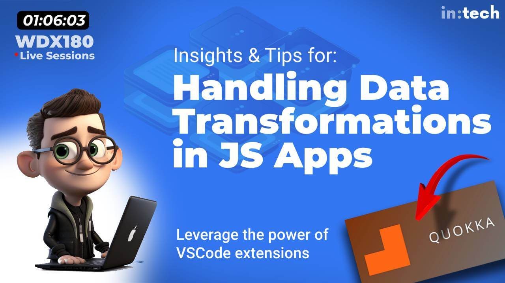

### Schedule

  - **Practice on yesterday's topics and share your questions**
  - **Watch lecture on data transformations**

### Study Plan

  - Watch our recorded live session on [Handling Data Transformations in JavaScript apps (using Quokka)](https://www.youtube.com/watch?v=CAp3avcHYCM){:target="_blank"}

  {:target="_blank"}

### Summary

### Exercises