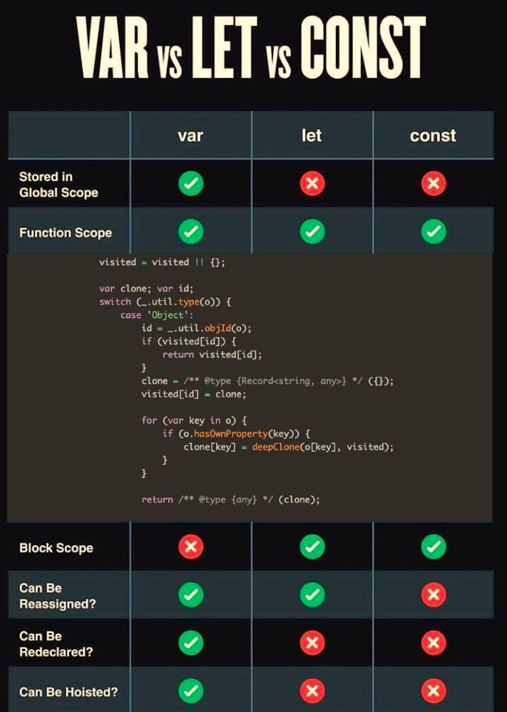

### Schedule

  - **Study the suggested material**
  - **Practice on the topics and share your questions**

### Study Plan

  First of all, some theory. Start by reading about `iframe` and `eval` (or as some people call it, `evil()`):

  - [eval @ W3Schools](https://www.w3schools.com/jsref/jsref_eval.asp){:target="_blank"}
  - [eval @ MDN](https://developer.mozilla.org/en-US/docs/Web/JavaScript/Reference/Global_Objects/eval){:target="_blank"}

  - [iframe @ W3Schools](https://www.w3schools.com/tags/tag_iframe.ASP){:target="_blank"}
  - [iframe @ MDN](https://developer.mozilla.org/en-US/docs/Web/HTML/Element/iframe){:target="_blank"}

### Exercises

  The challenge for today is to build an exact replica of this [reference table](https://cdn.hashnode.com/res/hashnode/image/upload/v1658225167119/MxOGBQkWE.jpg){:target="_blank"} using HTML and CSS.

  For each row of the table, the user must be able to click on it and some sample code must be displayed that shows the difference between the 3 ways of declaring a variable and the particular feature (e.g. function scope, hoisting, etc.). See the screenshot below for an idea on how to display the code. It's up to you to find the most appropriate solution. Feel free to experiment and also come up with various ways to do this.

  

  The code must be syntax highlighted. You **must** use the [prism.js library](https://prismjs.com/#examples){:target="_blank"} for that and pick the `tomorrow night` theme. 

  You can optionally go one step further and make the code runnable. You can experiment with things like `eval`, `iframe` or anything you can think of or find on StackOverflow. You might also want to experiment with ready-made libraries like [Flems](https://flems.io/){:target="_blank"}.

  Good luck!