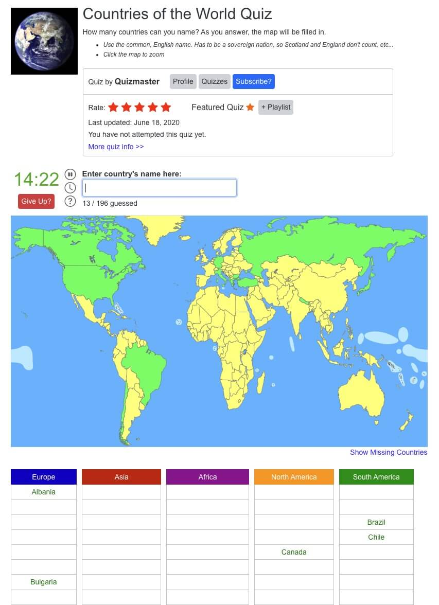

### Schedule

  - **Watch the lectures**
  - **Study the suggested material**
  - **Practice on the topics and share your questions**

### Study Plan

  

  In these lectures, we are going to try and recreate an online quiz game entitled **Countries of the World Quiz**.

  You can find the online quiz game on [this link](https://www.jetpunk.com/quizzes/how-many-countries-can-you-name)_blank.

  Your instructor will share the video lectures with you. Here are the topics covered:

  - **Part 1:** Q&A. Recreating `Countries of the World Quiz` game (Part 1)
  - **Part 2:** Recreating `Countries of the World Quiz` game (Part 2)

  You can find the lecture code [here](https://github.com/in-tech-gration/WDX-180/tree/main/curriculum/week18/assets/code/country-quiz){:target="_blank"}

  **Lecture Notes & Questions:**

  - **Reminder:** [...document.querySelectorAll("td")] => `document.querySelectorAll("td")`  
    - There is a difference between [**NodeList**](https://developer.mozilla.org/en-US/docs/Web/API/NodeList){:target="_blank"} and [**HTMLCollection**](https://developer.mozilla.org/en-US/docs/Web/API/HTMLCollection){:target="_blank"}  
      - `NodeList` => `@@iterator` => `for..of`
  - **console.dir**( HTMLElement objects ) for a different view on the console  
  - [HTMLDivElement](https://developer.mozilla.org/en-US/docs/Web/API/HTMLDivElement){:target="_blank"} <= [HTMLElement](https://developer.mozilla.org/en-US/docs/Web/API/HTMLElement){:target="_blank"}  
  - [HTMLCollection](https://developer.mozilla.org/en-US/docs/Web/API/HTMLCollection){:target="_blank"} does not support `forEach` (you’ll need to convert to array)  
  - Convert array-like objects *(HTMLCollection, NodeList, arguments,etc.)* to Arrays:  
    - **Array.from** (check the MD)  
    - **[...someArrayLikeObjectHere]**  
  - [**NodeList**](https://developer.mozilla.org/en-US/docs/Web/API/NodeList){:target="_blank"} supports forEach  
  - **DOM API**:  
    - `document.getElementById // A single HTMLElement`  
    - `document.querySelector  // A single HTMLElement` 
    - `document.getElementsByClassName // HTMLCollection`  
    - `document.getElementsByTagName // HTMLCollection`  
    - `document.querySelectorAll // NodeList`  
  <!-- - The different objects that are returned by the DOM API: [codepen](https://codepen.io/kostasx/pen/yLwRdee?editors=1011)   -->
  - 2 big categories of graphics in computers: Bitmaps (or Raster) vs Vectors  
  - Include a folder in VSCode workspace: `code -a .`  
  - Search for “json countries github” to find resources for use in JS  
  - [**Array some()**](https://developer.mozilla.org/en-US/docs/Web/JavaScript/Reference/Global_Objects/Array/some){:target="_blank"}  

  **References & Resources:**

  - [Free SVG World Map](https://simplemaps.com/resources/svg-world){:target="_blank"}

  - [Color this sofa! – SVG + Blend Mode trick](https://codepen.io/kostasx/pen/abbZyzj){:target="_blank"}
  - [Undraw (free vector illustrations)](https://undraw.co/illustrations){:target="_blank"}

  - SVG Editors:
    - [https://boxy-svg.com/app](https://boxy-svg.com/app){:target="_blank"}
    - [https://www.vectorpea.com](https://www.vectorpea.com){:target="_blank"}

  - Free Vectors:
    - [SVGP*rn](https://svgporn.com/){:target="_blank"}
    - [SVG and PNG tech icons](https://techicons.dev/){:target="_blank"}
    - [https://www.vecteezy.com/](https://www.vecteezy.com/){:target="_blank"}  

### Summary

### Exercises

  Complete the quiz game and make sure to implement the following requirements:

  - Enable case-insensitive input
  - Clear input value once we have the correct input
  - Update count of found countries
  - Add some styling to the game so that it looks like the original game
  - Find out how to properly center and display an SVG  
    - Learn about the `width`, `height` and `viewbox` attributes  
  - Deal with cases/values like *Curaçao*  
  - Deal with cases like "St. Eustatius (Netherlands)"  
  - Question/Study: What are some use cases for `submit` vs `change` vs `input` events?  
    - For example, Google search input uses the “input” event

### Extra Resources

  ---

  _Photo by [Monstera Production](https://www.pexels.com/photo/a-world-map-on-the-wall-7412035/)_

