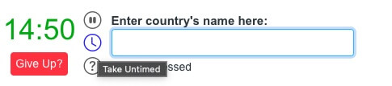
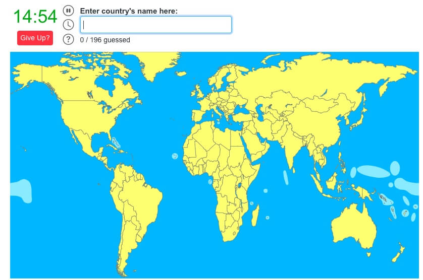

### Schedule

  - **Watch the lecture**
  - **Study the suggested material**
  - **Practice on the topics and share your questions**

### Study Plan

  {:target="_blank"}

  Watch our lecture on: [Intro to Design Patterns: A Simple Implementation of the Observer Pattern in JavaScript](https://youtu.be/fRpYNR_vM5A){:target="_blank"}

  The lecture code can be found [here](https://github.com/in-tech-gration/WDX-180/tree/main/curriculum/modules/computer_science/design_patterns/observer_pattern/source_code){:target="_blank"}.

  **References and resources for further study:**

  - [On Complex Systems](https://en.wikipedia.org/wiki/Complex_system){:target="_blank"}
  - [The Publish/Subscribe pattern](https://en.wikipedia.org/wiki/Publish%E2%80%93subscribe_pattern){:target="_blank"}
  - [Implementing the PubSub pattern in JS](https://medium.com/@ignatovich.dm/implementing-the-pub-sub-pattern-in-javascript-a-guide-for-beginners-44714a76d8c7){:target="_blank"}
  - [The Observer pattern at patterns.dev](https://www.patterns.dev/vanilla/observer-pattern){:target="_blank"}
  - [The Observer Pattern](https://refactoring.guru/design-patterns/observer){:target="_blank"}
  - [CRUD explained in 1 minute](https://www.youtube.com/shorts/AkDe3weBBsY){:target="_blank"}
  - [Private Properties in ES6 Classes](https://developer.mozilla.org/en-US/docs/Web/JavaScript/Reference/Classes/Private_properties){:target="_blank"}
  - [What is a Complex System?](https://www.youtube.com/watch?v=vp8v2Udd_PM){:target="_blank"} 
  - [Water CSS](https://watercss.kognise.dev){:target="_blank"}

  

### Exercises

  Your task for today is to try and complete all the challenges in the email app that we started developing during the lecture and implement all the required features (delete messages, display messages, star messages, mark messages as unread/read, etc.)

  It would be even better to try and work with one of these really cool email client clones:

  - [https://codepen.io/triss90/pen/WwvyRa](https://codepen.io/triss90/pen/WwvyRa){:target="_blank"}
  - [https://codepen.io/jonvadillo/pen/zzKawv](https://codepen.io/jonvadillo/pen/zzKawv){:target="_blank"}
  - [https://codepen.io/kostasx/pen/mybZpMR](https://codepen.io/kostasx/pen/mybZpMR){:target="_blank"}
  - {:target="_blank"}

  ---

  If you have some time left, you can take a look at the next challenge for this week, which is to try and replicate all the features of the Countries Quiz game that we've covered on [Week 18, Day 01](https://in-tech-gration.github.io/WDX-180/curriculum/week18/){:target="_blank"}:

  - Star quiz button
  - Timer
  - List of Continents and countries found (and not found)
  - Pause timer button
  - Disable timer button
  - Help box
  - Give up button
  - Guesses counter
  - Advanced: show missing countries 
  - Your extra features!? 

  

  

  

  

  

  You can find the lecture code [here](https://github.com/in-tech-gration/WDX-180/tree/main/curriculum/week18/assets/code/country-quiz){:target="_blank"}

  Perhaps you can try using the Observer pattern on the quiz game? That would definitely be a great challenge. Give it a try!

  The original game can be found [here](https://www.jetpunk.com/quizzes/how-many-countries-can-you-name){:target="_blank"}.

### Extra Resources
