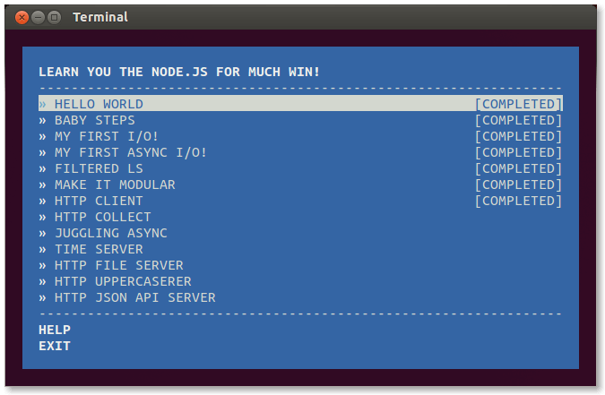
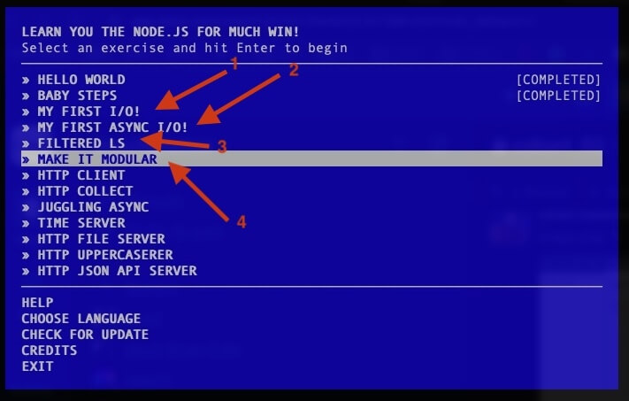

### Schedule

  - **Study the suggested material**
  - **Practice on the topics and share your questions**

### Study Plan

  {:target="_blank"}

  It's time to continue practicing your `Node.js` skills using `learnyounode`.

  Make sure that you have the package installed, up and running via `learnyounode` in the terminal. We suggest that you complete the following 4 steps:

  - My first I/O
  - My first async I/O
  - Filtered LS
  - Make it Modular

  

  Today, we also suggest to focus on the `fs` module and practice what you've learned yesterday.

  Questions? Cool things that you've learned? Post them on Slack or in the comments section below.

  Above all, enjoy!

### Summary

### Exercises

### Extra Resources

  Have some extra time and energy to devote on JavaScript?

  You can try completing a challenge from here: [https://javascript30.com/](https://javascript30.com/){:target="_blank"}