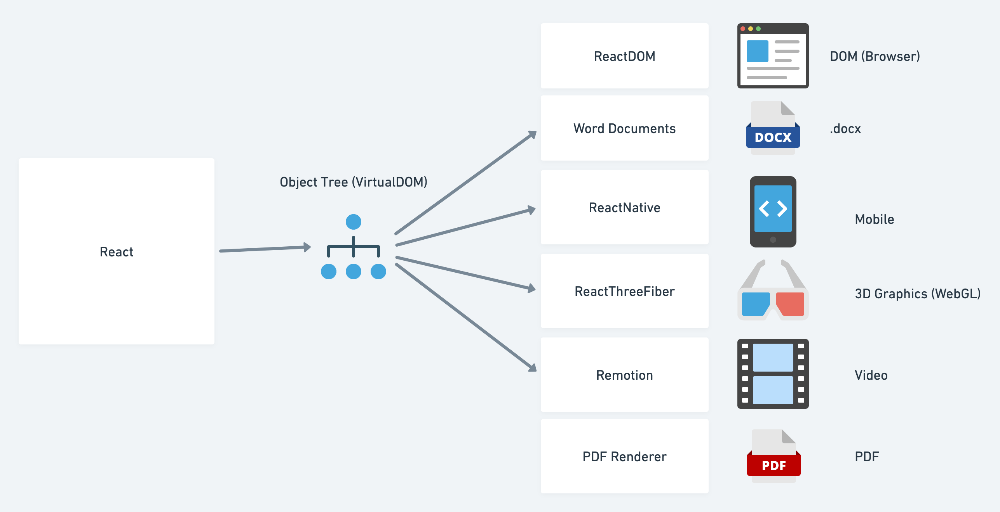
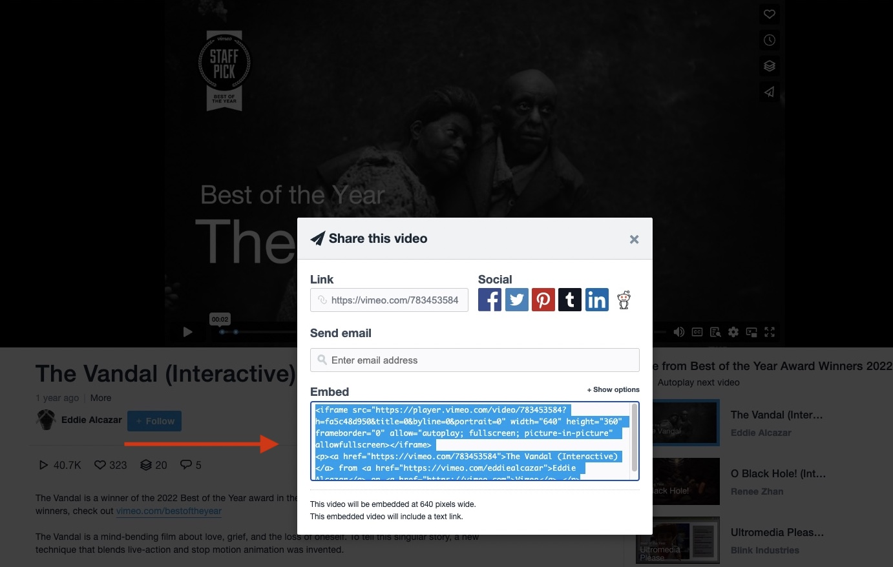

### Schedule

  - **Watch the lectures**
  - **Study the suggested material**
  - **Practice on the topics and share your questions**

### Study Plan

  

  Your instructor will share the video lectures with you. Here are the topics covered:

  - **Part 1:** Lecture Topics (**thanks to Aris Giotis ❤️**)
    - How compilation works: 08:59
    - Question: same function with different output: 9:30
    - Why to use tsx in StackBlitz: 12:13
    - ReactStrictMode removal: 14:04
    - The ! symbol in TypeScript (non-null): 17:18
    - The ts-nocheck directive: 19:42
    - The Chicken/egg function analogy: 21:22
    - Call the function: 22:38
    - How Babel works: 23:51
    - Nested components & Babel: 23:51
    - Can we use arrow functions: 30:00
    - Define component into their own file: 30:43
    - Returning JSX syntax vs function call: 33:01
    - Component in own file: 34:38
    - Export - import function: 36:31
    - Using JSX extension when importing: 41:11
    - Components with parameters: 43:59
    - Returning a single value: 49:19
    - JSX to JS transformer: 52:26
    - Discarded content: 57:58
    - Props: 58:41
    - Props.children: 1:04:27
    - Undefined: 1:10:01
    - Can you add an attribute: 1:11:21
    - Unexpected string rendering problem: 1:11:37
    - How JSX compiler works: 1:13:28
    - Switching modes: 1:14:25
    - XML mode: 1:14:35
    - Example walkthrough: 1:20:23
    - Think like "JS": 1:23:15
    - Counter of opening & closing tags: 1:23:55
    - RULE 2: ALWAYS CLOSE self-closing elements: 1:28:25
    - Linting: 1:28:25

  - **Part 2:** Lecture Topics (**thanks to Aris Giotis ❤️**)
    - Challenge: JS in HTML land: 03:32
    - The {} syntax in HTML mode: 04:41
    - (limited functionality) JS expressions: 6:26
    - What is a JS expression: 8:57
    - Can we use variables: 12:47
    - Replace static content: 15:04
    - Always close the self-closing tags: 18:12
    - Undefined and null are invisible: 18:33
    - typeof props.children: 19:44
    - What else is contained in props object: 19:59
    - HTML boolean attributes: 20:36
    - Supplying an attribute to a component (property injection): 20:47
    - Like passing different arguments on the props parameter: 20:42
    - Conditional checking: 23:50
    - Use default color: 23:34
    - Why the check uses typeof: 25:17
    - typeof always returns a string: 26:21
    - Question: 34:29
    - For any other value than string passed as props: 38:58
    - Passing a collection: 42:45
    - Channel component: 46:32
    - iframe HTML tag: 47:49
    - frameborder error: 54:33
    - HTML attributes to camelCase: 56:38
    - Error in JSX: 56:56
    - Template literals: 59:15
    - Exercise description: 1:02:38
    - Share & embed: 1:04:18

  You can find the lecture code [here](https://github.com/in-tech-gration/WDX-180/tree/main/curriculum/week21/assets/day03/code){:target="_blank"}

  **Lecture Notes & Questions:**

  VSCode shortcut: Use **Ctrl + `** => Minimize the Terminal

  **References & Resources:**

  - [**The JS Modules**](https://developer.mozilla.org/en-US/docs/Web/JavaScript/Guide/Modules){:target="_blank"}
  - [Online React jsx to javascript transformer using babel-cli](https://infoheap.com/online-react-jsx-to-javascript/){:target="_blank"}
  - [HTML-to-JSX](https://transform.tools/html-to-jsx){:target="_blank"}

### Summary

  - What does `React` teaches us?
    - **Encapsulation**
    - **Reusability**
    - **Composition & Composability**
    - The **DRY** Principle

### Exercises

  - Practice on `<YouTube />` Component
  - Create a `<Vimeo id="...">` Component

  
  

### Extra Resources