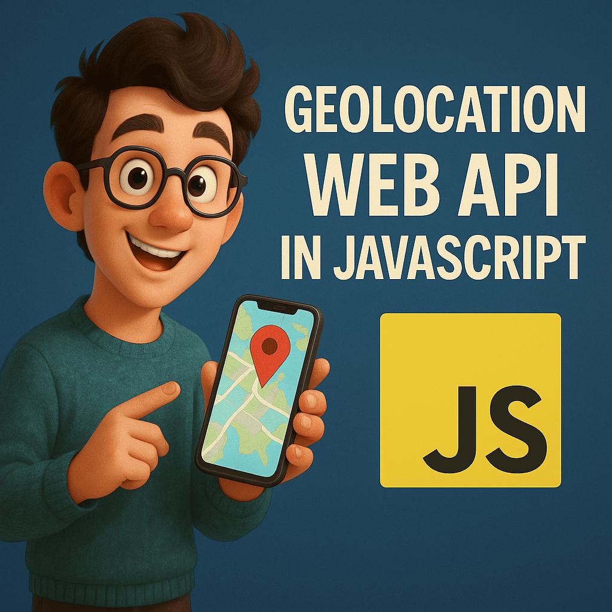

### Schedule

  - **Watch the lectures**
  - **Study the suggested material**
  - **Practice on the topics and share your questions**

### Study Plan

  

  Your instructor will share the video lectures with you. Here are the topics covered:

  - **Part 1:** The Geolocation API
  - **Part 2:** Combining the Geolocation API with OpenStreet Maps.

  You can find the lecture code [here](https://github.com/in-tech-gration/WDX-180/tree/main/curriculum/week25/assets/day03/code){:target="_blank"}

  **Lecture Notes:**

  - `Geolocation API`: a browser API for detecting and tracking the device's location on Earth (geo === earth).
    - Uses two coordinates (think of them as the x and y on a coordinate map) that are called `latitude` and `longitude` (floating point numbers).

  - `Navigator` (or `user-agent`, `User Agent`): the technical term for the Browser. In JS, it is an object: `navigator`.

  **Questions:**

  - How can we find a place/address from latitude/longitude?
    - A: We will use more APIs to get more information about the lat/lon, for example, country, city, address, weather information, etc.
  - Can this geo data be trusted?
    - A: They can be easily changed by the user with geo-spoofing.

  **References & Resources:**

  - [Geolocation (theory)](https://support.zartico.com/what-is-mobile-location-data-and-where-does-it-come-from){:target="_blank"}
  - Geolocation (Browser/Web) API:
    - [Geolocation API](https://developer.mozilla.org/en-US/docs/Web/API/Geolocation_API){:target="_blank"}
    - [Geolocation Interface](https://developer.mozilla.org/en-US/docs/Web/API/Geolocation){:target="_blank"}
    - [getCurrentPosition() method](https://developer.mozilla.org/en-US/docs/Web/API/Geolocation/getCurrentPosition){:target="_blank"}
    - [GeolocationPositionError](https://developer.mozilla.org/en-US/docs/Web/API/GeolocationPositionError){:target="_blank"}
    - GeolocationPosition Interface page (check it out)
    - GeolocationCoordinates Interface page (check it out)
  - [Navigator Interface](https://developer.mozilla.org/en-US/docs/Web/API/Navigator){:target="_blank"}
  - Open Source map: OpenStreetMaps
    - Alternatives are the commercial services: Google Maps, Bing, MapBox, etc.
  - Leaflet.js (open-source JS library for working with OpenStreetMaps)
    - Search for ['leaflet js quickstart’](https://leafletjs.com/examples/quick-start/){:target="_blank"}
  - How to trick [Google Maps](https://www.youtube.com/shorts/redHm15OJAA){:target="_blank"}
  - DevTools => Command Palette (Ctrl/Cmd+Shift+P) => Search for "Show Sensors"
  - [https://developer.mozilla.org/en-US/docs/Web/API/Geolocation/watchPosition](https://developer.mozilla.org/en-US/docs/Web/API/Geolocation/watchPosition){:target="_blank"}
  - Lat/Lon to Address and vice versa. Also, [more info](https://geocode.maps.co/){:target="_blank"} about the location

### Summary

### Exercises

  - Find more about the GeolocationCoordinates.accuracy property
  - Share your cool ideas for using the Geolocation API (and combining it with other APIs, services or technologies)
    - Air Pollution APIs, weather data, traffic, criminality rates, etc.
    - Find info about beaches and display them (e.g. red for not good for swimming, green, etc.)
    - Places to check for these kinds of data and APIS
      - Ministries of X
      - Google
      - [OpenData](https://data.europa.eu/data/datasets/dat-163-en?locale=en){:target="_blank"}
      - [GeoData Greek Government](http://geodata.gov.gr/en/dataset?groups=inland-waters){:target="_blank"}
      - [Eydap OpenData](https://opendata.eydap.gr/opendata.php?lang=EN){:target="_blank"} 
  - Give this repo a star: [https://github.com/Leaflet/Leaflet](https://github.com/Leaflet/Leaflet){:target="_blank"}
  - [Leaflet JS Tutorial 101](https://www.youtube.com/playlist?list=PLGHe6Moaz52PUNP4DtIshALDogSURIlYB){:target="_blank"}
  - Maps: Google Maps, Bing, TomTom, MapBox, etc.
    - [https://www.tomtom.com](https://www.tomtom.com){:target="_blank"}
  - [3D leaflet views](https://osmbuildings.org/?lat=52.52056&lon=13.40971&zoom=16.8&tilt=30){:target="_blank"}
  - Grab the bounding box from the geocode API and draw a bounding box around some address
  - [Search an address and show it on the map](https://geocode.maps.co/search?q=address&api_key=api_key){:target="_blank"}
  - [Get info from lat/lon](https://geocode.maps.co/reverse?lat=latitude&lon=longitude&api_key=api_key){:target="_blank"}
  - [Hardcoded lat/lon to countries](https://github.com/eesur/country-codes-lat-long/blob/master/country-codes-lat-long-alpha3.json){:target="_blank"}
  - Learn more about Geohashing: 
    - [What is Geohashing?](https://www.pubnub.com/guides/what-is-geohashing/){:target="_blank"}
    - [Geohash](https://www.youtube.com/watch?v=UaMzra18TD8){:target="_blank"}: Deep Intuitive Understanding in under 7 Minutes
    - [Geohashing Algorithm](https://www.youtube.com/watch?v=6uhSpLjGLgo){:target="_blank"} | Proximity Search Based Applications | System Design

### Extra Resources

  ---

  _Photo by _
