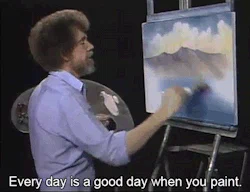

### Schedule

  - **Watch the lectures**
  - **Study the suggested material**
  - **Practice on the topics and share your questions**

### Study Plan

  Your instructor will share the video lectures with you. Here are the topics covered:

  - **Canvas API** 

  

  You can find the lecture code [here](https://github.com/in-tech-gration/WDX-180/blob/main/curriculum/week26/assets/canvas.html){:target="_blank"}

  **Lecture Notes & Questions:**

  **References & Resources:**

  - [**CanvasRenderingContext2D**](https://developer.mozilla.org/en-US/docs/Web/API/CanvasRenderingContext2D){:target="_blank"}  
    - [**fillRect**](https://developer.mozilla.org/en-US/docs/Web/API/CanvasRenderingContext2D/fillRect){:target="_blank"}  
    - [**clearRect**](https://developer.mozilla.org/en-US/docs/Web/API/CanvasRenderingContext2D/clearRect){:target="_blank"}  
    - [**arc()**](https://developer.mozilla.org/en-US/docs/Web/API/CanvasRenderingContext2D/arc){:target="_blank"}  
    - *more to explore...*  
  - The Photoshop clone built with Canvas API: [photopea](https://www.photopea.com/){:target="_blank"}

### Summary

### Exercises

  - Draw the Jamaica flag  
  - Draw a Pacman figure  
  - Combine Media API + Canvas API to track video progress/playtime

### Extra Resources

  ---

  _Photo by [Kelli Tungay](https://unsplash.com/photos/assorted-color-paints-and-paint-brushes-Sj0nhVIb4eY?utm_content=creditCopyText&utm_medium=referral&utm_source=unsplas)_      