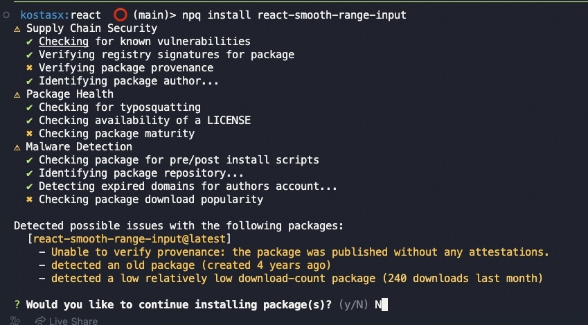
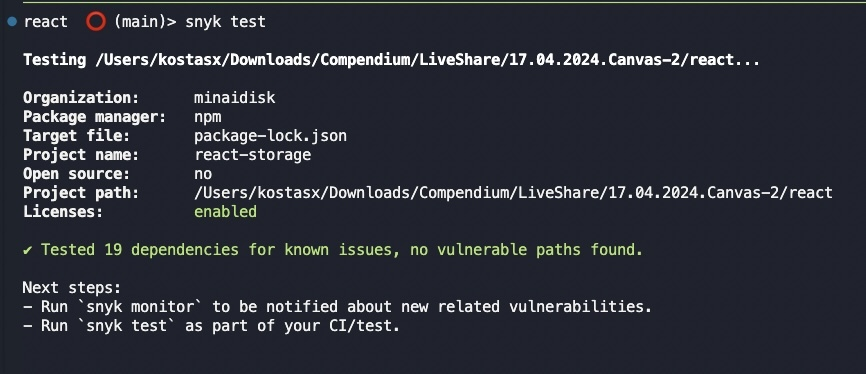

### Schedule

  - **Study the suggested material**
  - **Practice on the topics and share your questions**

### Study Plan

  - Today is Canvas API exploration day. Make sure to work on the tasks and challenges that we came up with yesterday and explore new ways to use the Canvas API. Here's a repo with lots of cool resources and demos: [Awesome Canvas](https://github.com/raphamorim/awesome-canvas){:target="_blank"}

  - Some highlights:
    - [30.000 particles](https://codepen.io/soulwire/full/DdGRYG){:target="_blank"}
    - [Inception](https://raphamorim.io/canvas-experiments/inception){:target="_blank"}
    - [Pirates love daisies](https://pirateslovedaisies.com/){:target="_blank"} (game)
  
  **Have fun and share your experience (bugs and frustrations included)!** 

  **`npm install virus`**

  `npm` now hosts more than 2.4 million packages! So many npm packages, so many things to worry about! Here are a couple of ways to check the integrity, safety and reliability for npm packages, both for Node and JavaScript:
  
  - 1) Install [npq](https://www.npmjs.com/package/npq){:target="_blank"} and run checks before installing: `npq install react`

  

  - 2) Check for the health of an npm package in [here](https://snyk.io/advisor/){:target="_blank"}. [Example](https://snyk.io/advisor/npm-package/react-smooth-range-input){:target="_blank"}

  - 3) Install [snyk](https://www.npmjs.com/package/snyk){:target="_blank"} and run some tests using `snyk test`

  

### Summary

### Exercises

### Extra Resources
